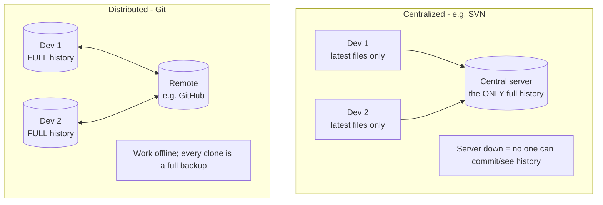

# What Is Git & Version Control: the time machine for your code

## 🧠 Intuition

**Version control** is a system that records changes to files over time so you can recall any earlier
version, see who changed what and why, and work with others without overwriting each other's work. **Git**
is the dominant version control system — fast, free, and **distributed**, meaning every developer has a
*complete copy* of the entire project history on their own machine, not just the latest files.

> 💡 **Analogy — a video game with unlimited save points.** Imagine playing a game where you can save at
> *any* moment, name each save ("before the boss fight"), branch into parallel save files to try different
> strategies, and instantly jump back to any save if things go wrong — and your friends each have the full
> save history too, so you can merge your progress. That's Git for your code: every commit is a save point,
> branches are parallel save files, and nothing good is ever truly lost.

## 🎯 The Problem

Before version control, people managed file versions by hand — and it was a disaster:

```text
project_final.zip
project_final_v2.zip
project_final_REALLY_final.zip
project_final_v2_johns_changes_USE_THIS_ONE.zip
project_final_v2_johns_changes_merged_maybe.zip   ← which one is actually current??
```

- You **can't tell what changed** between versions, or **why**.
- Two people editing the same file means someone's work gets **overwritten** (email the zip back and forth,
  manually merge, pray).
- You **can't go back** to "the version that worked last Tuesday" — it's gone.
- There's **no record** of who did what, when, or for what reason.

Version control solves all of this: a complete, queryable history, safe parallel work, and the ability to
return to any point in time.

## 📐 How It Works

### What version control gives you

- **History** — every change is recorded as a **commit** with an author, timestamp, and message ("why").
- **Time travel** — return to, compare, or recover any past version.
- **Branching** — work on features in isolation, in parallel, then merge them together.
- **Collaboration** — many people work on the same project, and Git **merges** their changes intelligently.
- **Backup** — because Git is distributed, every clone is a full backup of the whole history.

### Centralized vs Distributed VCS



- **Centralized (SVN, CVS):** one central server holds the full history; developers check out only the
  latest files. If the server is down, you can't commit or view history. One point of failure.
- **Distributed (Git, Mercurial):** **every** developer has the **complete** repository — full history,
  all branches — locally. You commit, branch, and view history **offline**; you sync with others
  (via a "remote" like GitHub) only when you choose. Faster, more resilient, more flexible.

Git's distributed nature is its superpower: local operations are instant (no network), every clone is a
backup, and you can experiment freely on your own copy.

### Where Git came from (1 minute of history)

Git was created in **2005 by Linus Torvalds** (creator of Linux) to manage the Linux kernel's development
after the team lost access to their previous tool. He needed something **fast**, **distributed**, and able
to handle **thousands of contributors** and massive history with **integrity** (so corruption is
detectable). The result became the standard for virtually all modern software development.

### Git vs GitHub (a crucial distinction)

People conflate these, but they're different:
- **Git** = the version control **tool** (runs on your computer; works with no internet).
- **GitHub / GitLab / Bitbucket** = **hosting services** for Git repositories — websites that store a
  remote copy and add collaboration features (pull requests, issues, CI). They use Git; they are **not**
  Git.

You can use Git with zero internet and no account. GitHub is just a popular place to *share* Git repos.

## 💻 In Practice

You don't need commands yet — but here's the 30-second tour of what Git lets you do (covered fully in
later chapters):

```bash
git init                 # turn a folder into a Git repository (start tracking)
git clone <url>          # copy an existing repo (with full history) to your machine
git add . && git commit -m "message"   # save a snapshot (a "save point")
git log                  # view the history of commits
git branch feature       # create a parallel line of work
git push                 # share your commits with a remote (e.g. GitHub)
```

Every one of these (except clone/push) works **completely offline**, instantly, because the whole repo
lives on your machine.

## ⚖️ Why Git Won

- **Distributed** — offline work, full local history, every clone a backup.
- **Fast** — local operations are near-instant (no server round-trip).
- **Cheap branching** — branches are trivial to create and merge (a branch is just a pointer — you'll see
  in [chapter 03](03-How-Git-Works-Internals.md)), which enables modern feature-branch workflows.
- **Integrity** — every commit is identified by a cryptographic hash of its content, so corruption or
  tampering is detectable.
- **Ubiquitous** — it's the de-facto standard; GitHub/GitLab built huge ecosystems on it.

Alternatives exist (Mercurial, SVN, Perforce) and have niches, but Git dominates open-source and most
commercial development.

## 🚫 Common Mistakes & Misconceptions

```text
❌ "Git and GitHub are the same thing." → Git is the tool; GitHub is a hosting website that uses Git.
✅ You can use Git fully offline with no GitHub account.

❌ "Version control is only for teams." → Even solo, you get history, time-travel, branches, and backup.
✅ Use Git for every project, even personal ones — your future self will thank you.

❌ "I'll just keep zip backups / copy folders." → no history of WHY, no safe merging, easy to lose work.
✅ Git records every change with context and merges parallel work safely.

❌ Thinking the central server (GitHub) holds something you don't. → with Git, your clone has the FULL history.
✅ A distributed clone is a complete, independent copy (and backup).
```

## 🌍 Real-World Use

Git underpins essentially all modern software: the **Linux kernel** (its birthplace, thousands of
contributors), virtually every **open-source project**, and the internal development at nearly every tech
company. Platforms like **GitHub** (100M+ developers), **GitLab**, and **Bitbucket** host billions of
repositories. Knowing Git is a baseline expectation for any software role — it's how teams coordinate,
review code, ship releases, and recover from mistakes. It's also increasingly used beyond code: writers,
researchers, and configuration management ("GitOps") all use Git for versioned, collaborative change.

## 🎯 Practice (with full solutions)

### 1. Centralized vs distributed — `Easy`
**Task:** Your team's central SVN server goes down for a day. With SVN, what can't you do — and how would
Git differ?
**Solution:** With **centralized** SVN, while the server is down you **cannot commit, view history, or
create branches** that others see — the server holds the only full history, so you're stuck with just your
working files. With **distributed** Git, every developer has the **complete repository locally**, so you can
keep **committing, branching, viewing history, and time-traveling offline**; you only need the remote
(GitHub) to **sync** with others, which you do when it's back up.
**Why it matters:** this is the core practical advantage of distributed VCS — productivity and history don't
depend on a live connection to a central server.

### 2. Git vs GitHub — `Easy`
**Task:** A colleague says "I can't use Git because I don't have a GitHub account." Are they right?
**Solution:** **No.** **Git** is a tool that runs entirely on their computer — they can `git init` a folder,
commit, branch, and view history with **no internet and no account**. **GitHub** is just a *hosting website*
for sharing Git repositories online; it's optional. They only need GitHub (or GitLab/Bitbucket) if they want
to **back up to or collaborate via** a remote server.
**Why it matters:** separating the tool (Git) from hosting services (GitHub) clears up the single most
common beginner confusion.

## ✅ Key Takeaways

- **Version control** records changes over time → history, time-travel, safe parallel work, collaboration,
  and backup.
- **Git is distributed**: every clone has the **complete history**, so you work **offline/instantly** and
  every copy is a backup — unlike **centralized** systems (SVN) with one full-history server.
- Created by **Linus Torvalds in 2005** for the Linux kernel; now the universal standard.
- **Git ≠ GitHub**: Git is the tool (works offline, no account); **GitHub/GitLab/Bitbucket** are hosting
  services that *use* Git.
- Git won on being **distributed, fast, cheap to branch, and integrity-checked** — enabling modern workflows.

**Self-check:**
1. What does "distributed" mean, and what does it let you do that a centralized system can't?
2. What's the difference between Git and GitHub?
3. Name three things version control gives you over manually copying/zipping folders.

---
◀ Prev: [Course Index](README.md) · ▲ [Index](README.md) · ▶ Next: [Setup & Configuration](02-Setup-and-Configuration.md)
