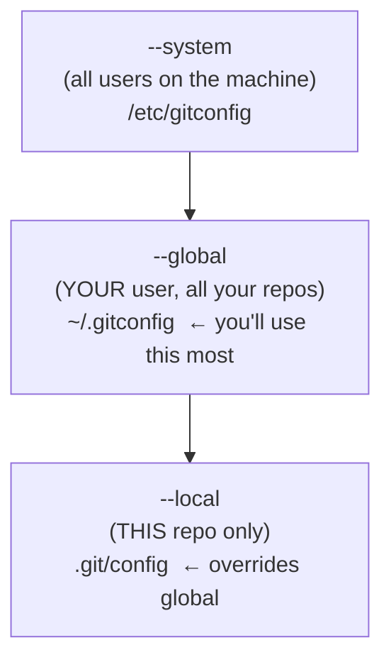

# Setup & Configuration: identity, SSH, and making Git yours

## 🧠 Intuition

Before Git can record *who* made each change, it needs to know **who you are**. And before you can push to
GitHub securely, you need an **authentication key**. Configuration is the one-time setup that makes Git
work the way you want — your identity stamped on every commit, sensible defaults, and shortcuts (aliases)
for the commands you type a hundred times a day.

> 💡 **Analogy — setting up a new workshop.** When you move into a new workshop, you put your name on the
> door (identity), get a key to lock up securely (SSH key), set your tools to your preferred defaults (the
> editor, the default branch name), and label your most-used drawers for quick access (aliases). A few
> minutes of setup makes every future job smoother. Git config is that one-time workshop setup.

## 🎯 The Problem

You install Git, make your first commit, and see:

```text
$ git commit -m "first commit"
Author identity unknown
*** Please tell me who you are.
Run
  git config --global user.email "you@example.com"
  git config --global user.name "Your Name"
```

Or you try to push to GitHub and get **"Permission denied (publickey)"**, or **"Support for password
authentication was removed"**. Git won't record a commit without knowing the author, and modern GitHub
won't accept your password over HTTPS for pushing. Setup solves both — and configuring an editor, default
branch, and aliases saves you friction forever.

## 📐 How It Works

### Installation

- **Windows:** download **Git for Windows** (git-scm.com) — includes **Git Bash** (a Unix-like terminal).
- **macOS:** `brew install git` (Homebrew) or it comes with Xcode command-line tools.
- **Linux:** `sudo apt install git` / `sudo dnf install git` / your package manager.

Verify: `git --version`.

### The three config levels

Git config is layered — each level overrides the broader one:



- **`--system`** — applies to every user on the machine (rarely set by you).
- **`--global`** — applies to **you** across all your repositories (`~/.gitconfig`). **This is where you set
  your identity.**
- **`--local`** — applies to the **current repo only** (`.git/config`); overrides global. Use it to set a
  different email for a work vs personal repo.

More specific wins: local > global > system.

### Authentication: SSH vs HTTPS

To push/pull from GitHub you authenticate. Two options:
- **SSH** (recommended) — generate a key pair; put the **public** key on GitHub, keep the **private** key on
  your machine. No password typing; secure.
- **HTTPS** — uses a **Personal Access Token (PAT)** instead of your password (GitHub removed password auth).
  A credential manager can cache it.

SSH is the smoother long-term choice for most developers.

## 💻 In Practice

### Essential first-time setup

```bash
# 1. Your identity — stamped on every commit (use the email tied to your GitHub account)
git config --global user.name "Hüseyin Kaymak"
git config --global user.email "huseyin@example.com"

# 2. Default branch name for new repos (modern default is 'main', not 'master')
git config --global init.defaultBranch main

# 3. Your preferred editor for commit messages, interactive rebase, etc.
git config --global core.editor "code --wait"     # VS Code  (or "nano", "vim")

# 4. Sensible defaults
git config --global pull.rebase false             # 'merge' on pull (a safe default; see ch.07)
git config --global core.autocrlf true            # Windows: handle line endings (input on macOS/Linux)

# View all settings (and which file each came from)
git config --list --show-origin
git config user.email          # check one value
```

### Set up SSH for GitHub

```bash
# 1. Generate a key pair (Ed25519 is modern & secure). Press Enter to accept defaults.
ssh-keygen -t ed25519 -C "huseyin@example.com"

# 2. Start the agent and add your key
eval "$(ssh-agent -s)"
ssh-add ~/.ssh/id_ed25519

# 3. Copy the PUBLIC key and add it on GitHub → Settings → SSH and GPG keys → New SSH key
cat ~/.ssh/id_ed25519.pub        # copy this output (the .pub = public, safe to share)

# 4. Test it
ssh -T git@github.com            # should greet you by your GitHub username
```

> 🔑 **Never share or commit your private key** (`id_ed25519`, no `.pub`). Only the **`.pub`** (public) key
> goes on GitHub. (More on never committing secrets in [chapter 19](19-Best-Practices.md).)

### Aliases — shortcuts for commands you type constantly

```bash
git config --global alias.st status
git config --global alias.co checkout
git config --global alias.br branch
git config --global alias.cm "commit -m"
git config --global alias.last "log -1 HEAD"
# A famous pretty one-line graph log:
git config --global alias.lg "log --oneline --graph --decorate --all"

# Now: `git st`, `git lg`, `git cm "msg"` ...
```

## ⚖️ Trade-offs / Choices

- **SSH vs HTTPS:** SSH (key-based) is smoother long-term (no token typing) and is recommended; HTTPS + PAT
  is fine and sometimes easier behind corporate proxies. Pick one and be consistent.
- **Global vs local identity:** set your identity **globally**; override with **local** config in repos that
  need a different email (e.g. a work email on work repos).
- **`pull.rebase`:** `false` (merge) is the safe beginner default; many advanced users prefer `true` or
  `--ff-only` for a cleaner history ([chapter 07](07-Rebase-vs-Merge.md)).
- **Line endings (`core.autocrlf`):** matters on Windows mixed teams — `true` on Windows, `input` on
  macOS/Linux — to avoid spurious whole-file diffs.

## 🚫 Common Mistakes & Gotchas

```text
❌ Committing with the wrong/unset email. → commits aren't attributed to you (GitHub won't link them).
✅ Set user.name and user.email globally first; use the email tied to your GitHub account.

❌ Sharing or committing your PRIVATE SSH key. → anyone can impersonate you.
✅ Only the .pub (public) key goes on GitHub; keep the private key secret (and out of repos).

❌ Trying to push with your GitHub PASSWORD over HTTPS. → rejected (password auth was removed).
✅ Use an SSH key, or a Personal Access Token for HTTPS.

❌ Setting identity with --local in every repo by hand. → tedious and error-prone.
✅ Set it once with --global; override locally only when needed.

❌ Ignoring line-ending config on a Windows/mac mixed team. → huge "whole file changed" diffs.
✅ Configure core.autocrlf appropriately (and use a .gitattributes file for the team).
```

## 🌍 Real-World Use

Every developer's first day on a new machine includes this setup: configure identity, generate an SSH key,
add it to GitHub/GitLab, and set a few preferences. Teams often standardize config via a shared
**`.gitattributes`** (line endings, diff settings) committed to the repo, and via documented onboarding
("run these `git config` commands"). Aliases and a good editor integration are personal productivity
multipliers — experienced developers have a `~/.gitconfig` they carry between machines. Getting identity
and auth right up front prevents the two most common day-one friction points: unattributed commits and
"permission denied" on push.

## 🎯 Practice (with full solutions)

### 1. First-time setup — `Easy`
**Task:** You just installed Git on a new laptop. List the commands to set your identity, default branch
name, and editor so your commits are properly attributed.
**Solution:**
```bash
git config --global user.name "Your Name"
git config --global user.email "you@example.com"   # the email on your GitHub account
git config --global init.defaultBranch main
git config --global core.editor "code --wait"      # or nano/vim
git config --list --show-origin                    # verify
```
**Why it works:** setting `user.name`/`user.email` **globally** stamps every future commit (in any repo)
with your identity so it's attributed to you (and linked on GitHub if the email matches); the other settings
give you a modern default branch and your preferred editor for commit messages.

### 2. Per-repo override — `Medium`
**Task:** Your global identity uses your personal email, but for your work repository you must commit with
your work email. How do you set that for just that one repo, and verify it?
**Solution:**
```bash
cd path/to/work-repo
git config --local user.email "you@company.com"   # --local (or just `git config`) sets THIS repo only
git config user.email                              # verify → shows the work email here
# In any other repo, git config user.email still shows the personal (global) email.
```
**Why it works:** local config (`.git/config`) overrides global, and "more specific wins," so this repo uses
the work email while all others keep the global personal email — exactly the per-context identity you need.

## ✅ Key Takeaways

- **Set your identity first**: `git config --global user.name`/`user.email` — it's stamped on every commit
  (use your GitHub email so commits link to you).
- Config has **three levels**: `--system` (machine) < `--global` (you) < `--local` (this repo); **more
  specific wins**.
- **Authenticate to GitHub** with **SSH** (recommended: `ssh-keygen -t ed25519`, add the **`.pub`** to
  GitHub) or **HTTPS + a Personal Access Token** (passwords no longer work). **Never share the private key.**
- Set sensible defaults (`init.defaultBranch main`, `core.editor`, line endings) and **aliases** for
  frequent commands.
- `git config --list --show-origin` shows every setting and where it came from.

**Self-check:**
1. What are the three config levels, and which one do you use for your identity?
2. Which SSH key goes on GitHub — public or private — and why must you protect the other?
3. Why does pushing to GitHub with your account password fail, and what do you use instead?

---
◀ Prev: [What Is Git & Version Control](01-What-Is-Git-and-Version-Control.md) · ▲ [Index](README.md) · ▶ Next: [How Git Works (the Object Model)](03-How-Git-Works-Internals.md)
