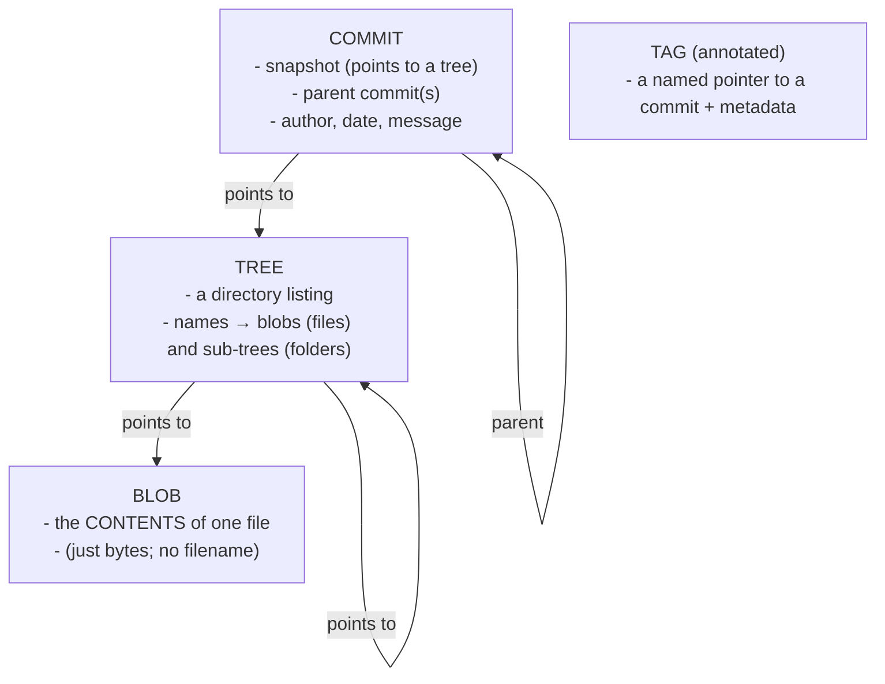
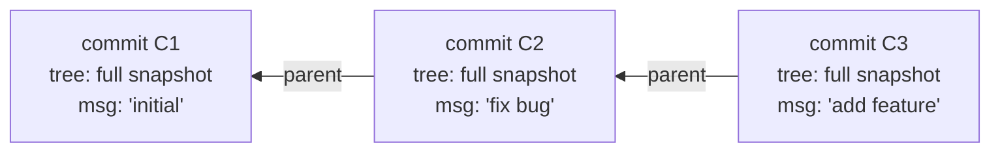
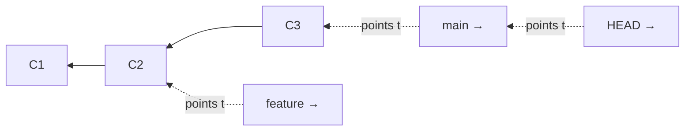

# How Git Works (the Object Model): the "aha" that makes everything click

## 🧠 Intuition

This is the most important chapter in the course. Everyone who finds Git "confusing" skipped this. Once you
understand that **Git stores snapshots, not differences**, that **a commit is a snapshot plus a pointer to
its parent**, and that **a branch is just a sticky note pointing at a commit**, then `reset`, `rebase`,
`merge`, detached HEAD, and recovery all stop being magic and become *obvious*. Spend real time here.

> 💡 **Analogy — a photo album, not a list of edits.** Many people think Git stores a *list of changes*
> ("added line 3, deleted line 7"). It doesn't. Git takes a **complete photo (snapshot)** of your whole
> project every time you commit, and each photo has a little note on the back pointing to the photo before
> it. The album is a chain of photos linked backward in time. A "branch" is just a paperclip you attach to
> one photo so you can find it again. To "go back in time," you just move the paperclip.

## 🎯 The Problem

You run commands like `git reset --hard HEAD~1` or `git rebase` and they feel **dangerous and
unpredictable** — you don't know what they'll do, so you're scared of Git. You hear "detached HEAD" and
panic. You think a commit is fragile. The root cause is **not knowing what Git actually stores**. With the
mental model below, every command becomes a simple, predictable operation on a graph of snapshots — and you
become *fearless*.

## 📐 How It Works

### Git is a content-addressable store of four object types

Inside the hidden `.git` folder, Git stores everything as **objects**, each identified by the **SHA-1 hash**
of its content (a 40-character ID like `e83c5163...`). Same content → same hash, always. There are four
object types:



- **Blob** — the **contents** of a file (just the bytes — it doesn't even know the filename). Two files with
  identical content share **one** blob.
- **Tree** — a **directory**: a list mapping names → blobs (files) and other trees (subdirectories). A tree
  is a snapshot of one folder's structure.
- **Commit** — a **snapshot of the whole project** at a moment: it points to **one top-level tree** (the
  full project state), to its **parent commit(s)**, and carries author/date/**message**.
- **Tag** (annotated) — a named, permanent pointer to a commit (e.g. `v1.0`).

### A commit is a snapshot + a parent pointer

Each commit points to its **parent** (the commit before it). Follow the parent pointers backward and you
have the **entire history** — a chain of complete snapshots:



This forms a **DAG** (Directed Acyclic Graph) — directed (points to parents), acyclic (no loops, since time
only goes one way). Branches and merges make it a graph rather than a straight line, but it's still just
commits pointing at parents.

> **"Snapshots, not diffs":** every commit conceptually contains the *full* project state (via its tree).
> Git is smart about storage (identical files reuse blobs; packfiles compress similar content — see
> [chapter 17](17-Advanced-Tools.md)), but **conceptually each commit is a complete snapshot**, not a delta.
> Diffs (`git diff`) are *computed on demand* by comparing two snapshots — they're not how data is stored.

### A branch is just a movable pointer

Here's the liberating part: a **branch is a tiny file containing one commit's SHA** — a sticky note pointing
at a commit. That's *all* it is.



- Creating a branch = writing a new 40-char file. **That's why branching is instant and cheap.**
- Committing on a branch = create a new commit, then **move the branch pointer forward** to it.
- **HEAD** is a special pointer that says **"where am I right now?"** — usually it points to a branch (e.g.
  `HEAD → main`), so "you are on main." (More on HEAD and the three areas in
  [chapter 04](04-The-Three-Areas-and-Lifecycle.md).)

So switching branches just moves HEAD; deleting a branch just removes a sticky note (the commits remain).
Operations like `reset` and `rebase` are mostly **moving pointers and creating commits** — not destroying
data.

### The `.git` directory (peek inside)

When you `git init`, Git creates a `.git/` folder — *that* is the repository (the rest is your working
copy). Key contents:

```text
.git/
  objects/      # all the blobs, trees, commits (the database), named by hash
  refs/heads/   # your branches (each file holds one commit SHA)
  refs/tags/    # your tags
  HEAD          # points to the current branch (e.g. "ref: refs/heads/main")
  config        # this repo's config (ch.02)
  index         # the staging area (ch.04)
  logs/         # the reflog — a log of where HEAD has been (your safety net! ch.09)
```

## 💻 In Practice — see the objects yourself

You can inspect the internals with "plumbing" commands (low-level; `git log` etc. are "porcelain"):

```bash
git init demo && cd demo
echo "hello" > file.txt
git add file.txt && git commit -m "first"

# The commit's hash:
git log --oneline           # e.g. a1b2c3d first

# Look at the commit object — it points to a tree and (here) has no parent:
git cat-file -p HEAD
#   tree 5f8e...        ← the snapshot
#   author Hüseyin ...  message: first

# Look at the tree — it lists the files (names → blobs):
git cat-file -p HEAD^{tree}
#   100644 blob ce0136...   file.txt

# Look at the blob — the file's CONTENTS (no name):
git cat-file -p ce0136...
#   hello

# A branch really is just a file with a SHA:
cat .git/refs/heads/main    # → a1b2c3d... (the commit hash)
cat .git/HEAD               # → ref: refs/heads/main  (HEAD points to the branch)
```

> Seeing `commit → tree → blob` with your own eyes is the moment Git "clicks." The commit is the snapshot,
> the branch is a pointer to it, HEAD points to the branch.

## ⚖️ Why this model is powerful

- **Cheap branching** → modern feature-branch workflows are practical because a branch is just a pointer.
- **Integrity** → every object is named by the hash of its content, so any corruption or tampering changes
  the hash and is **detectable**; a commit's hash depends on its parent's, so history can't be altered
  silently.
- **Deduplication** → identical content is stored once (same blob), making Git space-efficient despite
  conceptual full snapshots.
- **Fearlessness** → understanding that commits persist and branches/HEAD are just pointers is what makes
  `reset`, `rebase`, and recovery (via the reflog) safe to use.

## 🚫 Common Mistakes & Misconceptions

```text
❌ "Git stores diffs/changes between versions." → No: it stores full SNAPSHOTS (commits → trees → blobs).
✅ Diffs are computed on demand; storage is snapshots (deduplicated + compressed).

❌ "A branch is a copy of all my files." → No: a branch is a tiny pointer to ONE commit.
✅ That's why branching is instant; switching branches moves HEAD, not copies of files.

❌ "Deleting a branch deletes its commits." → The commits remain (reachable via reflog for a while).
✅ A branch is just a label; removing the label doesn't remove the snapshots.

❌ Fearing reset/rebase as if they destroy data irreversibly. → they mostly move pointers; reflog remembers.
✅ Learn the model + the reflog (ch.09) and these become safe, predictable tools.

❌ Thinking the commit's SHA is random. → it's the hash of the commit's content (incl. parent + tree).
✅ Same content = same hash; changing anything changes the hash (integrity).
```

## 🌍 Real-World Use

This model isn't academic — it's *why* Git behaves the way it does in daily work. "Cheap branching"
(branch = pointer) is the foundation of feature branches and pull requests
([chapter 15](15-Pull-Requests-and-Code-Review.md)). "Snapshots + parent pointers" explain how `git log`,
`git diff`, `merge`, and `rebase` work. The reflog (a log of where HEAD has pointed) is what lets you
**recover "lost" commits** ([chapter 09](09-Undoing-Things.md), [18](18-Troubleshooting-and-Recovery.md)) —
because the commits were never gone, only unreferenced. And content-addressing (hashes) is what gives Git
its famous **integrity**. Senior engineers reason about Git *through this model*; it's why they're calm
during a scary-looking history problem.

## 🎯 Practice (with full solutions)

### 1. Snapshots vs diffs — `Easy`
**Task:** A teammate says "Git saves space by only storing the lines I changed in each commit." Correct
them, precisely.
**Solution:** Conceptually, **each commit stores a full snapshot** of the project (a commit points to a
**tree**, which points to **blobs** = file contents) — **not** a diff of changed lines. Git *does* save space,
but through **deduplication** (unchanged files reuse the same blob across commits — same content, same hash)
and **packfile compression**, not by storing line-level diffs. The diffs you see in `git diff`/`git show` are
**computed on demand** by comparing two snapshots; they're a *view*, not the storage format.
**Why it works:** distinguishing "stored as snapshots, shown as diffs" is the core correction — it explains
both Git's behavior and its (efficient) storage without the false "stores diffs" model.

### 2. What is a branch, really? — `Medium`
**Task:** Explain why creating a branch in Git is essentially instant, and what actually happens when you
commit on that branch.
**Solution:** A **branch is just a tiny reference file** (under `.git/refs/heads/`) containing **one commit's
40-character SHA** — a movable pointer. Creating a branch writes that one small file pointing at the current
commit — no files are copied, so it's **instant and cheap**. When you **commit** on the branch, Git creates a
**new commit object** (snapshot + parent = the previous commit) and then **moves the branch pointer forward**
to the new commit (and `HEAD`, pointing at the branch, comes along). So branching and committing are just
**creating objects and moving pointers**.
**Why it works:** recognizing a branch as a pointer (not a copy) explains Git's cheap branching and demystifies
committing as "new snapshot + advance the label" — the foundation for understanding reset/rebase/merge.

## ✅ Key Takeaways

- Git stores four object types: **blob** (file contents), **tree** (a directory: names → blobs/trees),
  **commit** (a **full snapshot** = a tree + parent(s) + message), **tag**. Everything is named by the
  **SHA hash of its content** (integrity + deduplication).
- **Snapshots, not diffs:** each commit conceptually holds the whole project; diffs are *computed*, not
  stored. Storage is efficient via blob deduplication + packfiles.
- Commits point to their **parent(s)**, forming a **DAG** (the history graph).
- **A branch is just a movable pointer** (a file with one commit SHA) → branching is instant; committing =
  create a commit + advance the pointer. **HEAD** points to "where you are" (usually a branch).
- This model makes `reset`, `rebase`, `merge`, detached HEAD, and **recovery** predictable and safe — it's
  the "aha" that ends Git anxiety.

**Self-check:**
1. What are the four object types, and what does a commit point to?
2. Why is "Git stores diffs" wrong, and how does Git actually save space?
3. What *is* a branch, and what happens to it when you make a new commit?

---
◀ Prev: [Setup & Configuration](02-Setup-and-Configuration.md) · ▲ [Index](README.md) · ▶ Next: [The Three Areas & File Lifecycle](04-The-Three-Areas-and-Lifecycle.md)
