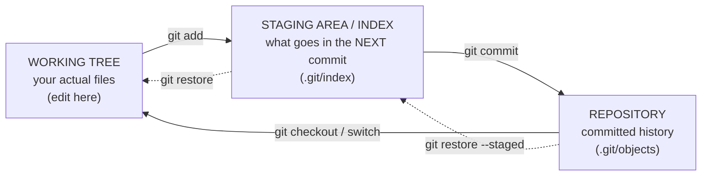
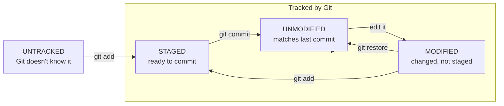

# The Three Areas & File Lifecycle: working tree, staging, repository

## 🧠 Intuition

Git has **three places** a version of your work can live: the **working tree** (the files you actually
edit), the **staging area / index** (a holding zone for what goes into your *next* commit), and the
**repository** (the committed history). The thing that confuses beginners — `git add` — exists because of
the **staging area**: it lets you craft *exactly* what goes into a commit, rather than committing every
change at once. Understanding these three areas (and how files move between them) makes `add`, `commit`,
`restore`, and `reset` make sense.

> 💡 **Analogy — packing a shipping box.** Your **desk** (working tree) is covered with items you're working
> on. Before you ship, you choose which items to put **in the box** (staging area) — maybe not everything on
> the desk, just the ones that belong in *this* shipment. When the box is exactly right, you **seal and send
> it** (commit) — it's now permanently logged in the shipping records (the repository). The box (staging)
> lets you control precisely what each shipment contains.

## 🎯 The Problem

You've edited five files but only two of them belong in a logical "fix the login bug" commit; the other
three are unrelated work-in-progress. If Git committed *everything you changed* at once, your history would
be a mess of unrelated changes lumped together — impossible to review, hard to revert cleanly. You need a
way to say "commit *these* changes, but not *those*." That's the staging area. Without understanding it,
`git add` feels like a pointless extra step ("why can't I just commit?") instead of the precision tool it is.

## 📐 How It Works

### The three areas



- **Working tree (working directory):** the real files on disk you open and edit. This is your sandbox.
- **Staging area (index):** a list of changes **proposed for the next commit**. `git add` copies the current
  state of a file *into* the staging area. It's a preview/draft of your next snapshot.
- **Repository:** the permanent, committed history (the objects from
  [chapter 03](03-How-Git-Works-Internals.md)). `git commit` takes whatever is staged and seals it into a
  new commit.

The flow: **edit (working tree) → `git add` (stage) → `git commit` (repository)**.

### HEAD — "where am I?"

**HEAD** is the pointer to your current position — normally the branch you're on (e.g. `HEAD → main → <last
commit>`). A commit's snapshot is compared against HEAD to compute "what changed." When you commit, the new
commit's parent is whatever HEAD pointed to, and then the branch (and HEAD) move forward.

### The file lifecycle

Every file in a Git repo is in one of these states:



- **Untracked** — a new file Git isn't tracking yet (never added). Git lists it but ignores its changes.
- **Tracked** — Git knows about it. A tracked file is then:
  - **Unmodified** — matches the last commit (nothing to do).
  - **Modified** — you've edited it, but the change isn't staged yet.
  - **Staged** — the current version is in the staging area, ready for the next commit.

`git status` is how you see every file's state. `git add` moves changes toward staged; `git commit` records
staged changes; `git restore` moves changes back.

### The key insight: staged ≠ working tree

A file can be **staged with one version and then modified again** in the working tree — so the *staged*
version and the *working* version differ. This is normal and powerful: you stage a clean change, keep
tinkering, and only the staged version goes into the commit. `git diff` (working vs staged) and
`git diff --staged` (staged vs last commit) show the two gaps.

## 💻 In Practice

```bash
# See the state of every file (your most-used command)
git status
git status -s                 # short format: XY filename (e.g. "M  file" staged, " M file" modified)

# Move changes from working tree → staging area
git add file.txt              # stage one file
git add src/                  # stage a directory
git add .                     # stage everything (new + modified) in current dir & below
git add -p                    # stage INTERACTIVELY, hunk by hunk (precision! see below)

# See the two different diffs:
git diff                      # working tree vs staging  (unstaged changes)
git diff --staged             # staging vs last commit   (what WILL be committed)

# Commit what's staged
git commit -m "message"

# Unstage / discard (preview — full detail in ch.09)
git restore --staged file.txt # unstage (keep the edit in the working tree)
git restore file.txt          # discard the working-tree edit (back to last commit) — destructive!
```

### `git add -p` — the precision tool

`git add -p` (patch mode) lets you stage **part of a file** — individual "hunks" of changes — so you can
split unrelated edits in the same file into separate, clean commits. It's how you keep commits **atomic**
(one logical change each — [chapter 19](19-Best-Practices.md)).

## ⚖️ Why the staging area exists (trade-offs)

- **Pro: precise, atomic commits.** Stage exactly the changes that form one logical unit; leave the rest for
  the next commit. This makes history reviewable and revertable.
- **Pro: review before committing.** `git diff --staged` shows exactly what you're about to commit — a last
  check.
- **Con: an extra step.** Beginners find `add` then `commit` annoying. The shortcut `git commit -a` stages
  all **tracked** modified files and commits in one step (but skips **untracked** files and skips the
  precision benefit).
- Some other VCS skip an explicit staging area; Git's is a deliberate feature for crafting good commits.

## 🚫 Common Mistakes & Gotchas

```text
❌ Thinking `git add` saves/commits your work. → add only STAGES; commit saves to history.
✅ Edit → add (stage) → commit (save). A commit is the durable save point.

❌ Editing a file AFTER staging it and expecting the new edit to be committed. → only the STAGED version commits.
✅ Re-run `git add` after further edits, or check with `git diff` (working vs staged).

❌ `git commit -a` and wondering why a NEW file wasn't included. → -a stages tracked files only, not untracked.
✅ `git add` new files first; -a is for already-tracked modifications.

❌ Confusing `git diff` and `git diff --staged`. → you check the wrong gap and miss changes.
✅ `git diff` = working vs staged; `git diff --staged` = staged vs last commit (what will be committed).

❌ Running `git restore file` to "undo staging". → that DISCARDS your edit. Use `git restore --staged`.
✅ --staged unstages (keeps the edit); plain restore discards the working-tree change.
```

## 🌍 Real-World Use

The staging area is what separates a tidy, professional Git history from a messy one. Experienced developers
routinely use `git add -p` to **split a working session into several focused commits** — e.g. "refactor
function" separate from "fix bug" separate from "update docs" — even when those changes were made together.
Code reviewers love this: each commit is a reviewable, revertable unit ([atomic commits](19-Best-Practices.md)).
`git status` is the single most-run Git command — it's the dashboard that tells you where everything stands
before you act. Mastering the three areas is the foundation for everything in the next chapters.

## 🎯 Practice (with full solutions)

### 1. Stage selectively — `Medium`
**Task:** You've edited `login.js` (a bug fix) and `notes.txt` (unrelated scratch notes). You want a commit
containing **only** the `login.js` fix. What do you do?
**Solution:**
```bash
git status                 # see both as modified
git add login.js           # stage ONLY the bug fix
git diff --staged          # verify: only login.js changes are staged
git commit -m "Fix login validation bug"
# notes.txt remains modified in the working tree, untouched — staged for a later commit or not at all.
```
**Why it works:** the staging area lets you choose exactly what goes into the commit; by adding only
`login.js`, the commit contains just the logical change "fix login bug," keeping `notes.txt` out of history —
an atomic, reviewable commit.

### 2. The staged-vs-working trap — `Medium`
**Task:** You run `git add config.txt`, then edit `config.txt` again to add another line, then
`git commit -m "update config"`. Is the second edit in the commit? How would you check, and how do you fix
it?
**Solution:** **No** — only the version that was **staged** (before the second edit) is committed; the second
line is still an **unstaged modification** in the working tree. Check with `git status` (shows `config.txt`
as modified again) or `git diff` (shows the un-committed second line). Fix: stage and commit (or amend) the
remaining change:
```bash
git add config.txt
git commit -m "update config (add second line)"   # or: git commit --amend  (ch.13)
```
**Why it works:** `git add` snapshots the file *at that moment* into the index; later edits aren't
automatically staged, so they're excluded from the commit until you `add` again — the staged-vs-working gap
in action.

## ✅ Key Takeaways

- Git has **three areas**: **working tree** (files you edit) → **staging area/index** (what's in the *next*
  commit) → **repository** (committed history). Flow: **edit → `git add` → `git commit`**.
- The **staging area** lets you craft **precise, atomic commits** — stage exactly the changes that form one
  logical unit (use **`git add -p`** to stage part of a file).
- **`git status`** shows every file's state: **untracked / unmodified / modified / staged**.
- **Staged ≠ working tree:** a file edited *after* staging has a staged version (committed) and a newer
  working version (not). `git diff` = working vs staged; `git diff --staged` = staged vs last commit.
- **HEAD** marks "where you are" (the current branch/commit); a commit's parent is whatever HEAD pointed at.

**Self-check:**
1. What are the three areas, and which command moves a change from each to the next?
2. Why does Git have a staging area — what does it let you do?
3. What's the difference between `git diff` and `git diff --staged`?

---
◀ Prev: [How Git Works (the Object Model)](03-How-Git-Works-Internals.md) · ▲ [Index](README.md) · ▶ Next: [The Basic Workflow](05-The-Basic-Workflow.md)
