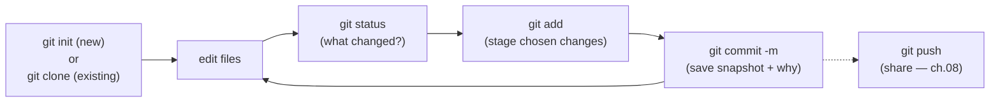

# The Basic Workflow: init, status, add, commit, ignore

## 🧠 Intuition

This is the everyday loop — the 90% of Git you'll use most: start (or copy) a repo, make changes, see
what's different, stage the changes you want, and commit them with a message explaining *why*. Master this
rhythm and you're productive; everything else in the course is built on top of it.

> 💡 **Analogy — keeping a project journal.** Each day you do some work, then write a dated journal entry
> summarizing what you accomplished and why ("Fixed the login bug because users couldn't reset passwords").
> Over time the journal becomes a complete, searchable record of the project's evolution. A Git commit is
> that journal entry — a snapshot of the work plus a note explaining it — and the basic workflow is the
> habit of writing good entries regularly.

## 🎯 The Problem

You have a folder of code and want to start tracking it: save versioned snapshots, be able to go back, and
later share it. You also have files you *don't* want to track — build outputs, `node_modules/`, secret keys,
`.env` files — that would clutter history and (worse) leak secrets. The basic workflow plus a `.gitignore`
handles both: track what matters, ignore what doesn't, and record clean snapshots with meaningful messages.

## 📐 How It Works

### The everyday loop



1. **Start:** `git init` turns a folder into a repo, or `git clone <url>` copies an existing one (with full
   history).
2. **Edit** your files normally.
3. **`git status`** — see what changed (your dashboard).
4. **`git add`** — stage the changes you want in the next commit
   ([the staging area, ch.04](04-The-Three-Areas-and-Lifecycle.md)).
5. **`git commit -m "..."`** — record a snapshot with a message.
6. Repeat. Occasionally **`git push`** to share ([ch.08](08-Remotes-and-Collaboration.md)).

### Anatomy of a commit message

A commit message explains **why**, not just what (the diff shows *what*). The widely-used convention:

```text
Short summary in imperative mood, ≤ 50 chars   ← "Add login validation" not "Added"/"Adds"
                                                ← blank line
Optional longer body explaining WHY the change
was needed, what approach was taken, and any
context a future reader (or you) will want.

Refs #123                                       ← optional: link an issue/ticket
```

Good messages make `git log` a readable story and are invaluable when debugging months later. (Full
guidance in [chapter 19](19-Best-Practices.md).)

### `.gitignore` — what NOT to track

A **`.gitignore`** file (committed to the repo) lists patterns of files Git should **ignore** — never track,
never nag about. Essential for build artifacts, dependencies, logs, OS files, and **secrets**.

```gitignore
# Dependencies / build output
node_modules/
bin/
obj/
dist/

# Logs & temp
*.log
*.tmp

# OS / editor junk
.DS_Store
Thumbs.db
.vscode/

# Secrets — NEVER commit these
.env
*.key
appsettings.Local.json
```

Patterns: `*.log` (any .log file), `dir/` (a whole directory), `!keep.log` (negate — don't ignore this one),
`/root-only.txt` (anchored to repo root). GitHub provides ready-made `.gitignore` templates per language.

## 💻 In Practice

### Start a new repo and make your first commit

```bash
mkdir myproject && cd myproject
git init                          # creates .git/ → now a repo (default branch: main)

echo "# My Project" > README.md
echo "node_modules/" > .gitignore

git status                        # README.md and .gitignore are 'untracked'
git add .                         # stage everything (respecting .gitignore)
git status                        # now 'staged'
git commit -m "Initial commit: add README and gitignore"

git log                           # see your commit
git log --oneline                 # compact: one line per commit
```

### Clone an existing repo

```bash
git clone git@github.com:user/repo.git        # SSH (ch.02)
git clone https://github.com/user/repo.git    # HTTPS
cd repo
# You now have the full history; edit → add → commit → push as usual.
```

### The daily rhythm

```bash
# ...you edited some files...
git status                        # what changed?
git diff                          # review the actual changes (working vs staged)
git add file1.js file2.css        # stage the related changes
git diff --staged                 # final review of what you're about to commit
git commit -m "Fix navbar overflow on mobile"
```

### Handy commit shortcuts

```bash
git commit -am "msg"      # stage all TRACKED modified files AND commit (skips untracked!)
git commit                # opens your editor for a full (multi-line) message
```

## ⚖️ Habits That Matter

- **Commit early and often.** Small, frequent commits are easier to understand, review, and revert than
  giant ones. A commit should be one logical change.
- **Write meaningful messages.** "Fix bug" tells a future reader nothing; "Fix crash when cart is empty"
  does. The message is for *humans reading history later*.
- **Check `git status` and `git diff` before committing.** Know exactly what you're recording — avoid
  committing debug code, secrets, or unrelated changes.
- **Set up `.gitignore` first**, before your first commit, so junk and secrets never enter history (removing
  them later is harder — [ch.13](13-Rewriting-History.md)).

## 🚫 Common Mistakes & Gotchas

```text
❌ Committing node_modules/, build output, or .env secrets. → bloated repo and leaked credentials.
✅ Add a .gitignore BEFORE the first commit (use GitHub's per-language templates).

❌ Giant commits mixing unrelated changes ("WIP", "stuff"). → unreviewable, hard to revert.
✅ Small, focused, atomic commits with clear messages (stage selectively, ch.04).

❌ Useless commit messages ("fix", "update", "asdf"). → history tells no story.
✅ Imperative summary explaining the change; body explaining WHY when needed.

❌ `git commit -am` and a new file silently isn't included. → -a only stages tracked files.
✅ `git add` new files first; -a is for modifications to already-tracked files.

❌ Forgetting to commit for days, then losing work. → no save points.
✅ Commit at every logical stopping point — they're cheap and your safety net.

❌ Committing a secret, then deleting it in a later commit. → it's STILL in history (and possibly pushed).
✅ Never commit it in the first place (.gitignore); if you did, rotate the secret + scrub history (ch.13).
```

## 🌍 Real-World Use

This loop — `status` → `add` → `commit` — is what every developer does dozens of times a day. The quality
of a team's Git history (atomic commits, clear messages) directly affects how easy it is to review code,
track down bugs (`git blame`/`bisect` — [ch.11](11-Inspecting-History.md)), and revert safely. A well-curated
`.gitignore` is standard in every repo; teams often start from GitHub's templates and add project-specific
entries. The discipline of "commit early, commit often, with good messages" is one of the clearest markers of
an experienced developer — and it pays off most exactly when something goes wrong and you need to navigate
history.

## 🎯 Practice (with full solutions)

### 1. Track a new project — `Easy`
**Task:** You have a folder `app/` with your code plus a `node_modules/` directory and a `.env` file with
secrets. Initialize Git and make a first commit that includes your code but **not** `node_modules/` or
`.env`.
**Solution:**
```bash
cd app
git init
printf "node_modules/\n.env\n" > .gitignore   # ignore deps and secrets FIRST
git status                                      # confirm node_modules/ and .env are NOT listed (ignored)
git add .                                       # stages code + .gitignore, but not the ignored paths
git commit -m "Initial commit"
```
**Why it works:** creating `.gitignore` before staging means `git add .` skips `node_modules/` and `.env`, so
they never enter history — keeping the repo clean and the secrets safe — while everything else is committed.

### 2. Write a good commit — `Easy`
**Task:** You fixed a bug where the app crashed if the shopping cart was empty. Write the `git` command with
a quality message, and explain why it's better than `git commit -m "fix"`.
**Solution:**
```bash
git add cart.js
git commit -m "Fix crash when checking out an empty cart"
# For more context, open the editor (git commit) and add a body:
#   Fix crash when checking out an empty cart
#
#   getTotal() assumed at least one item and divided by count.
#   Guard against an empty cart and return 0. Fixes #214.
```
**Why it works:** the imperative summary states exactly *what* changed and implies *why*, so `git log` reads
as a clear history; "fix" tells a future reader (or `git blame`) nothing about the problem or the change,
making debugging and review harder.

## ✅ Key Takeaways

- The everyday loop: **`git init`/`clone` → edit → `git status` → `git add` → `git commit -m`** → (repeat) →
  occasionally `git push`.
- A **commit message** explains **why** (the diff shows what): imperative summary (≤50 chars), blank line,
  optional body. Good messages make history a readable story.
- **`.gitignore`** (committed) lists files to never track — build output, dependencies, logs, and **secrets**
  (`.env`, keys). Set it up **before** the first commit.
- **Commit early and often**, with **small, atomic, well-described** commits — easier to review, revert, and
  debug.
- Always **review with `git status`/`git diff`** before committing; `git commit -am` stages tracked
  modifications only (not new files).

**Self-check:**
1. What are the steps of the everyday Git loop?
2. What makes a good commit message, and why does it matter later?
3. What belongs in `.gitignore`, and why set it up before your first commit?

---
◀ Prev: [The Three Areas & File Lifecycle](04-The-Three-Areas-and-Lifecycle.md) · ▲ [Index](README.md) · ▶ Next: [Branching & Merging](06-Branching-and-Merging.md)
