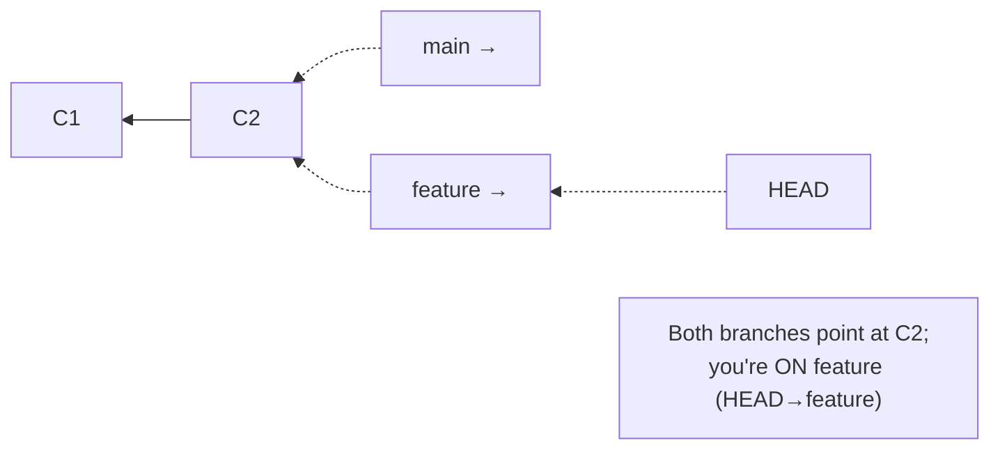
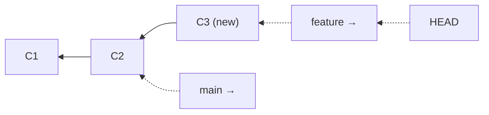
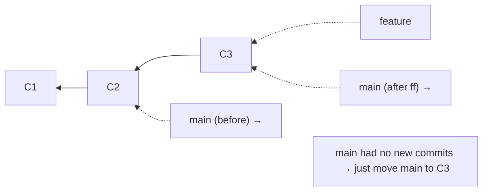
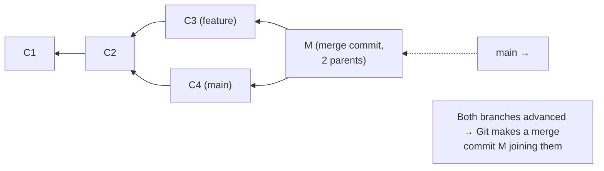

# Branching & Merging: parallel work and bringing it together

## 🧠 Intuition

A **branch** lets you work on something — a feature, a bug fix, an experiment — **in isolation**, without
disturbing the main line of development. When the work is ready, you **merge** it back. Because a branch is
just a movable pointer ([chapter 03](03-How-Git-Works-Internals.md)), creating one is instant and free, which
is why modern Git workflows revolve around branches: one branch per feature, merged when done.

> 💡 **Analogy — parallel universes for your project.** A branch is a parallel universe that splits off from
> the main timeline. In your "add-dark-mode" universe you can change anything freely — break things,
> experiment — while the main universe stays safe and shippable. When your experiment succeeds, you **merge**
> the two universes back together, combining their changes. If it fails, you just delete that universe and
> the main timeline is untouched. Branches make experimentation consequence-free.

## 🎯 The Problem

You're midway through building a big feature when an **urgent production bug** comes in. Your code is
half-finished and broken — you can't ship it, and you can't easily set it aside. Or: three teammates are all
editing the project at once, and you need to combine everyone's work without overwriting each other. Without
branches you'd be stuck juggling unfinished work and stepping on each other. **Branches** isolate each line
of work; **merging** safely recombines them.

## 📐 How It Works

### A branch is a pointer; HEAD says where you are

Recall from [chapter 03](03-How-Git-Works-Internals.md): a branch is a label on a commit. You start with
`main`. Create `feature` and it points at the same commit. **HEAD** marks which branch you're "on."



Commit on `feature` and only `feature` moves forward; `main` stays put:



### Two kinds of merge

When you merge `feature` into `main`, Git does one of two things:

**1. Fast-forward** — if `main` hasn't moved since `feature` branched off, Git just **slides `main` forward**
to `feature`'s commit. No new commit needed; the history stays linear.



**2. Three-way merge** — if **both** branches have new commits (the history diverged), Git creates a new
**merge commit** with **two parents**, combining both lines:



Git computes the merge by comparing both branch tips to their **common ancestor** (C2) — hence
"three-way" (two tips + the base).

### Merge conflicts

If both branches changed **the same lines** of the same file differently, Git can't decide which to keep —
that's a **conflict**. Git pauses the merge and marks the conflict in the file:

```text
<<<<<<< HEAD
color: blue;            ← your current branch's version
=======
color: green;           ← the incoming branch's version
>>>>>>> feature
```

You **edit the file** to the correct final version (removing the markers), `git add` it, and `git commit` to
complete the merge. Conflicts are normal — not errors — and only happen on overlapping changes.

## 💻 In Practice

### Creating and switching branches

```bash
git branch                      # list branches (* marks current)
git branch feature              # create 'feature' (doesn't switch to it)
git switch feature              # switch to it  (modern command)
git switch -c feature           # create AND switch in one step (most common)
#   older equivalent: git checkout -b feature

git switch main                 # go back to main
git branch -d feature           # delete a merged branch (safe; refuses if unmerged)
git branch -D feature           # force-delete (even if unmerged) — careful
git branch -m old new           # rename a branch
```

### Merging

```bash
git switch main                 # 1. go to the branch you want to merge INTO
git merge feature               # 2. merge feature into main
#   → "Fast-forward" or creates a merge commit, or reports conflicts

# Force a merge commit even when fast-forward is possible (keeps feature history visible):
git merge --no-ff feature

git branch -d feature           # 3. delete the now-merged branch
```

### Resolving a conflict

```bash
git merge feature
#   Auto-merging style.css
#   CONFLICT (content): Merge conflict in style.css
#   Automatic merge failed; fix conflicts and then commit the result.

git status                      # shows "Unmerged paths: style.css"
# → open style.css, find the <<<<<<< ======= >>>>>>> markers, edit to the desired final content
git add style.css               # mark this file's conflict resolved
git commit                      # complete the merge (Git pre-fills a merge message)

# Bail out and undo the whole merge attempt:
git merge --abort
```

## ⚖️ Trade-offs / When to Use

- **Branch for everything non-trivial** — every feature, fix, or experiment on its own branch keeps `main`
  always shippable and isolates work. It's cheap; do it freely.
- **Fast-forward vs merge commit:** fast-forward gives linear history but "hides" that work happened on a
  branch; `--no-ff` always records a merge commit, making the branch's existence visible (some teams
  standardize on this for traceability).
- **Merge vs [rebase](07-Rebase-vs-Merge.md):** merging preserves the true history (with merge commits);
  rebasing creates a linear history but rewrites commits — the subject of the next chapter.
- **Long-lived vs short-lived branches:** short-lived feature branches (merged quickly) cause fewer, smaller
  conflicts; long-lived branches drift far from `main` and produce painful merges
  ([workflows, ch.14](14-Workflows-and-Branching-Strategies.md)).

## 🚫 Common Mistakes & Gotchas

```text
❌ Committing straight to main for everything. → no isolation; main can become broken/unshippable.
✅ Use a branch per feature/fix; merge when ready (keep main clean).

❌ Panicking at a merge conflict as if it's an error. → it's normal; Git just needs you to choose.
✅ Edit the marked file to the correct content, remove the markers, `git add` + `git commit`.

❌ Leaving conflict markers (<<<<<<<) in the committed file. → broken code committed.
✅ Remove ALL markers and verify the file builds before `git add`.

❌ Letting a feature branch live for weeks, far behind main. → huge, painful conflicts at merge time.
✅ Keep branches short-lived; integrate often (merge/rebase main in regularly).

❌ `git branch feature` and assuming you're now ON it. → branch creates but doesn't switch.
✅ `git switch -c feature` to create AND switch.

❌ Deleting an unmerged branch with -D and losing the work. → (recoverable via reflog, but scary).
✅ Use -d (refuses if unmerged); only -D when you truly mean to discard (ch.18 to recover).
```

## 🌍 Real-World Use

Branching is the backbone of all modern collaboration: the **feature-branch workflow** (a branch per task,
merged via a pull request) is near-universal ([ch.14](14-Workflows-and-Branching-Strategies.md),
[ch.15](15-Pull-Requests-and-Code-Review.md)). The "urgent bug while mid-feature" scenario is solved daily by
stashing or committing your branch work, switching to a fix branch off `main`, shipping the fix, then
returning. Teams keep `main` (or `main` + a `develop` branch) always-deployable precisely *because* unfinished
work lives on isolated branches. Merge conflicts are a routine part of collaboration — knowing they're normal
and how to resolve them calmly is a core daily skill. Cheap branching is arguably *the* feature that made Git
win.

## 🎯 Practice (with full solutions)

### 1. Feature branch + merge — `Easy`
**Task:** From `main`, create a branch to add a footer, make a commit, then merge it back into `main` and
delete the branch.
**Solution:**
```bash
git switch -c add-footer          # create and switch
# ...edit files to add the footer...
git add . && git commit -m "Add site footer"
git switch main                   # go to the target branch
git merge add-footer              # fast-forward (main hadn't moved) → main now has the footer
git branch -d add-footer          # clean up the merged branch
```
**Why it works:** the feature was built in isolation on `add-footer`; merging moved `main` forward to include
it (a fast-forward since `main` had no new commits), and deleting the merged branch keeps the branch list
tidy — the standard feature-branch cycle.

### 2. Resolve a conflict — `Medium`
**Task:** You merge `feature` into `main` and get a conflict in `config.json` because both branches changed
the `"version"` line. Walk through resolving it.
**Solution:**
```bash
git merge feature
#   CONFLICT (content): Merge conflict in config.json
git status                        # config.json under "Unmerged paths"
```
Open `config.json` and find:
```text
<<<<<<< HEAD
  "version": "1.2.0",       ← main's value
=======
  "version": "1.3.0",       ← feature's value
>>>>>>> feature
```
Edit to the single correct value (say `"1.3.0"`), removing all three markers:
```text
  "version": "1.3.0",
```
Then:
```bash
git add config.json               # mark resolved
git commit                        # complete the merge (accept the prefilled message)
```
**Why it works:** the conflict arose because both sides changed the same line, so Git couldn't auto-pick;
editing the file to the intended final content and removing the markers tells Git the resolution, and
`add`+`commit` finalizes the merge commit that joins both branches.

## ✅ Key Takeaways

- A **branch** isolates a line of work; it's just a **movable pointer**, so branching is instant — branch
  freely (one per feature/fix) to keep `main` shippable. **HEAD** marks the branch you're on.
- **`git switch -c name`** creates + switches; **`git merge other`** (run from the target branch) brings work
  in.
- Merge is either a **fast-forward** (target hadn't moved → slide the pointer, linear history) or a
  **three-way merge** (both diverged → a **merge commit** with two parents, computed against the common
  ancestor).
- **Conflicts** happen only when both branches change the **same lines**; they're normal — edit the marked
  file, remove `<<<<<<< ======= >>>>>>>`, `git add`, `git commit` (or `git merge --abort`).
- Keep branches **short-lived** and integrate often to minimize conflict pain.

**Self-check:**
1. Why is creating a branch instant, and what does HEAD track?
2. What's the difference between a fast-forward and a three-way merge, and when does each happen?
3. What causes a merge conflict, and what are the steps to resolve one?

---
◀ Prev: [The Basic Workflow](05-The-Basic-Workflow.md) · ▲ [Index](README.md) · ▶ Next: [Rebase vs Merge](07-Rebase-vs-Merge.md)
