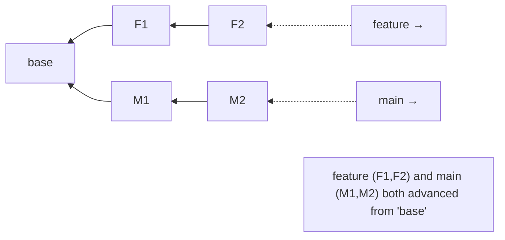
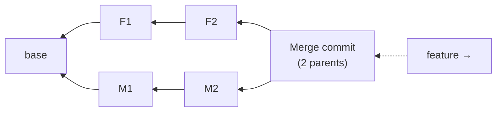
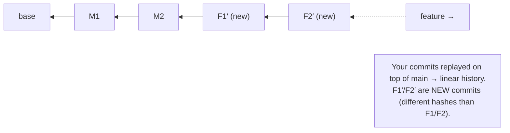

# Rebase vs Merge: two ways to combine work (and a golden rule)

## 🧠 Intuition

Both **merge** and **rebase** integrate changes from one branch into another — but they produce **different
histories**. **Merge** preserves exactly what happened: it ties two lines of work together with a merge
commit, keeping the true, branching shape. **Rebase** rewrites your branch's commits to appear as if you'd
started from the latest `main` — producing a **clean, linear history** as if no branching ever happened. The
choice is between *accurate history* (merge) and *tidy history* (rebase), with one critical safety rule.

> 💡 **Analogy — writing a group report.** You wrote your section while branched off an old draft. To
> combine with the team's updated draft you can either **staple** your pages onto theirs and add a note
> saying "merged here" (merge — you can see both threads and where they joined), or **re-transcribe** your
> section cleanly onto the *latest* draft as if you'd written it last, so the final report reads as one
> smooth document (rebase). Stapling preserves the real process; re-transcribing reads better — but you must
> never re-transcribe pages your teammates have already built upon.

## 🎯 The Problem

Your `feature` branch has 3 commits. Meanwhile `main` got 5 new commits from teammates. You need your work to
include theirs. If you **merge** `main` into `feature` repeatedly, your history fills with merge commits and
becomes a tangled "railroad diagram" that's hard to read. If you **rebase**, you get a clean straight line —
but if you rebase commits that others have *already pulled*, you rewrite shared history and create chaos for
them. Knowing which to use, when, is what this chapter is about.

## 📐 How It Works

### Starting point: divergent branches



### Merge: join with a merge commit (history preserved)

`git merge main` (while on `feature`) creates a **merge commit** with two parents. Both branches' original
commits stay exactly as they were; the graph shows the divergence and the join.


- ✅ **Truthful** — records exactly what happened and when branches joined; **non-destructive** (no commit is
  changed).
- ❌ **Cluttered** — many merge commits make history a hard-to-follow web; the actual change is split across
  the diagram.

### Rebase: replay your commits on top (history linearized)

`git rebase main` (while on `feature`) takes your commits (F1, F2), sets them aside, moves `feature` to the
tip of `main`, and **re-applies your commits one by one on top** — creating **new** commits (F1′, F2′) with
new hashes. The result is a straight line.


- ✅ **Clean, linear** history — reads like a sequence of changes with no merge noise; easy to follow,
  bisect, and review.
- ❌ **Rewrites commits** (new hashes) — so it must **not** be done to commits others have already based work
  on (the golden rule, below).

### The Golden Rule of Rebasing

> **Never rebase commits that exist outside your local repository — i.e., that others may have already
> pulled.** Rebasing rewrites history (new hashes); if you rewrite *shared* commits and force-push, everyone
> else's history diverges from yours, causing duplicate commits and painful confusion.

**Safe to rebase:** your **local, unpushed** commits, or a feature branch that **only you** work on.
**Not safe:** shared branches like `main`/`develop`, or any commits teammates have pulled.

### A common, safe pattern: rebase your feature, merge into main

Many teams: **rebase** your feature branch onto the latest `main` (cleaning up *your* local history and
making the eventual merge trivial), then **merge** the feature into `main`. You get tidy feature history *and*
a clear integration point — without rewriting anyone else's commits.

## 💻 In Practice

```bash
# --- MERGE: bring main's updates into your feature (creates a merge commit) ---
git switch feature
git merge main                 # feature now has main's commits + a merge commit

# --- REBASE: replay your feature commits on top of the latest main (linear) ---
git switch feature
git rebase main                # moves feature's commits on top of main (new hashes)
#   If conflicts occur, Git pauses on each conflicting commit:
git status                     # shows the conflict
# ...edit the file to resolve...
git add <file>
git rebase --continue          # proceed to the next commit
git rebase --skip              # skip the current commit (rare)
git rebase --abort             # cancel the whole rebase, back to the start

# --- Keep main itself linear when pulling (avoid noisy merge commits) ---
git pull --rebase              # fetch + rebase your local commits on top of upstream (ch.08)
git config --global pull.rebase true   # make that the default for pull

# --- Update a feature branch after rebasing (you rewrote history → force-push SAFELY) ---
git push --force-with-lease    # safer than --force: refuses if the remote moved unexpectedly
```

> ⚠️ After a rebase you must **force-push** to update the remote branch (the commits changed). Always use
> **`--force-with-lease`** (not `--force`) — it refuses to overwrite if someone else pushed in the meantime,
> protecting against clobbering others' work.

## ⚖️ When to Use Which

| Situation | Use |
|-----------|-----|
| Integrating a finished feature into `main` (keep an explicit integration point) | **Merge** (often `--no-ff`) |
| Cleaning up **your local** feature branch before sharing/merging | **Rebase** onto `main` |
| Keeping **your local** `main`/`pull` linear | `git pull --rebase` |
| Public/shared history (`main`, `develop`, anything others pulled) | **Merge** (never rebase) |
| You value a truthful record of when things merged | **Merge** |
| You value a clean, linear, easy-to-read/bisect history | **Rebase** (local only) |

**Rule of thumb:** *Rebase to clean up your own local work; merge to integrate shared work. Never rebase what
others have.*

## 🚫 Common Mistakes & Gotchas

```text
❌ Rebasing a shared branch (main/develop) or commits others have pulled, then force-pushing. → chaos: everyone's history diverges.
✅ Only rebase LOCAL, unpushed commits or solo branches. Merge shared history (the Golden Rule).

❌ Using `git push --force` after a rebase. → can silently overwrite a teammate's new commits.
✅ Use `git push --force-with-lease` — it refuses if the remote moved unexpectedly.

❌ Thinking rebase and merge produce the same commits. → rebase creates NEW commits (new hashes).
✅ Rebased commits are rewritten copies; the originals are gone (recoverable via reflog, ch.18).

❌ Abandoning a rebase mid-conflict and getting confused. → use `git rebase --abort` to safely cancel.
✅ Resolve → `git add` → `git rebase --continue`, or `--abort` to start over cleanly.

❌ Merging main into your feature over and over. → history fills with merge commits ("merge bubbles").
✅ Rebase your feature onto main for a clean line (locally), or keep features short-lived.
```

## 🌍 Real-World Use

The merge-vs-rebase choice is one of the most discussed topics in Git, and teams adopt explicit conventions.
Many use a **"rebase locally, merge to integrate"** approach: developers rebase their feature branch onto the
latest `main` to keep *their* commits tidy and conflict-free, then open a pull request that's merged (often
squashed — [ch.13](13-Rewriting-History.md)) into `main`. **`git pull --rebase`** is widely recommended to
avoid cluttering history with trivial merge commits every time you sync. The **Golden Rule** is sacrosanct in
every shop: rebasing shared history is a classic way to ruin a teammate's day. Knowing *why* (rebase rewrites
hashes) and *when* (local only) is a strong signal of Git competence in interviews and on the job.

## 🎯 Practice (with full solutions)

### 1. Clean up before merging — `Medium`
**Task:** Your solo `feature` branch has 3 local (unpushed) commits. `main` has advanced. You want your work
on top of the latest `main` with a clean, linear history, then integrated into `main`. What do you run?
**Solution:**
```bash
git switch feature
git rebase main                 # replay your 3 commits on top of the latest main (linear, local-only → safe)
#   (resolve any conflicts: edit → git add → git rebase --continue)
git switch main
git merge feature               # now a clean fast-forward (or simple merge) into main
git branch -d feature
```
**Why it works:** the commits are **local and unpushed** (solo branch), so rebasing is safe (Golden Rule
satisfied); rebasing onto `main` linearizes your work and makes the final integration trivial — tidy history
without rewriting anyone else's commits.

### 2. Spot the Golden Rule violation — `Easy`
**Task:** A teammate rebased the shared `main` branch to "clean it up" and force-pushed. The next morning,
everyone's `git pull` is a mess of duplicate commits and conflicts. What rule did they break, and what should
they have done?
**Solution:** They violated the **Golden Rule of Rebasing**: never rebase commits that exist outside your
local repo / that others have already pulled. Rebasing `main` **rewrote shared history** (new hashes), so
everyone else's local `main` no longer matched the remote — producing duplicates and conflicts on pull.
Instead, shared branches should be integrated with **merge** (non-destructive); cleanup of shared history, if
truly needed, requires coordinating with the whole team. (Recovery: everyone resets their local `main` to the
new remote, but the right fix is *don't rebase shared branches*.)
**Why it works:** rebasing changes commit identities, so any history others have built on top of must not be
rebased — merging preserves shared commits, which is why it's the correct tool for shared branches.

## ✅ Key Takeaways

- **Merge** joins branches with a **merge commit** — **truthful** and **non-destructive**, but can clutter
  history. **Rebase** **replays your commits** onto another branch's tip — **clean, linear** history, but
  **rewrites commits** (new hashes).
- **Golden Rule:** **never rebase commits others have** (shared branches like `main`/`develop`, or anything
  pushed/pulled by others). Rebase only **local, unpushed** commits or solo branches.
- Common safe pattern: **rebase your feature locally** to tidy it, then **merge** it into `main`.
- Rebasing requires a **force-push** to update the remote — always **`--force-with-lease`**, never plain
  `--force`.
- **`git pull --rebase`** keeps your local history linear when syncing; resolve rebase conflicts with
  `git add` + `git rebase --continue` (or `--abort`).

**Self-check:**
1. What history does merge produce versus rebase, and what's the key downside of each?
2. State the Golden Rule of Rebasing and explain *why* rebasing shared commits is dangerous.
3. Why must you force-push after a rebase, and why use `--force-with-lease` instead of `--force`?

---
◀ Prev: [Branching & Merging](06-Branching-and-Merging.md) · ▲ [Index](README.md) · ▶ Next: [Remotes & Collaboration](08-Remotes-and-Collaboration.md)
