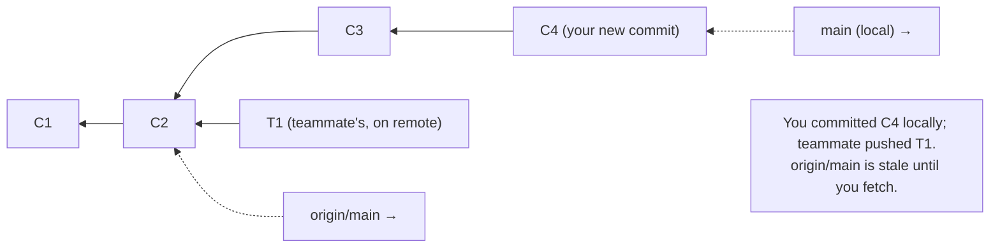

# Remotes & Collaboration: fetch, pull, push, and staying in sync

## 🧠 Intuition

A **remote** is a copy of your repository hosted somewhere else — typically on GitHub/GitLab — that you and
your teammates sync with. Because Git is [distributed](01-What-Is-Git-and-Version-Control.md), you work
**locally** (commit, branch, all offline) and then **push** your commits up to share them, and **pull** to
bring teammates' commits down. The remote is the **shared meeting point**; your local repo is your private
workspace.

> 💡 **Analogy — a shared cloud folder for a team document, but smarter.** Everyone has the full document on
> their own laptop and edits offline. Periodically you **upload** (push) your changes to the shared copy and
> **download** (pull) everyone else's. Unlike a dumb shared folder, Git doesn't overwrite — it **merges**
> changes intelligently and refuses to let you clobber work you haven't seen yet. The remote (e.g. "origin"
> on GitHub) is that shared copy everyone syncs against.

## 🎯 The Problem

You committed your work locally — but it's only on **your** machine. Your teammates can't see it, and if your
laptop dies, it's gone. Meanwhile, teammates have pushed their own commits to the shared repo that you don't
have yet. You need to (a) **send** your commits to the shared remote, (b) **receive** theirs, and (c) do this
**without overwriting** each other. That's what `push`, `fetch`/`pull`, and tracking branches handle — and
why `push` sometimes gets **rejected** ("updates were rejected") until you integrate the latest first.

## 📐 How It Works

### Remotes and `origin`

A remote is just a **named URL** pointing at a hosted copy. When you `git clone`, Git automatically names the
source remote **`origin`** (a convention, not magic). You can have multiple remotes (e.g. `origin` =
your fork, `upstream` = the original repo — see [forks, ch.15](15-Pull-Requests-and-Code-Review.md)).

```mermaid
flowchart LR
    subgraph Local [Your machine]
      WT[working tree] --> Local[(local repo\n+ remote-tracking branches)]
    end
    Local -->|git push| Remote[(origin\nGitHub)]
    Remote -->|git fetch / pull| Local
    subgraph Team
      T1[(Teammate's local)] <--> Remote
    end
```

### Remote-tracking branches: `origin/main`

Your local repo keeps **remote-tracking branches** — read-only bookmarks of where the remote's branches were
**last time you synced**. `origin/main` means "where `main` was on origin as of my last fetch." Your local
`main` and `origin/main` are **different pointers** — yours moves when you commit; `origin/main` moves only
when you `fetch`/`pull`.



### fetch vs pull

- **`git fetch`** — **downloads** new commits and updates remote-tracking branches (`origin/main`), but does
  **NOT** change your working files or local branches. Safe, non-destructive — "show me what's new."
- **`git pull`** = **`git fetch` + integrate** (merge or rebase) the remote's changes into your **current
  local branch**, updating your working files. Convenient, but it changes your branch — so understand it.

```text
git pull  ==  git fetch  +  git merge origin/<branch>     (default)
git pull --rebase  ==  git fetch  +  git rebase origin/<branch>   (linear; ch.07)
```

### push and why it gets rejected

**`git push`** uploads your local commits to the remote. But Git **refuses** (`! [rejected]`) if the remote
has commits you don't have locally — pushing would lose them. The fix: **pull (integrate) first**, resolve any
merge, then push.

```text
$ git push
 ! [rejected]        main -> main (fetch first)
error: Updates were rejected because the remote contains work that you do not have locally.
→  git pull   (integrate teammate's commits)   then   git push
```

### Upstream / tracking branches

A local branch can **track** a remote branch (its "upstream"), so plain `git push`/`git pull` know where to
go. `git clone` sets this up automatically for `main`. For a new local branch, set it on first push with
`-u`.

## 💻 In Practice

```bash
# --- Inspect remotes ---
git remote -v                          # list remotes and their URLs
git remote add origin git@github.com:user/repo.git   # add a remote named origin
git remote add upstream git@github.com:original/repo.git  # a second remote (e.g. the upstream of a fork)

# --- Get updates ---
git fetch                              # download new commits; update origin/* (doesn't touch your files)
git fetch origin                       # explicitly from origin
git log --oneline main..origin/main    # see what's new on the remote that you don't have yet
git pull                               # fetch + merge into current branch
git pull --rebase                      # fetch + rebase (linear history; ch.07)

# --- Send updates ---
git push                               # push current branch to its upstream
git push -u origin feature             # FIRST push of a new branch: set upstream (-u) so future push/pull are bare
git push origin --delete feature       # delete a remote branch

# --- See divergence ---
git status                             # "Your branch is ahead/behind 'origin/main' by N commits"
git branch -vv                         # show each local branch's upstream and ahead/behind counts
```

### The typical daily sync

```bash
git switch main
git pull                  # 1. get the latest from the team
git switch -c feature     # 2. branch off the fresh main
# ...work, commit...
git push -u origin feature  # 3. publish your branch (first time)
# ...more work, commit...
git push                    # 4. subsequent pushes are just `git push`
# (then open a Pull Request — ch.15)
```

## ⚖️ Trade-offs / Habits

- **`fetch` then review, vs `pull` directly:** `fetch` + inspect (`git log main..origin/main`) is the
  cautious approach — you see what's coming before integrating; `pull` is the convenient one-step. Pull
  freely on simple branches; fetch-first when you want control.
- **`pull` (merge) vs `pull --rebase`:** merge is safe and truthful; `--rebase` keeps your local history
  linear (no trivial merge commits) — many prefer it for personal branches ([ch.07](07-Rebase-vs-Merge.md)).
- **Pull before you start work** each day so you branch off the latest and minimize conflicts later.
- **Push often** so teammates see your progress and your work is backed up off your machine.

## 🚫 Common Mistakes & Gotchas

```text
❌ Committing locally for days and never pushing. → invisible to the team; lost if your machine dies.
✅ Push regularly; the remote is your shared backup.

❌ Panic when `git push` is rejected ("fetch first"). → it's protecting teammate commits you don't have.
✅ `git pull` (integrate), resolve any conflict, then `git push`.

❌ Thinking `git fetch` changed your files. → fetch only updates origin/*; it never touches your working tree.
✅ Use fetch to preview; pull (or merge origin/branch) to actually integrate.

❌ Confusing local `main` with `origin/main`. → they're separate pointers; origin/main is stale until you fetch.
✅ `git status` / `git branch -vv` show how far ahead/behind your branch is from its upstream.

❌ Forgetting -u on a new branch's first push, then plain `git push` fails. → no upstream set.
✅ First push: `git push -u origin <branch>`; after that, plain `git push` works.

❌ Force-pushing to a shared branch to "win" a rejected push. → overwrites teammates' commits (ch.07 Golden Rule).
✅ Never force-push shared branches; integrate properly. Force only your own rebased feature, with --force-with-lease.
```

## 🌍 Real-World Use

This is the daily heartbeat of team development: pull the latest, branch, work, commit, push, open a pull
request. The "push rejected → pull first" dance happens constantly and is Git protecting the team from lost
work. Remote-tracking branches (`origin/*`) are how you reason about "what's on the server vs what's local."
The **fork-and-upstream** pattern (two remotes) powers open-source contribution: you push to your fork
(`origin`) and pull updates from the original project (`upstream`) — covered in
[chapter 15](15-Pull-Requests-and-Code-Review.md). Understanding fetch-vs-pull and why pushes get rejected is
the difference between fighting Git and flowing with it.

## 🎯 Practice (with full solutions)

### 1. Handle a rejected push — `Medium`
**Task:** You finished a change on `main`, but `git push` is rejected: "Updates were rejected because the
remote contains work that you do not have locally." What happened, and how do you safely get your commit
pushed?
**Solution:** A teammate **pushed commits to `origin/main`** that you don't have locally; Git refuses your
push because it would discard their work. Integrate first, then push:
```bash
git pull                 # fetch + merge origin/main into your local main (resolve conflicts if any)
#   (or: git pull --rebase  to replay your commit on top, for a linear history)
git push                 # now accepted — the remote's history is included
```
**Why it works:** the rejection is Git ensuring no commits are lost; pulling brings the remote's commits into
your branch (merging or rebasing your commit with theirs), after which your local history contains everything
the remote has plus your change, so the push fast-forwards cleanly.

### 2. fetch vs pull — `Easy`
**Task:** You want to see what your teammates have pushed **without** changing your current working files
yet. Which command, and how do you then view exactly what's new?
**Solution:**
```bash
git fetch                              # downloads new commits, updates origin/* — does NOT touch your files
git log --oneline main..origin/main    # list commits on origin/main that your local main doesn't have
git diff main origin/main              # see the actual changes
# When ready: git merge origin/main   (or git pull) to integrate.
```
**Why it works:** `fetch` updates remote-tracking branches only, so your working tree and local branch are
untouched — letting you **inspect** incoming work (via the `main..origin/main` range) before deciding to
integrate, unlike `pull` which fetches *and* merges in one step.

## ✅ Key Takeaways

- A **remote** (conventionally **`origin`**) is a hosted copy you sync with; you work **locally** and
  **push**/**pull** to share. Every clone is a full, independent copy.
- **Remote-tracking branches** (`origin/main`) bookmark where the remote was at your **last sync** — separate
  pointers from your local branches.
- **`git fetch`** downloads new commits and updates `origin/*` **without touching your files** (safe preview);
  **`git pull`** = fetch **+ merge** (or `--rebase`) into your current branch.
- **`git push`** uploads your commits; it's **rejected** if the remote has commits you lack — **pull
  (integrate) first**, then push. First push of a new branch: **`git push -u origin <branch>`**.
- **Pull before you start, push often**; never **force-push shared branches**.

**Self-check:**
1. What's the difference between `git fetch` and `git pull`?
2. Why does `git push` get rejected sometimes, and how do you fix it safely?
3. What is `origin/main`, and how does it differ from your local `main`?

---
◀ Prev: [Rebase vs Merge](07-Rebase-vs-Merge.md) · ▲ [Index](README.md) · ▶ Next: [Undoing Things](09-Undoing-Things.md)
