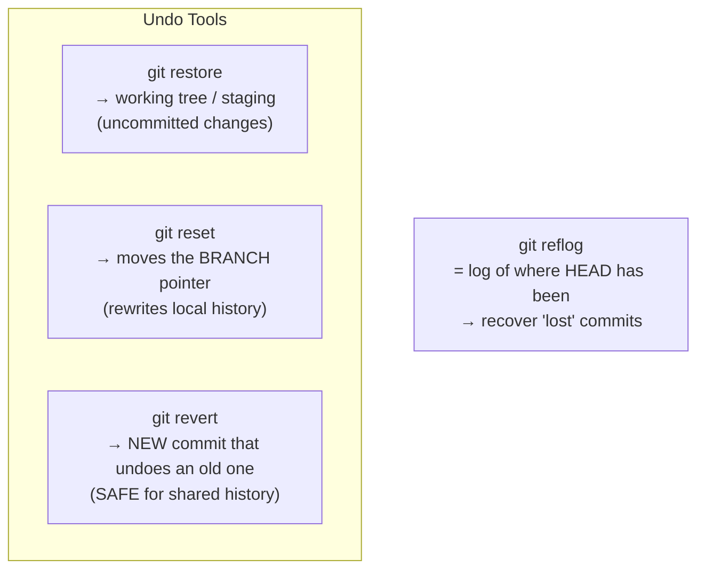
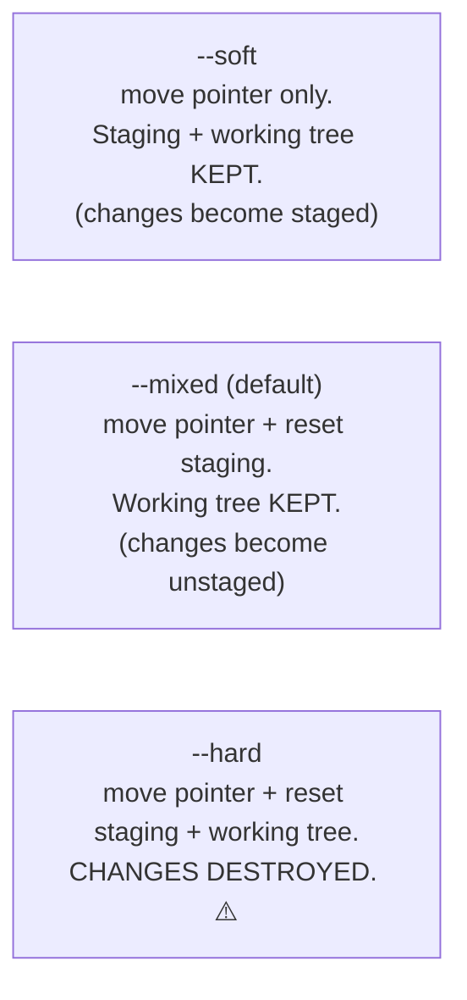
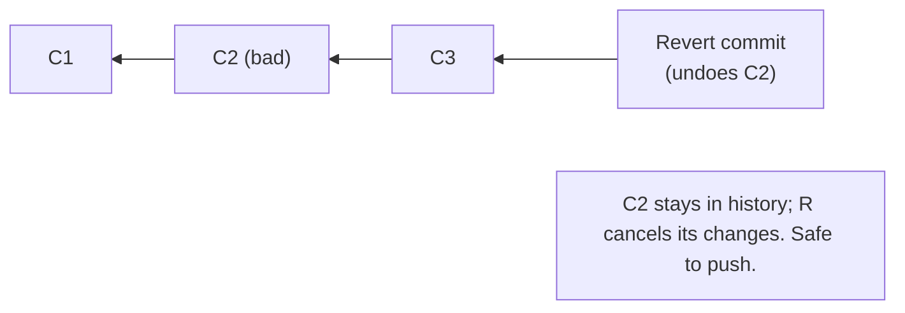

# Undoing Things: restore, reset, revert, and the reflog safety net

## 🧠 Intuition

Git has several ways to "undo," and the confusion comes from not knowing **which area** each one touches
([the three areas, ch.04](04-The-Three-Areas-and-Lifecycle.md)) and whether it's **safe for shared history**.
The key distinctions: **`restore`** undoes uncommitted changes (working tree / staging), **`reset`** moves the
branch pointer (rewrites local history), and **`revert`** makes a *new* commit that undoes an old one (safe
for shared history). And underpinning all of it is the **reflog** — Git's "undo history" that makes almost
nothing truly unrecoverable.

> 💡 **Analogy — different kinds of "undo."** Undoing in Git is like editing a published book. **`restore`**
> = erasing pencil notes you haven't typed up yet (uncommitted work). **`reset`** = ripping out the last few
> pages of your *private draft* before anyone's read it. **`revert`** = the book is already printed and
> distributed, so instead of un-printing a page (impossible), you publish an *erratum* that cancels it out (a
> new commit). And the **reflog** is the publisher's archive — even pages you "ripped out" are recoverable
> for a while.

## 🎯 The Problem

You need to undo — but "undo" means different things:
- "I edited a file and want to throw the edit away" (uncommitted change).
- "I staged something by mistake" (wrong area).
- "My last commit was bad — I want it gone from my local branch" (rewrite local history).
- "A commit that's already pushed/shared broke things and I must cancel it safely" (shared history).
- "I ran a destructive command and lost commits — get them back!" (recovery).

Using the wrong tool can **destroy work** or **corrupt shared history**. Matching the right command to each
situation — and knowing the reflog has your back — is what makes you fearless.

## 📐 How It Works

### The map: which command touches which area



### `git restore` — undo uncommitted changes

- **`git restore <file>`** — discard working-tree changes to a file (revert it to the last commit/staged
  version). **Destructive** to uncommitted edits — they're gone.
- **`git restore --staged <file>`** — unstage a file (move it out of the staging area; keep the edit in the
  working tree). Non-destructive.

(These replaced the overloaded `git checkout <file>` for this purpose.)

### `git reset` — move the branch pointer (three modes)

`git reset` moves your current branch (and HEAD) to a target commit, and optionally changes the staging area
and working tree. The mode controls **how far** the undo reaches:



| Mode | Branch pointer | Staging area | Working tree | Use for |
|------|----------------|--------------|--------------|---------|
| `--soft` | moved | unchanged | unchanged | "uncommit but keep changes staged" (e.g. recombine commits) |
| `--mixed` (default) | moved | reset to target | unchanged | "uncommit and unstage, keep my edits" |
| `--hard` | moved | reset | **reset (destroys edits)** | "throw everything away back to that commit" ⚠️ |

`git reset HEAD~1` (mixed) undoes the last commit but **keeps your changes** as unstaged edits — the most
common "oops, let me redo that commit." `git reset --hard HEAD~1` undoes the commit **and discards the
changes** — powerful and dangerous.

> ⚠️ **`reset` rewrites history** by moving the branch pointer, so — like rebase — **don't `reset` commits
> that are already pushed/shared** (use `revert` instead). It's fine for local, unshared commits.

### `git revert` — safe undo for shared history

**`git revert <commit>`** creates a **new commit** that applies the **inverse** of the target commit,
cancelling its effect **without removing it from history**. Because it adds a commit (rather than rewriting),
it's **safe to use on shared branches** — everyone just gets the new "undo" commit.



### `git reflog` — the safety net

Git keeps a **reflog**: a log of **every** position `HEAD` (and each branch) has pointed to — every commit,
reset, rebase, checkout, merge. Even after a `reset --hard` or a "lost" rebase, the old commit is still in the
reflog (and the object database) for a while (typically ~90 days). So you can **recover** it.

```bash
git reflog                       # HEAD@{0}, HEAD@{1}, ... each a past position with its commit hash
git reset --hard HEAD@{2}        # jump back to where HEAD was 2 moves ago — UNDO a bad reset/rebase
```

The reflog is **local** (it's your machine's history of HEAD) and is *the* reason experienced users stay calm:
almost nothing is truly lost. (More recovery in [chapter 18](18-Troubleshooting-and-Recovery.md).)

## 💻 In Practice — the cheat map

```bash
# Discard an uncommitted edit to a file (DESTRUCTIVE to that edit):
git restore file.txt

# Unstage a file (keep the edit):
git restore --staged file.txt

# Undo the LAST commit but keep the changes (unstaged) to redo it:
git reset HEAD~1                 # (--mixed, the default)

# Undo the last commit and keep changes STAGED (e.g. to recommit differently):
git reset --soft HEAD~1

# Nuke the last commit AND its changes (gone from working tree) — careful:
git reset --hard HEAD~1

# Safely cancel a commit that's already pushed/shared:
git revert <commit-hash>         # makes a new "undo" commit; then push

# Undo an amend or a fix to the very latest commit's message:
git commit --amend -m "Better message"   # (ch.13 — only on unpushed commits)

# RECOVER from a bad reset/rebase/deletion:
git reflog                       # find the hash/position you want back
git reset --hard HEAD@{n}        # or: git checkout -b rescue <hash>
```

## ⚖️ Choosing the Right Tool

| You want to… | Use | Safe for shared history? |
|--------------|-----|--------------------------|
| Discard an unstaged file edit | `git restore file` | n/a (uncommitted) |
| Unstage a file (keep edit) | `git restore --staged file` | n/a |
| Uncommit, keep changes to redo | `git reset HEAD~1` (mixed/soft) | ❌ local only |
| Throw away commits + changes | `git reset --hard <commit>` | ❌ local only ⚠️ |
| Cancel a pushed/shared commit | `git revert <commit>` | ✅ yes |
| Recover lost commits | `git reflog` + `reset`/`checkout` | n/a (recovery) |

**Rule:** `reset` rewrites history (local only); **`revert`** adds a commit (shared-safe). When in doubt on a
shared branch, **revert**.

## 🚫 Common Mistakes & Gotchas

```text
❌ `git reset --hard` on shared/pushed commits, then force-push. → rewrites shared history (breaks teammates).
✅ Use `git revert` for anything already pushed; reset --hard only on local, unshared commits.

❌ Using `git restore file` to "unstage" → it DISCARDS the edit. 
✅ `git restore --staged file` unstages (keeps the edit); plain restore discards working-tree changes.

❌ Believing `reset --hard` permanently destroyed your commits. → they're in the reflog for ~90 days!
✅ `git reflog` + `git reset --hard HEAD@{n}` (or `git checkout -b rescue <hash>`) recovers them.

❌ Confusing reset modes. → losing work with --hard when you meant --soft/--mixed.
✅ Remember: soft = keep staged, mixed = keep unstaged, hard = destroy. Default is mixed.

❌ `git revert` of a merge commit without -m. → Git doesn't know which parent → error.
✅ `git revert -m 1 <merge-commit>` (specify the mainline parent).

❌ Reaching for force-push to "undo" a shared mistake. → revert is the safe, push-friendly undo.
✅ revert + normal push; keep force-push for your own local rebased branches only.
```

## 🌍 Real-World Use

These commands are the daily toolkit for fixing mistakes. `git restore` recovers from "ugh, that edit was
wrong." `git reset --soft HEAD~1` is the standard move to **recombine or re-message a just-made commit**.
`git revert` is *the* way to undo something already on `main` (a bad deploy, a broken commit) **safely** — CI/CD
pipelines and release processes rely on revert because it doesn't rewrite shared history. And the **reflog** is
the unsung hero: countless "I lost my commits!" panics are solved in seconds with `git reflog`. Internalizing
"reset rewrites (local), revert adds (shared-safe), reflog rescues" is a hallmark of Git fluency.

## 🎯 Practice (with full solutions)

### 1. Undo a local commit but keep the work — `Medium`
**Task:** You just committed, then realized the commit message is wrong and you also forgot to include a file.
The commit is **not pushed**. Undo the commit, keep all your changes, and redo it correctly.
**Solution:**
```bash
git reset --soft HEAD~1     # uncommit; changes stay STAGED (nothing lost)
git add forgotten-file.txt  # add the file you forgot
git commit -m "Correct, complete message"
# (Alternatively, since it's just the last commit: git commit --amend — see ch.13.)
```
**Why it works:** `reset --soft HEAD~1` moves the branch pointer back one commit but leaves the staging area
and working tree intact, so your changes are preserved (staged) and you simply re-commit them — a clean redo
of the last (unpushed) commit with the correct message and contents.

### 2. Safely undo a pushed commit + recover from a bad reset — `Medium`
**Task:** (a) A commit you already **pushed** to `main` broke the build. Undo its effect safely. (b)
Separately, you ran `git reset --hard HEAD~3` on a local branch and panicked — get those 3 commits back.
**Solution:**
(a) Use **revert** (shared-safe — adds an undo commit, doesn't rewrite history):
```bash
git revert <bad-commit-hash>   # creates a new commit undoing the bad one
git push                        # safe normal push
```
(b) Use the **reflog** to find where the branch was before the reset and restore it:
```bash
git reflog                      # find the entry just BEFORE the reset, e.g. HEAD@{1} = <hash> "commit: ..."
git reset --hard HEAD@{1}       # (or: git reset --hard <hash>) → your 3 commits are back
```
**Why it works:** (a) `revert` cancels the bad change with a *new* commit, so shared history stays intact and
the push is non-destructive; (b) `reset --hard` only moved the pointer — the commits remained in the object
store and the reflog records the pre-reset position, so resetting back to it fully recovers them. Almost
nothing is truly lost.

## ✅ Key Takeaways

- Match the tool to the area/scope: **`git restore`** undoes **uncommitted** changes (working tree / `--staged`
  to unstage); **`git reset`** **moves the branch pointer** (rewrites **local** history); **`git revert`**
  adds a **new commit** that undoes an old one (**safe for shared history**).
- **`reset` modes:** **`--soft`** (keep changes staged), **`--mixed`** (default; keep changes unstaged),
  **`--hard`** (⚠️ destroy changes). `git reset HEAD~1` is the common "uncommit, keep my work."
- **Never `reset`/rewrite pushed/shared commits — use `revert`.** Revert is the push-safe undo.
- The **reflog** (`git reflog`) records every position HEAD has held → **recover "lost" commits** after a bad
  reset/rebase/deletion (`git reset --hard HEAD@{n}` or `git checkout -b rescue <hash>`). Almost nothing is
  truly gone.
- When unsure on a shared branch: **revert**. When you think you lost work: **reflog**.

**Self-check:**
1. What's the difference between `git restore file` and `git restore --staged file`?
2. Explain the three `reset` modes and which one destroys your working changes.
3. When must you use `revert` instead of `reset`, and how does the reflog let you recover from `reset --hard`?

---
◀ Prev: [Remotes & Collaboration](08-Remotes-and-Collaboration.md) · ▲ [Index](README.md) · ▶ Next: [Stashing & Cleaning](10-Stashing-and-Cleaning.md)
