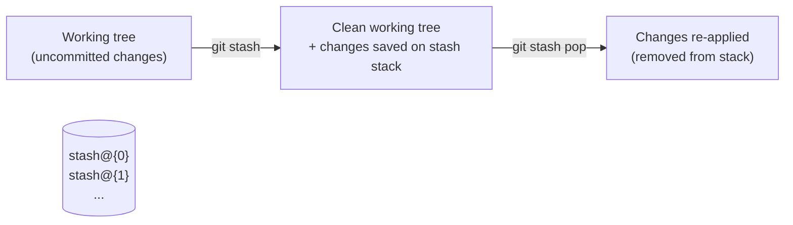

# Stashing & Cleaning: park work-in-progress and tidy up

## 🧠 Intuition

Sometimes you have uncommitted changes but need a **clean working tree right now** — to switch branches, pull
updates, or handle an urgent fix — without committing half-finished work. **`git stash`** sets your changes
aside in a safe holding area and gives you a clean slate; later you bring them back. **`git clean`** is the
opposite housekeeping tool: it **deletes untracked files** to tidy a cluttered working directory. One parks
work; the other removes junk.

> 💡 **Analogy — a drawer to sweep your desk into.** You're mid-task with papers everywhere, and the boss
> drops an urgent job on your desk. You sweep your current papers into a labeled drawer (stash) so your desk
> is clear, do the urgent job, then pull your papers back out and resume exactly where you were. **Clean** is
> the trash can — for the scrap paper and junk (untracked files) you never want to keep. The drawer preserves;
> the trash can discards.

## 🎯 The Problem

You're halfway through a feature — files edited, nothing committed — when an **urgent bug** needs fixing on
`main`. You can't switch branches cleanly: Git will either carry your messy changes along or refuse. You don't
want to make a junk "WIP" commit. You need to **temporarily set aside** your work, get a clean tree, fix the
bug, then **restore** your work-in-progress. Separately, after a build your directory is full of generated
junk files (untracked) you want gone. `stash` and `clean` solve these two everyday needs.

## 📐 How It Works

### `git stash` — shelve uncommitted changes

`git stash` takes your **uncommitted changes** (staged + unstaged tracked modifications), saves them on a
**stash stack**, and **reverts your working tree to a clean state** (matching the last commit). Your changes
aren't lost — they're stored — and you can re-apply them anytime, even on a different branch.



- The stash is a **stack** — multiple stashes are `stash@{0}` (most recent), `stash@{1}`, etc.
- **`pop`** re-applies the top stash **and removes it** from the stack; **`apply`** re-applies but **keeps**
  it (useful to apply the same stash to multiple branches).
- By default `stash` shelves **tracked** changes only; add **`-u`** to include **untracked** files too.

### `git clean` — delete untracked files

`git clean` **removes untracked files** (files Git isn't tracking — build outputs, generated files, junk).
It's **destructive and irreversible** (these files aren't in Git, so the reflog can't save them), so Git
requires a **`-f`** (force) flag, and you should always **dry-run with `-n` first**.

```text
git clean -n     # DRY RUN: list what WOULD be deleted (always do this first!)
git clean -f     # actually delete untracked files
git clean -fd    # also delete untracked directories
git clean -fX    # delete only files ignored by .gitignore (build artifacts)
git clean -fx    # delete ALL untracked incl. ignored (nuke everything not tracked) ⚠️
```

Note: `clean` does **not** touch tracked files or your committed history — only untracked files.

## 💻 In Practice

### The classic "urgent fix" interruption

```bash
# You're mid-feature with uncommitted changes; an urgent bug comes in.
git stash                       # shelve your changes → clean working tree
#   (or: git stash -u   to include untracked files too)
git switch main
git pull
git switch -c hotfix
# ...fix the bug, commit, push, merge...
git switch feature              # back to your feature branch
git stash pop                   # restore your work-in-progress and continue
```

### Managing the stash stack

```bash
git stash                       # stash current changes (auto-named)
git stash push -m "half-done navbar"   # stash WITH a descriptive message
git stash list                  # show all stashes: stash@{0}, stash@{1}, ...
git stash show -p stash@{0}     # see the diff of a stash
git stash apply stash@{1}       # re-apply a specific stash, KEEP it on the stack
git stash pop                   # re-apply the top stash and REMOVE it
git stash drop stash@{0}        # delete a stash without applying
git stash clear                 # delete ALL stashes ⚠️
git stash branch newbranch      # create a branch from a stash (handy if it conflicts with current work)
```

### Cleaning untracked junk

```bash
git status                      # see untracked files
git clean -n                    # DRY RUN — what would be removed (do this first!)
git clean -fd                   # remove untracked files AND directories
git clean -fdX                  # remove only ignored build artifacts (keep new source files)
```

## ⚖️ Trade-offs / When to Use

- **Stash vs a WIP commit:** stash is great for *quick, short-lived* interruptions ("park this for 10
  minutes"). For anything you'll leave for a while, a **proper commit on a branch** (even a "WIP" one you'll
  later amend/squash) is safer and more visible — stashes are easy to forget and aren't shared or pushed.
- **`pop` vs `apply`:** `pop` for the normal "restore and move on"; `apply` when you want to apply the same
  stashed changes to **multiple branches** (it leaves the stash on the stack).
- **`-u` (untracked):** include untracked files when your WIP involves new files; otherwise they'd be left
  behind (and a plain stash wouldn't clean them).
- **`clean` is irreversible** — untracked files aren't in Git, so there's **no reflog recovery**. Always
  `-n` first.

## 🚫 Common Mistakes & Gotchas

```text
❌ `git clean -f` without `-n` first. → permanently deletes untracked files you wanted (NO recovery).
✅ ALWAYS `git clean -n` (dry run) first; then `-f`/`-fd` once you've confirmed the list.

❌ Stashing, then forgetting about it for weeks. → "where did my changes go?"; stashes pile up silently.
✅ Use `git stash list` regularly; prefer a real WIP commit for anything non-trivial/long-lived.

❌ Expecting a plain `git stash` to include NEW (untracked) files. → it only shelves tracked changes.
✅ `git stash -u` to include untracked files.

❌ `git stash pop` onto a branch where it conflicts, then getting stuck. → resolve like a merge conflict.
✅ Resolve the conflict (edit + add); or `git stash branch <name>` to apply it on a fresh branch.

❌ Thinking `git clean` removes committed files or history. → it only deletes UNTRACKED files.
✅ clean is for junk; use restore/reset/revert (ch.09) for tracked/committed changes.

❌ `git clean -fx` to "clean everything" and wiping your local .env / config. → ignored files gone too.
✅ Be specific: -fX removes only ignored build artifacts; -fx (lowercase) nukes ALL untracked — use with care.
```

## 🌍 Real-World Use

`git stash` is a daily lifesaver for the "I'm mid-change and need a clean tree *now*" situation — switching
branches to review a teammate's PR, pulling updates, or jumping on an urgent fix without committing
half-baked work. Experienced developers stash, handle the interruption, and `stash pop` back in seconds.
`git clean` is the standard way to **reset a working directory to pristine** — e.g. clearing all build
artifacts and generated files before a fresh build, or wiping a messy experiment's leftovers (`git clean
-fdx` is common in CI to guarantee a clean checkout). The shared caution: `clean` deletes untracked files
*permanently*, so the `-n` dry-run habit is universal.

## 🎯 Practice (with full solutions)

### 1. Interrupt-driven workflow — `Medium`
**Task:** You're mid-feature with several uncommitted edits (including one brand-new file) when an urgent bug
must be fixed on `main`. Park your work, fix the bug on a hotfix branch, then resume your feature exactly where
you left off.
**Solution:**
```bash
git stash -u                    # shelve ALL changes incl. the new untracked file → clean tree
git switch main && git pull
git switch -c hotfix
# ...fix, commit, push, open PR/merge...
git switch feature
git stash pop                   # restore your WIP (including the new file) and continue
git stash list                  # (confirm the stash is gone after pop)
```
**Why it works:** `stash -u` saves both tracked edits and the new untracked file and gives you a clean tree to
switch branches safely; after the interruption, `stash pop` re-applies everything exactly as it was and removes
it from the stack — your feature work resumes intact, with no junk WIP commit polluting history.

### 2. Clean safely — `Easy`
**Task:** Your project directory is cluttered with untracked build output (a `dist/` folder and `.tmp` files).
Remove all untracked files and directories, but first make sure you won't delete anything important.
**Solution:**
```bash
git status                      # review what's untracked
git clean -nd                   # DRY RUN: list every untracked file AND directory that would be removed
#   → inspect the list carefully (make sure no new source files are in there!)
git clean -fd                   # now actually remove untracked files and directories
```
**Why it works:** `clean -nd` previews exactly what would be deleted (including directories) without removing
anything, so you can confirm you're only nuking junk; only after verifying do you run `-fd` to delete — the
dry-run-first habit prevents the irreversible loss of an untracked file you actually wanted.

## ✅ Key Takeaways

- **`git stash`** shelves **uncommitted changes** and gives you a **clean working tree**; restore later with
  **`pop`** (apply + remove) or **`apply`** (keep). It's a **stack** (`stash list`); use **`-u`** to include
  untracked files and **`push -m`** to label.
- Stash is best for **short interruptions** (switch branches, pull, urgent fix); for long-lived WIP, prefer a
  real **commit on a branch** (stashes are easy to forget and never pushed).
- **`git clean`** **deletes untracked files** (junk/build output) — **destructive and unrecoverable** (not in
  Git). **Always dry-run `-n` first**, then `-f`/`-fd`; `-fX` targets only ignored artifacts.
- `clean` never touches **tracked** files or history; use [restore/reset/revert (ch.09)](09-Undoing-Things.md)
  for those.

**Self-check:**
1. What does `git stash` do, and what's the difference between `pop` and `apply`?
2. Why must you run `git clean -n` before `git clean -f`?
3. When would you use a stash versus making a "WIP" commit on a branch?

---
◀ Prev: [Undoing Things](09-Undoing-Things.md) · ▲ [Index](README.md) · ▶ Next: [Inspecting History](11-Inspecting-History.md)
