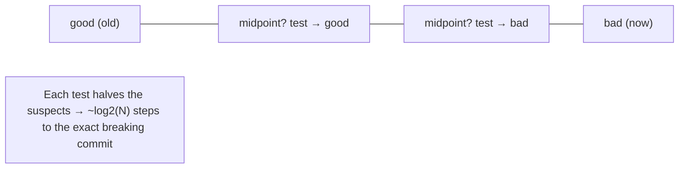

# Inspecting History: log, diff, show, blame, bisect

## 🧠 Intuition

A repository's history is a goldmine — but only if you can **query** it. Git gives you tools to answer every
"what/when/who/why" question: **`log`** (what changed over time), **`diff`** (what's different between two
points), **`show`** (everything about one commit), **`blame`** (who last touched each line, and in which
commit), and **`bisect`** (binary-search the history to find exactly which commit introduced a bug). Mastering
these turns history from a passive record into an active debugging and understanding tool.

> 💡 **Analogy — a detective's case file.** Every commit is an entry in a meticulously kept case file. **`log`**
> is reading the timeline of events; **`diff`** is comparing two snapshots to spot what changed; **`blame`** is
> dusting each line of evidence for the fingerprint (which commit/author last touched it); and **`bisect`** is
> the brilliant deduction trick — instead of examining every entry, you ask "was the crime present at the
> midpoint?" and halve the suspects each time until you pinpoint the exact moment it happened.

## 🎯 The Problem

A bug appears that "wasn't there last week." You need to know: *when* did this code last work, *which commit*
broke it, *who* wrote the offending line and *why*, and *what exactly* changed. Scrolling through hundreds of
commits by hand is hopeless. With history-inspection tools you can pinpoint the breaking commit in seconds
(`bisect`), see the author and reasoning behind any line (`blame` → commit message), and compare any two
points precisely (`diff`).

## 📐 How It Works

### `git log` — the history viewer

```bash
git log                          # full history: hash, author, date, message (newest first)
git log --oneline                # compact: one line per commit (hash + summary)
git log --oneline --graph --all  # ASCII graph of ALL branches (see the DAG!)
git log -5                       # last 5 commits
git log --stat                   # + which files changed and how many lines
git log -p                       # + the full diff of each commit (patch)
```

**Filtering** (powerful for investigation):
```bash
git log --author="Hüseyin"       # commits by an author
git log --since="2 weeks ago"    # by time   (--until also)
git log --grep="login"           # commits whose MESSAGE matches
git log -S"functionName"         # commits that ADDED/REMOVED that string in code ("pickaxe" search)
git log main..feature            # commits on feature not yet on main (a range)
git log -- path/to/file          # history of one file
git log --follow -- file         # ...even across renames
```

### `git diff` — compare anything

```bash
git diff                         # working tree vs staging (unstaged changes)
git diff --staged                # staging vs last commit (what's about to be committed)
git diff HEAD                    # working tree vs last commit (all uncommitted changes)
git diff commitA commitB         # between two commits
git diff main feature            # between two branches
git diff HEAD~3 HEAD             # what changed over the last 3 commits
git diff --stat                  # summary (files + line counts) instead of full patch
git diff branchA...branchB       # changes on B since the branches diverged (note the THREE dots)
```

### `git show` — inspect one commit (or object)

```bash
git show <commit>                # the commit's message + full diff
git show HEAD                    # the latest commit
git show <commit>:path/to/file   # a file's CONTENTS as of that commit
git show v1.0                    # what a tag points to
```

### `git blame` — who last changed each line

```bash
git blame file.txt               # each line annotated: commit, author, date
git blame -L 40,60 file.txt      # only lines 40–60
git blame -w file.txt            # ignore whitespace-only changes (find the real author)
```
Then `git show <that-commit>` reveals **why** (the commit message + the full change). `blame` answers *who/when*;
the commit message answers *why*.

### `git bisect` — binary-search for the breaking commit

The killer feature for "which commit introduced this bug." You mark a known-**bad** commit (now) and a known-
**good** commit (e.g. last release). Git checks out the **midpoint**; you test and tell it good/bad; it halves
the range each time — finding the culprit in **log₂(N)** steps (e.g. ~10 tests for 1000 commits).



## 💻 In Practice

### Find the commit that broke something with bisect

```bash
git bisect start
git bisect bad                   # current commit is broken
git bisect good v1.0             # this older commit/tag was fine
#   → Git checks out a commit halfway between. Test your code...
git bisect good                  # if this midpoint works
#   ...or...
git bisect bad                   # if it's broken
#   → repeat; Git narrows down...
#   "abc123 is the first bad commit"  ← the culprit!
git bisect reset                 # return to where you started

# Fully automate it with a test script (exit 0 = good, non-0 = bad):
git bisect start HEAD v1.0
git bisect run ./test.sh         # Git runs the script at each step automatically (ch.17)
```

### A typical investigation

```bash
git log --oneline -- src/auth.js          # 1. recent history of the suspect file
git blame -w src/auth.js                  # 2. who last touched the broken lines, and in which commit
git show <commit>                         # 3. see that commit's full change + message (the WHY)
git diff <good-commit> <bad-commit> -- src/auth.js   # 4. exactly what changed between working & broken
```

## ⚖️ Choosing the Right Tool

| Question | Tool |
|----------|------|
| What happened over time? | `git log` (+ `--oneline --graph`, filters) |
| What's different between X and Y? | `git diff X Y` |
| Everything about one commit? | `git show <commit>` |
| Who last changed this line, and why? | `git blame` → `git show <commit>` |
| Which commit *introduced* this bug? | `git bisect` |
| Which commit added/removed this code string? | `git log -S"string"` (pickaxe) |

- **`blame` vs `bisect`:** `blame` finds who last *touched* a line (great when you can see the offending
  line); `bisect` finds which commit *changed behavior* (great when the bug is a behavior change with no
  obvious line). Use bisect when blame's "last touch" isn't the real cause.
- **Two dots vs three dots in diff/log:** `A..B` and `A...B` mean different ranges — learn them when comparing
  branches (`...` in diff = "changes on B since divergence").

## 🚫 Common Mistakes & Gotchas

```text
❌ Scrolling through hundreds of commits by hand to find a bug. → slow and error-prone.
✅ `git bisect` finds the breaking commit in ~log2(N) tests; `git log -S` finds where code appeared/vanished.

❌ Using `git blame` and stopping at a whitespace/reformat commit. → wrong "author".
✅ `git blame -w` ignores whitespace-only changes to find who wrote the real logic.

❌ Treating `git diff` output without knowing WHICH two things it compares. → confusion.
✅ Be explicit: `git diff` (working vs staged), `--staged` (staged vs HEAD), `A B` (two commits/branches).

❌ Forgetting `git bisect reset` after bisecting. → left on a detached commit (ch.18).
✅ Always `git bisect reset` to return to your branch when done.

❌ Ignoring commit messages during investigation. → you see WHAT changed but not WHY.
✅ blame/log give the commit; `git show <commit>` gives the message (the reasoning) — read it.
```

## 🌍 Real-World Use

History inspection is core debugging. When a regression appears, `git bisect` is the fastest known way to find
the exact breaking commit — teams automate it with `git bisect run <test>` so it pinpoints the culprit
unattended. `git blame` is built into GitHub/GitLab and every IDE ("Git Blame" gutter annotations) — you click
a line to see the commit and author, then read the message to understand the intent. `git log` with filters
(`--author`, `--grep`, `-S`, date ranges) is how you audit changes, generate changelogs, and trace features.
The combination — *blame to find the line's origin, show to read the why, bisect to find the behavior change* —
is the everyday detective kit of an experienced developer.

## 🎯 Practice (with full solutions)

### 1. Find the breaking commit — `Medium`
**Task:** Your app's checkout worked in release `v2.0` but is broken on `main` (hundreds of commits later).
Find the exact commit that broke it.
**Solution:**
```bash
git bisect start
git bisect bad                   # current (main) is broken
git bisect good v2.0             # v2.0 was working
# Git checks out the midpoint commit. Test checkout in the app:
#   works  → git bisect good
#   broken → git bisect bad
# Repeat as Git halves the range each time, until:
#   "<hash> is the first bad commit"
git show <hash>                  # inspect what that commit changed (and its message) — the cause
git bisect reset                 # return to main
```
**Why it works:** bisect performs a **binary search** over the commit range between known-good (`v2.0`) and
known-bad (`main`): each test halves the number of suspects, so even hundreds of commits are narrowed to the
single breaking commit in ~log₂(N) tests — vastly faster than checking commits one by one.

### 2. Who wrote this and why? — `Easy`
**Task:** Line 52 of `payment.js` looks wrong. Find who last changed it, in which commit, and the reasoning
behind the change (ignoring any reformatting commits).
**Solution:**
```bash
git blame -w -L 52,52 payment.js   # -w ignores whitespace-only changes → the real author/commit of line 52
#   → e.g. "a1b2c3d (Sara 2025-03-10) ... if (amount > 0) {"
git show a1b2c3d                   # the full change + the commit MESSAGE explaining WHY it was made
```
**Why it works:** `blame -w` attributes line 52 to the commit that last meaningfully changed it (skipping
whitespace/reformatting noise), and `git show` on that commit reveals both the surrounding change and the
author's message — answering *who/when* (blame) and *why* (the message) together.

## ✅ Key Takeaways

- **`git log`** views history — use **`--oneline --graph --all`** to see the branch DAG, and filters
  (**`--author`, `--grep`, `--since`, `-S"code"`** pickaxe, `path`, ranges `A..B`) to investigate.
- **`git diff`** compares anything — be explicit about the two sides (working/staged/HEAD/commits/branches);
  **`git show <commit>`** displays one commit's message + diff (and `<commit>:file` shows file contents then).
- **`git blame`** annotates each line with the commit/author that last changed it (use **`-w`** to skip
  whitespace) → then `git show` that commit for the **why**.
- **`git bisect`** binary-searches between a known **good** and **bad** commit to pinpoint the **breaking
  commit** in ~log₂(N) tests; automate with **`git bisect run <test>`**; always **`git bisect reset`** after.
- Combine them: **blame** for a line's origin, **show** for the reason, **bisect** for a behavior change.

**Self-check:**
1. How does `git bisect` find a breaking commit so efficiently, and what two commits must you mark?
2. What does `git blame -w` tell you, and how do you then learn *why* the change was made?
3. Name three `git log` filters and what each is for.

---
◀ Prev: [Stashing & Cleaning](10-Stashing-and-Cleaning.md) · ▲ [Index](README.md) · ▶ Next: [Tagging & Releases](12-Tagging-and-Releases.md)
