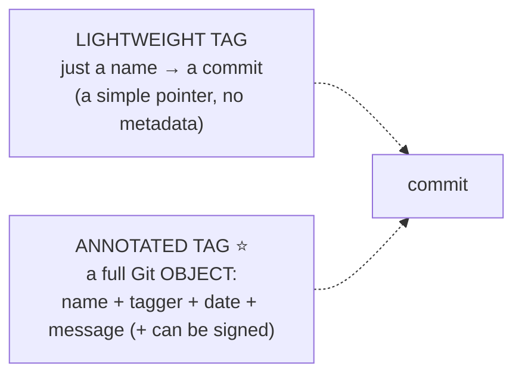

# Tagging & Releases: marking versions in history

## 🧠 Intuition

As your project evolves, certain commits are **special** — "this is version 1.0," "this is what we shipped to
production on Friday." A **tag** is a permanent, human-friendly **label on a specific commit** that marks these
milestones. Unlike a branch (which moves as you commit), a tag **stays fixed** on its commit forever — it's a
bookmark for "this exact version." Tags are how you mark releases, and combined with **semantic versioning**,
they give your project a clear, navigable version history.

> 💡 **Analogy — bookmarks vs a moving cursor.** A branch is like the cursor in a document — it moves forward
> as you type (commit). A tag is like a **permanent bookmark** you stick on a specific page that never moves,
> labeled "Chapter 1 final" or "v1.0". Months later, anyone can flip straight to that exact page. Releases are
> the chapters you officially publish, each marked with its bookmark.

## 🎯 The Problem

Three months after shipping, a customer reports a bug in "version 1.2." You need to check out *exactly* the
code that was in 1.2 — but which of your 800 commits was that? Without tags, you're guessing from dates and
commit messages. Or: you want to tell users "download version 2.0," generate a changelog "what changed between
1.0 and 2.0," and let your CI build and publish that exact version. **Tags** mark these versions immutably so
you (and your tools) can always find, compare, and rebuild any release.

## 📐 How It Works

### Two kinds of tags



- **Lightweight tag** — just a name pointing at a commit (like a branch that never moves). No extra
  information. Fine for temporary/private markers.
- **Annotated tag** (recommended for releases) — a real **tag object** storing the **tagger's name, date, a
  message**, and optionally a **GPG signature**. It's a first-class, documented, verifiable milestone. **Use
  annotated tags for releases.**

### Semantic Versioning (SemVer)

The standard scheme for naming release tags: **`MAJOR.MINOR.PATCH`** (e.g. `v2.4.1`), where you bump:

| Part | When | Example |
|------|------|---------|
| **MAJOR** | breaking changes (incompatible API) | `1.x.x → 2.0.0` |
| **MINOR** | new features, backward-compatible | `2.3.x → 2.4.0` |
| **PATCH** | bug fixes, backward-compatible | `2.4.0 → 2.4.1` |

Pre-releases: `v2.0.0-rc.1`, `v2.0.0-beta`. The `v` prefix (`v1.0.0`) is a common convention. SemVer lets users
and dependency tools reason about what an upgrade means (a patch is safe; a major may break them).

### Tags vs branches

- A **branch** moves forward as you commit (a line of development).
- A **tag** is **fixed** on one commit forever (a milestone marker).

You don't commit "onto" a tag; it just marks a point. To continue work from a tagged version, you branch from
it.

### Tags and releases

Tags are local until you **push** them (they aren't pushed by default with `git push`). On GitHub/GitLab, a
pushed tag can become a **Release** — a page with release notes, and **build artifacts** (binaries,
installers) attached. CI/CD pipelines commonly **trigger on a new tag** to build and publish that version.

## 💻 In Practice

```bash
# --- Create tags ---
git tag v1.0.0                          # LIGHTWEIGHT tag on the current commit
git tag -a v1.0.0 -m "Release 1.0.0"    # ANNOTATED tag (recommended) with a message
git tag -a v1.0.0 <commit-hash>         # tag a SPECIFIC (past) commit, not just HEAD
git tag -s v1.0.0 -m "..."              # SIGNED annotated tag (GPG) for verifiable releases

# --- List & inspect ---
git tag                                 # list all tags
git tag -l "v1.*"                       # filter by pattern
git show v1.0.0                         # tag message + the commit it points to
git describe --tags                     # human name for current commit, e.g. "v1.0.0-14-g2b1c3d"
                                        #   (= 14 commits after v1.0.0, at commit 2b1c3d)

# --- Push tags (NOT pushed by default!) ---
git push origin v1.0.0                  # push ONE tag
git push origin --tags                  # push ALL tags
git push --follow-tags                  # push commits + annotated tags reachable from them

# --- Use a tagged version ---
git checkout v1.0.0                     # check out the exact code of that release (detached HEAD! ch.18)
git switch -c hotfix-1.0 v1.0.0         # branch from a tag to make a fix on an old release

# --- Delete / move ---
git tag -d v1.0.0                       # delete a LOCAL tag
git push origin --delete v1.0.0         # delete a REMOTE tag
# (Moving a published tag is discouraged — like rewriting shared history.)

# --- Compare releases (changelog) ---
git log v1.0.0..v2.0.0 --oneline        # what changed between two releases
git diff v1.0.0 v2.0.0                  # the full diff between releases
```

## ⚖️ Best Practices / Trade-offs

- **Use annotated tags for releases** — they carry who/when/why (and can be signed/verified), which
  lightweight tags don't. Reserve lightweight tags for private/temporary markers.
- **Follow SemVer** (`MAJOR.MINOR.PATCH`) so version numbers convey meaning (breaking vs feature vs fix) to
  users and dependency tools.
- **Remember to push tags** — they're **not** included in a normal `git push`. Use `--tags` or `--follow-tags`
  (or push the specific tag).
- **Don't move/delete published tags** — others (and build systems) rely on a tag meaning one immutable
  version; changing it is like rewriting shared history.
- **Branch from a tag** to patch an old release (e.g. `hotfix-1.0` off `v1.0.0`) — don't try to commit "on" a
  tag.

## 🚫 Common Mistakes & Gotchas

```text
❌ Tagging a release and forgetting `git push --tags`. → the tag exists only locally; CI/users never see it.
✅ Push tags explicitly (`git push origin <tag>` / `--tags` / `--follow-tags`).

❌ Using lightweight tags for official releases. → no tagger, date, message, or signature to verify provenance.
✅ Annotated tags (`git tag -a`) for releases; signed (`-s`) where authenticity matters.

❌ Ad-hoc version names (v1, version2, final). → no meaning; tools can't compare/order them.
✅ Semantic Versioning (MAJOR.MINOR.PATCH) so versions convey breaking/feature/fix.

❌ Moving or re-tagging an already-published version. → breaks anyone who pinned that tag (shared-history sin).
✅ Treat published tags as immutable; cut a new version instead.

❌ Confusing `git checkout v1.0.0` ending up in "detached HEAD" as an error. → it's expected for viewing a tag.
✅ To work from a tag, branch off it: `git switch -c fix v1.0.0` (ch.18 on detached HEAD).
```

## 🌍 Real-World Use

Tags are the backbone of release management. Open-source projects tag every release (`v18.2.0`), and GitHub
turns pushed tags into **Releases** with changelogs and downloadable artifacts. **CI/CD pipelines trigger on
tags**: pushing `v2.1.0` kicks off a build that compiles, tests, and publishes that exact version (to npm,
NuGet, Docker Hub, app stores). **Semantic versioning** drives dependency managers — `^2.4.0` means "any
2.x.y ≥ 2.4.0," relying on the SemVer contract that minors/patches don't break. `git describe` is used in build
metadata to stamp binaries with a precise version ("v2.1.0-5-gabc123"). When a bug is reported against a
released version, developers `git checkout` or branch from that tag to reproduce and patch it. Tagging well is a
hallmark of a professionally-managed project.

## 🎯 Practice (with full solutions)

### 1. Cut a release — `Easy`
**Task:** You're shipping version 1.4.0. Create a proper release tag on the current commit, with a message, and
make sure your CI and users can see it.
**Solution:**
```bash
git tag -a v1.4.0 -m "Release 1.4.0 — adds dark mode and fixes login bug"   # annotated (who/when/why)
git show v1.4.0                       # verify it points to the right commit
git push origin v1.4.0                # push the tag (NOT included in a normal push!)
#   (or: git push --follow-tags  to push commits + reachable annotated tags together)
```
**Why it works:** an **annotated** tag records the tagger, date, and message (a documented, verifiable release
marker), and explicitly **pushing** it makes it visible on the remote — where CI can trigger a build and users
can find the release. Following SemVer (`v1.4.0`) also signals "new feature, backward-compatible."

### 2. Patch an old release — `Medium`
**Task:** A critical bug is reported in the already-shipped `v1.2.0`, while `main` is far ahead on unrelated
work. Reproduce and fix the bug against exactly the 1.2.0 code without disturbing `main`.
**Solution:**
```bash
git switch -c hotfix-1.2 v1.2.0       # branch from the EXACT v1.2.0 commit (not main)
# ...reproduce, fix the bug, commit...
git tag -a v1.2.1 -m "Patch 1.2.0: fix critical bug"   # new PATCH release
git push origin hotfix-1.2 v1.2.1     # publish the fix branch and the new tag
# Then merge/cherry-pick the fix into main as appropriate (ch.13).
```
**Why it works:** branching **from the tag** gives you the precise code state of `v1.2.0`, isolated from
`main`'s newer (possibly incompatible) changes, so you can reproduce and fix the reported bug; tagging the
result `v1.2.1` follows SemVer (a backward-compatible patch) and gives users a clean upgrade path.

## ✅ Key Takeaways

- A **tag** is a permanent, fixed **label on a commit** marking a milestone (a release) — unlike a branch, it
  never moves.
- Prefer **annotated tags** (`git tag -a`) for releases (they store tagger/date/message and can be **signed**);
  lightweight tags are bare pointers for private markers.
- Name releases with **Semantic Versioning** `MAJOR.MINOR.PATCH` — breaking / feature / fix — so versions
  convey meaning to users and tools.
- **Tags aren't pushed by default** — push them explicitly (`git push origin <tag>` / `--tags` /
  `--follow-tags`). On GitHub a pushed tag can become a **Release**, and CI often triggers on tags.
- **Don't move/delete published tags** (treat them as immutable); to fix an old release, **branch from its
  tag** and cut a new patch version.

**Self-check:**
1. What's the difference between a lightweight and an annotated tag, and which should releases use?
2. What do MAJOR, MINOR, and PATCH mean in semantic versioning?
3. Why might you tag a release and find that no one else can see it — and how do you fix that?

---
◀ Prev: [Inspecting History](11-Inspecting-History.md) · ▲ [Index](README.md) · ▶ Next: [Rewriting History](13-Rewriting-History.md)
