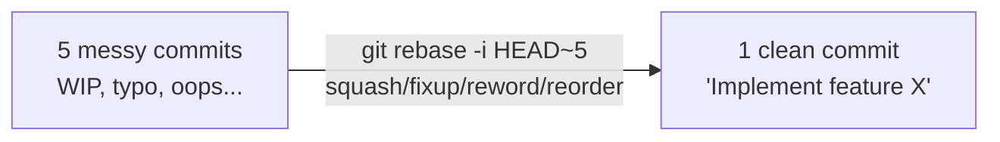

# Rewriting History: amend, interactive rebase, squash, cherry-pick

## 🧠 Intuition

Git history isn't carved in stone (until it's shared). Before you push, you can **rewrite** your commits to
make them clean and logical: fix the last commit (**amend**), reorder/combine/edit/delete commits
(**interactive rebase**), copy a commit from one branch to another (**cherry-pick**), or surgically remove a
file from all of history (**filter-repo**). The goal is a history that tells a clear, deliberate story — not a
messy log of "WIP", "fix typo", "oops". The same **Golden Rule** from [chapter 07](07-Rebase-vs-Merge.md)
applies: **rewrite only what you haven't shared.**

> 💡 **Analogy — editing a draft before publishing.** While writing a draft (local commits), you freely
> reorder paragraphs, merge two rambling sections into one, delete a bad paragraph, and fix typos — polishing
> it into a clean final version. But once you've **published** it (pushed; others have read it), you can't
> quietly re-edit those pages without confusing everyone — you'd issue a correction (a [revert,
> ch.09](09-Undoing-Things.md)) instead. History rewriting is editing your private draft before it goes to
> print.

## 🎯 The Problem

Your feature branch's history looks like this:

```text
a1b2c3 WIP
d4e5f6 fix typo
g7h8i9 actually fix the thing
j0k1l2 oops forgot a file
m3n4o5 implement feature
```

This is embarrassing to merge — five noisy commits for one logical change, in the wrong order, with a secret
accidentally committed in `j0k1l2`. Reviewers will struggle; `git log` will be junk; the secret is a security
problem. **Rewriting** lets you collapse this into one (or a few) clean, well-described commits, reorder them,
and scrub the secret — *before* you share it.

## 📐 How It Works

### `git commit --amend` — fix the last commit

Replaces the **most recent** commit with a new one (new hash) — useful to fix its message or add a forgotten
change. It's the simplest history rewrite.

```bash
git commit --amend -m "Better message"        # change just the message
git add forgotten.txt && git commit --amend --no-edit   # add a file to the last commit, keep the message
```

### `git rebase -i` — interactive rebase (the power tool)

`git rebase -i <base>` opens an editor listing the commits **after** `<base>`, letting you act on each:

```text
pick   m3n4o5 implement feature
squash j0k1l2 oops forgot a file       ← fold into the commit above (combine + edit message)
fixup  d4e5f6 fix typo                 ← fold into above, DISCARD this message
reword g7h8i9 actually fix the thing   ← keep commit, change its message
edit   a1b2c3 WIP                       ← pause here to modify the commit
drop   ...                              ← delete this commit entirely
# Reorder lines to reorder commits.
```

Commands: **pick** (keep), **reword** (change message), **edit** (stop to amend), **squash** (combine + merge
messages), **fixup** (combine, drop message), **drop** (delete), and **reorder** by moving lines. This is how
you turn five messy commits into one clean one.



### `git cherry-pick` — copy a commit to the current branch

Applies the **changes of a specific commit** onto your current branch as a **new commit** (new hash). Useful
to grab one fix from another branch without merging everything.

```bash
git cherry-pick <commit-hash>          # apply that commit's changes here
git cherry-pick <hashA> <hashB>        # several commits
git cherry-pick <hashA>..<hashB>       # a range
```

### Squash on merge (the easy alternative)

Instead of interactive rebase, many teams **squash-merge** a pull request: GitHub/GitLab collapses the whole
branch into **one commit** on `main` automatically ([chapter 15](15-Pull-Requests-and-Code-Review.md)). You get
a clean `main` history without manually rebasing — at the cost of losing the branch's individual commits.

### `git filter-repo` — scrub a file from ALL history

If you committed a secret or a huge file, deleting it in a *new* commit isn't enough — it's still in **every
past commit**. **`git filter-repo`** (the modern replacement for `filter-branch` and the BFG tool) rewrites
**all** of history to remove it everywhere. This rewrites every commit hash, so it's a major operation
requiring a force-push and team coordination.

```bash
git filter-repo --path secrets.txt --invert-paths    # remove secrets.txt from ALL commits
git filter-repo --strip-blobs-bigger-than 10M        # remove huge files from history
```

## 💻 In Practice

### Clean up a messy branch before merging

```bash
git log --oneline                       # see the 5 messy commits
git rebase -i HEAD~5                     # interactive rebase over the last 5 commits
#   → editor opens; set first to 'pick', others to 'squash'/'fixup', reword as needed, save & close
#   → resolve any conflicts: edit → git add → git rebase --continue
git log --oneline                       # now 1 clean commit
git push --force-with-lease             # update the (unshared/solo) remote branch — SAFE force
```

### Grab one fix from another branch

```bash
git switch main
git log --oneline feature               # find the one fix commit you want
git cherry-pick a1b2c3d                 # apply just that commit onto main
```

### Remove an accidentally-committed secret from all history

```bash
# 1. ROTATE the secret first (assume it's compromised — it was in history/possibly pushed!)
# 2. Remove it from all history:
git filter-repo --path .env --invert-paths
# 3. Force-push and have everyone re-clone (coordinated):
git push --force --all
```

## ⚖️ When to Rewrite (and When NOT)

- **Rewrite freely** on **local, unshared** commits or a **solo** feature branch — clean up before sharing
  (amend, interactive rebase, squash).
- **Never rewrite shared/pushed history** that others have based work on (the **Golden Rule**). To undo
  something already public, use **[revert (ch.09)](09-Undoing-Things.md)**, not rewriting.
- **Squash-merge vs preserve commits:** squashing gives a clean `main` (one commit per feature) but loses the
  granular history; some teams prefer a tidy rebased history that keeps meaningful commits. Pick a team
  convention.
- **filter-repo is heavy** — it rewrites *all* hashes and forces everyone to re-clone; reserve it for genuine
  needs (leaked secrets, huge files) and **always rotate leaked secrets** regardless (scrubbing history
  doesn't un-leak something already pushed/cloned).
- **cherry-pick sparingly** — copying commits between branches can create duplicates that complicate later
  merges; prefer merging/rebasing whole branches when possible.

## 🚫 Common Mistakes & Gotchas

```text
❌ Rewriting (amend/rebase -i/squash) commits that are already pushed and pulled by others. → diverged history, chaos.
✅ Rewrite only local/unshared commits; use `revert` for anything public (Golden Rule, ch.07).

❌ `git commit --amend` on a pushed commit, then a plain push fails / needs force. → you rewrote shared history.
✅ Amend only unpushed commits; if truly needed on a shared one, coordinate + --force-with-lease.

❌ Deleting a committed secret in a NEW commit and thinking it's gone. → it's still in every prior commit.
✅ Scrub ALL history (git filter-repo) AND rotate the secret (it's compromised regardless).

❌ Using plain `--force` after a rebase. → can clobber a teammate's new commits.
✅ `--force-with-lease` — refuses if the remote moved unexpectedly.

❌ Cherry-picking the same fix that later gets merged too. → duplicate commits / merge confusion.
✅ Cherry-pick only when you can't merge the whole branch; track what's been ported.

❌ Getting lost mid interactive-rebase conflict. → use `git rebase --abort` to bail out cleanly.
✅ Resolve (edit → add → `git rebase --continue`) or `--abort` to restore the pre-rebase state (reflog also has it).
```

## 🌍 Real-World Use

History rewriting is how professionals keep a **clean, reviewable `main`**. The common workflow: develop on a
feature branch with messy WIP commits, then **interactive-rebase (or squash-merge) into a few logical commits**
before opening/merging the pull request — so reviewers and future readers see intent, not noise.
**`git commit --amend`** is the reflexive fix for "oops, typo in my last commit message / forgot a file"
(before pushing). **`cherry-pick`** ports a hotfix from `main` back to a release branch (or vice versa).
**`git filter-repo`** is the emergency tool when a secret or a giant binary gets committed — paired *always*
with rotating the secret, because once pushed, it must be assumed compromised. The discipline "rewrite private
history to make it clean; never rewrite shared history" is a clear marker of Git expertise.

## 🎯 Practice (with full solutions)

### 1. Squash a messy branch — `Medium`
**Task:** Your solo `feature` branch has 4 commits: "implement search", "WIP", "fix typo", "forgot import".
They're not pushed. Combine them into one clean commit before opening a PR.
**Solution:**
```bash
git log --oneline                # confirm the 4 commits (HEAD~4..HEAD)
git rebase -i HEAD~4             # interactive rebase
#   In the editor:
#     pick   <hash> implement search
#     squash <hash> WIP
#     squash <hash> fix typo
#     squash <hash> forgot import
#   Save → Git opens a combined message editor → write: "Implement product search"
git log --oneline                # now ONE clean commit
git push --force-with-lease      # update the solo remote branch safely (or just push if not yet pushed)
```
**Why it works:** interactive rebase replays the 4 commits, and `squash` folds the latter three into the first,
producing a single commit with a clean message — turning noisy WIP history into one logical unit. It's safe
because the commits are **local/solo** (Golden Rule satisfied); `--force-with-lease` updates the branch without
risking others' work.

### 2. Scrub a leaked secret — `Medium`
**Task:** You discover an API key was committed in `config.json` 20 commits ago and pushed. What's the correct
response?
**Solution:** Two essential steps, in order:
1. **Rotate the key immediately** — assume it's **compromised** (it's been in pushed history and possibly
   cloned/scanned). Revoke it and issue a new one. *This is the most important step* — scrubbing history does
   **not** un-leak a key that's already out.
2. **Remove it from all history** and force-push (coordinated with the team):
```bash
git filter-repo --path config.json --invert-paths   # (or remove just the key with a replace rule)
git push --force --all                                # everyone must re-clone afterward
```
**Why it works:** the key existed in **every commit since it was added**, so a normal delete-commit leaves it
in history — `filter-repo` rewrites all of history to remove it everywhere. But because pushed history may
already be cloned or scraped by bots, the key must be treated as exposed, so **rotation is mandatory**
regardless of the scrub.

## ✅ Key Takeaways

- You can **rewrite local history** to make it clean: **`commit --amend`** (fix the last commit),
  **`rebase -i`** (reorder / **squash** / **fixup** / **reword** / **drop** commits), and **squash-merge** (one
  commit per PR).
- **`cherry-pick`** copies a specific commit's changes onto your current branch (new hash) — for porting a
  single fix between branches.
- **`git filter-repo`** scrubs a file/secret/large blob from **all** history (heavy: rewrites every hash, needs
  force-push + re-clone). **Always rotate a leaked secret** too — scrubbing doesn't un-leak it.
- **Golden Rule applies:** rewrite only **unshared** commits; use **`revert`** for anything already pushed.
  After rewriting a solo branch, **`push --force-with-lease`** (never plain `--force`).
- Goal: a **clean, intentional history** that tells the project's story — polish your private draft before
  publishing.

**Self-check:**
1. What can interactive rebase do that `commit --amend` can't, and name three of its actions (pick/squash/…)?
2. Why isn't deleting a secret in a new commit enough, and what two things must you do?
3. Which history is safe to rewrite, and what do you use instead for shared history?

---
◀ Prev: [Tagging & Releases](12-Tagging-and-Releases.md) · ▲ [Index](README.md) · ▶ Next: [Workflows & Branching Strategies](14-Workflows-and-Branching-Strategies.md)
