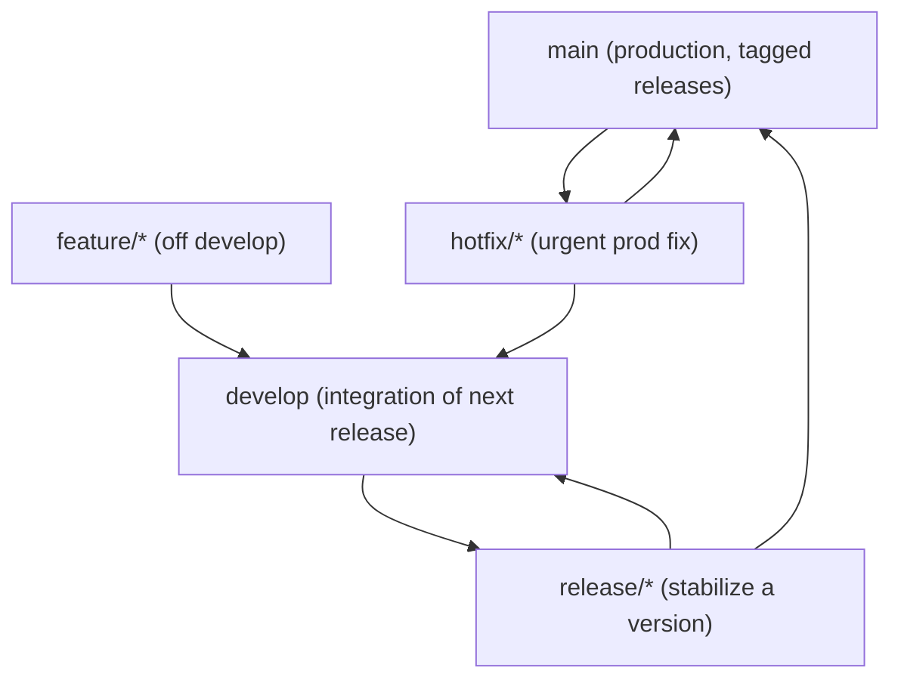
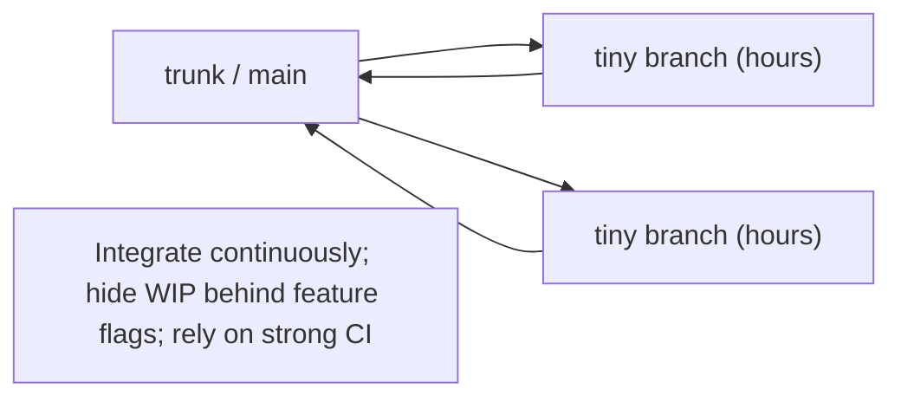

# Workflows & Branching Strategies: how teams organize branches

## 🧠 Intuition

Git gives you branches; a **workflow** is the **agreed convention** for how your team *uses* them — which
branches exist, what each is for, how work flows from idea to production, and how releases happen. There's no
single "right" workflow; the best one depends on your team size, release cadence, and product type. The three
dominant patterns — **GitHub Flow**, **Git Flow**, and **trunk-based development** — sit on a spectrum from
simple-and-continuous to structured-and-release-heavy.

> 💡 **Analogy — traffic systems for a city.** Branches are roads; a workflow is the **traffic system** that
> keeps everyone moving without collisions. A small town needs just a few clear rules (GitHub Flow). A complex
> city with scheduled events needs more structure — dedicated lanes for through-traffic, staging areas,
> release routes (Git Flow). And a high-speed highway optimizes for constant flow with minimal stopping
> (trunk-based). You pick the traffic system that matches your city's size and rhythm — and everyone must
> follow the same rules.

## 🎯 The Problem

A team without an agreed workflow descends into chaos: people commit straight to `main` and break it,
half-finished features block releases, nobody knows which branch is "the stable one" or where a hotfix should
go, and merges become tangled. A workflow answers these questions **up front and consistently**: where does new
work start, how is it reviewed, what's always-deployable, and how do releases and hotfixes flow. Consistency is
the point — the *specific* workflow matters less than everyone following the *same* one.

## 📐 How It Works

### GitHub Flow (simple, continuous) — the common default

One long-lived branch (`main`, always deployable) plus short-lived feature branches merged via pull requests.


1. `main` is **always deployable**.
2. Branch off `main` for each piece of work (`feature/login`).
3. Commit, push, open a **pull request** ([ch.15](15-Pull-Requests-and-Code-Review.md)).
4. Review + CI pass → **merge into `main`** → deploy.

- ✅ Simple, fast, great for web apps / continuous deployment / small-to-medium teams.
- ❌ Less structure for managing **multiple released versions** in parallel.

### Git Flow (structured, release-oriented)

Two long-lived branches plus several supporting branch types — designed for **scheduled releases** and
**versioned software**.



- **`main`** — production; every commit is a tagged release.
- **`develop`** — integration branch for the next release.
- **`feature/*`** — branch off `develop`, merge back to `develop`.
- **`release/*`** — branch off `develop` to stabilize a release, then merge to `main` (+ tag) and `develop`.
- **`hotfix/*`** — branch off `main` for urgent production fixes, merged to both `main` and `develop`.

- ✅ Clear structure for versioned/released products, parallel maintenance of multiple versions.
- ❌ **Heavy** — many branches and merges; often overkill for continuous web delivery (its own author later
  noted it's not ideal for modern CD).

### Trunk-Based Development (continuous, at scale)

Everyone commits to **one trunk** (`main`) frequently (at least daily), via **very short-lived** branches (or
direct small commits), with unfinished work hidden behind **feature flags** rather than long branches.



- ✅ Minimizes merge pain (everyone's always near the tip), enables continuous integration/deployment at
  scale, fast feedback. Used by many large tech companies.
- ❌ Requires **strong CI, feature flags, and discipline** — a broken trunk blocks everyone; not for teams
  without good automated testing.

### Choosing

| Workflow | Best for | Branches |
|----------|----------|----------|
| **GitHub Flow** | web apps, small/medium teams, continuous deploy | `main` + short feature branches |
| **Git Flow** | versioned/released software, scheduled releases, multiple supported versions | `main`, `develop`, feature/release/hotfix |
| **Trunk-Based** | large teams, high CI maturity, continuous delivery | mostly just `main` (+ tiny branches, feature flags) |

## 💻 In Practice

### GitHub Flow (the everyday default)

```bash
git switch main && git pull                 # start from the latest main
git switch -c feature/search                # branch per task
# ...work, commit...
git push -u origin feature/search           # publish
# → open a Pull Request, get review + CI, then "Merge" (often squash) into main → deploy
git switch main && git pull                 # sync; delete the merged branch
```

### Git Flow (with the helper, or by hand)

```bash
# By hand:
git switch develop && git switch -c feature/checkout   # feature off develop
# ...work... → merge feature into develop
git switch develop && git switch -c release/1.4.0      # stabilize → merge to main (+ tag v1.4.0) and develop
git switch main && git switch -c hotfix/1.4.1          # urgent prod fix off main → merge to main + develop
# (the `git flow` extension automates these conventions: `git flow feature start ...`)
```

### Naming conventions (any workflow)

```text
feature/add-dark-mode      bugfix/login-crash      hotfix/payment-500
release/2.1.0              chore/update-deps        docs/api-readme
```
Consistent prefixes make branches self-describing and easy to filter/automate.

## ⚖️ Trade-offs / Choosing

- **Simplicity vs structure:** GitHub Flow (simple) and trunk-based (continuous) suit fast, web-style delivery;
  Git Flow (structured) suits versioned products with scheduled releases and multiple supported versions.
- **Branch lifetime is the key variable:** **short-lived** branches (GitHub Flow, trunk-based) mean small,
  frequent integrations and fewer conflicts; **long-lived** branches (heavy Git Flow) drift apart and cause
  painful merges. Modern consensus favors short-lived branches + continuous integration.
- **Trunk-based needs maturity:** it only works with **strong automated testing/CI** and **feature flags**;
  without them, a broken trunk halts the team.
- **The meta-point:** any consistent workflow beats no workflow. Match it to your context and **document it**
  so everyone follows the same rules.

## 🚫 Common Mistakes & Gotchas

```text
❌ No agreed workflow — everyone does their own thing. → broken main, tangled merges, confusion.
✅ Pick ONE workflow, document it, and apply it consistently across the team.

❌ Adopting heavy Git Flow for a simple web app with continuous deploy. → needless branch/merge overhead.
✅ Use GitHub Flow (or trunk-based) for continuous delivery; reserve Git Flow for versioned releases.

❌ Long-lived feature branches that live for weeks. → drift far from main → huge, painful merges.
✅ Short-lived branches; integrate frequently (or trunk-based with feature flags).

❌ Trunk-based development without strong CI/feature flags. → a broken trunk blocks everyone.
✅ Trunk-based requires solid automated tests and flags to hide WIP safely.

❌ Inconsistent branch names (john-stuff, test2, final-branch). → unfilterable, unclear.
✅ Conventional prefixes (feature/, bugfix/, hotfix/, release/) — self-describing and automatable.

❌ Committing directly to main in a flow that requires PRs. → bypasses review/CI; can break production.
✅ Protect main (branch protection rules) so changes go through PRs + checks (ch.15).
```

## 🌍 Real-World Use

**GitHub Flow** is the most common workflow for web apps and most teams today — branch, PR, review, merge,
deploy — thanks to its simplicity and fit with continuous deployment. **Git Flow** remains popular for software
with **explicit versioned releases** (desktop/mobile apps, libraries, anything supporting multiple versions),
though its own creator has noted it's often too heavy for continuous web delivery. **Trunk-based development**
is favored by large engineering organizations (Google, and many at scale) practicing continuous integration,
underpinned by heavy automated testing and feature flags. In practice, most teams use a **GitHub-Flow-like**
model with branch protection on `main`, required reviews, and required CI checks — and standardize **branch
naming**. The specific choice matters less than picking one, documenting it, and keeping branches short-lived.

## 🎯 Practice (with full solutions)

### 1. Pick a workflow — `Medium`
**Task:** (a) A 5-person team building a continuously-deployed web app. (b) A team shipping a desktop
application with versions 1.x, 2.x maintained in parallel and scheduled releases. Which workflow for each, and
why?
**Solution:** (a) **GitHub Flow** (or trunk-based if they have strong CI) — a single always-deployable `main`
with short-lived feature branches merged via PRs fits continuous deployment and a small team with minimal
overhead; there are no parallel "supported versions" to manage. (b) **Git Flow** — versioned, scheduled
releases with **multiple supported versions** benefit from `main` (tagged releases) + `develop` +
`release/*` + `hotfix/*` branches, which give clear structure for stabilizing releases and patching old
versions in parallel.
**Why it works:** the choice follows release model and complexity — continuous web delivery wants simplicity
and always-deployable `main` (GitHub Flow), while parallel versioned releases need Git Flow's explicit
release/hotfix structure; matching the workflow to the context avoids both chaos and needless overhead.

### 2. Diagnose the merge pain — `Easy`
**Task:** A team keeps feature branches alive for 3–4 weeks and suffers huge, conflict-ridden merges every
time. They blame Git. What's the real issue and the fix?
**Solution:** The problem isn't Git — it's **long-lived branches**. Over weeks, a feature branch and `main`
diverge enormously, so merging means reconciling a mountain of overlapping changes (conflicts). Fix: adopt
**short-lived branches** that merge within days, **integrate frequently** (regularly merge/rebase the latest
`main` into the feature, or open smaller PRs), and consider **trunk-based development with feature flags** to
hide unfinished work instead of hoarding it on a branch. Smaller, more frequent integrations mean smaller,
rarer conflicts.
**Why it works:** conflict size scales with how far branches diverge; keeping branches short and integrating
continuously keeps divergence small, so merges stay trivial — addressing the root cause rather than blaming the
tool.

## ✅ Key Takeaways

- A **workflow** is the team's **agreed convention** for using branches — which exist, what each is for, and
  how work flows to production. Consistency matters more than the specific choice.
- **GitHub Flow** (simple): `main` always deployable + short-lived feature branches via PRs — the common
  default for web apps / continuous deploy.
- **Git Flow** (structured): `main` + `develop` + `feature/release/hotfix` branches — for **versioned,
  scheduled releases** and parallel supported versions; heavy for continuous delivery.
- **Trunk-based** (continuous): everyone commits to `main` frequently via tiny branches + **feature flags**;
  needs **strong CI**. Great at scale.
- **Short-lived branches + frequent integration** minimize merge pain; use **conventional branch names** and
  **protect `main`** (PRs + CI). Document your workflow.

**Self-check:**
1. Describe GitHub Flow and when it's the right choice.
2. What branches does Git Flow add, and what kind of project is it best for?
3. What does trunk-based development require to work, and why do short-lived branches reduce merge pain?

---
◀ Prev: [Rewriting History](13-Rewriting-History.md) · ▲ [Index](README.md) · ▶ Next: [Pull Requests & Code Review](15-Pull-Requests-and-Code-Review.md)
