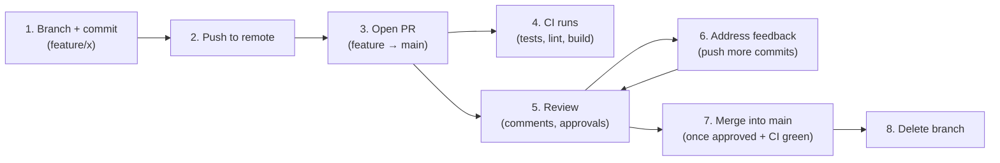
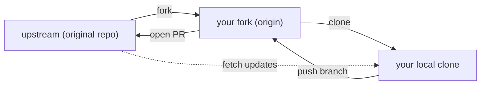

# Pull Requests & Code Review: collaborating through proposed changes

## 🧠 Intuition

A **Pull Request (PR)** — called a **Merge Request** on GitLab — is a *proposal* to merge your branch into
another (usually `main`). It's not a Git command; it's a **collaboration feature** of GitHub/GitLab/Bitbucket
built *on top of* Git. The PR is where your changes get **reviewed**, **discussed**, **tested by CI**, and
finally **merged**. It's the gate that keeps `main` healthy and the forum where the team shares knowledge about
every change. **Forks** extend this to people who don't have write access to a repo (open source).

> 💡 **Analogy — submitting an article to an editor before publishing.** You don't publish straight to the
> front page (push to `main`). You **submit your draft** (open a PR) to an editor, who reads it, leaves
> margin notes ("clarify this", "this could break X"), and may ask for revisions. Automated spell/fact checks
> run (CI). Once the editor approves and checks pass, the article is **published** (merged). The process
> catches mistakes, spreads knowledge, and keeps the publication's quality high.

## 🎯 The Problem

If everyone pushed straight to `main`, you'd get: untested code breaking production, no second pair of eyes
catching bugs, no shared understanding of changes, and no record of *why* a change was made or who approved it.
For open-source projects, you also can't give write access to thousands of strangers. **Pull requests** solve
all of this: changes are **proposed** (not forced), **reviewed** by humans, **validated** by CI, **discussed**
and documented, and only then merged — by people with permission — keeping `main` protected and the team
aligned.

## 📐 How It Works

### The pull request flow



1. Create a branch, commit, push ([ch.08](08-Remotes-and-Collaboration.md)).
2. **Open a PR** on the platform: "merge `feature/x` into `main`," with a title and description (what + why).
3. **CI runs automatically** — tests, linting, build ([ch.16](16-Hooks-and-Automation.md)).
4. **Reviewers** read the diff, leave **comments** (line-by-line or general), request changes or **approve**.
5. You **respond** — push more commits to the same branch (the PR updates automatically) or discuss.
6. Once **approved and CI is green**, someone **merges** it.
7. **Delete the branch** (it's served its purpose).

### Forks (for open source / no write access)

If you can't push to a repo (you're not a collaborator), you **fork** it — make your own copy on GitHub — then:



You push your branch to **your fork** (`origin`) and open a PR **from your fork to the original** (`upstream`).
The maintainers review and merge. This is how open-source contribution works for non-members.

### Merge options (how the PR lands on `main`)

Platforms offer three ways to merge a PR:

| Option | Result on `main` | When |
|--------|------------------|------|
| **Merge commit** (`--no-ff`) | keeps all branch commits + a merge commit | preserve full history/context |
| **Squash and merge** | collapses the whole branch into **one** commit | clean, one-commit-per-feature `main` (popular) |
| **Rebase and merge** | replays the branch's commits linearly, no merge commit | linear history, keep individual commits |

(Related to [merge vs rebase, ch.07](07-Rebase-vs-Merge.md) and [squashing, ch.13](13-Rewriting-History.md).)

### Branch protection

Teams **protect `main`** with rules: require PRs (no direct pushes), require **N approvals**, require **CI to
pass**, require branches to be up to date, etc. This *enforces* the review process technically, not just by
convention.

## 💻 In Practice

### The contributor's flow

```bash
git switch main && git pull
git switch -c feature/dark-mode
# ...work, commit (small, clear commits)...
git push -u origin feature/dark-mode
# → Go to GitHub → "Compare & pull request" → write a clear title + description
# → CI runs; reviewers comment
# ...address feedback:
git add . && git commit -m "Address review: extract helper, add test"
git push                            # the PR updates automatically
# → once approved + green, click "Squash and merge" → delete branch
```

### Open-source contribution (fork)

```bash
# On GitHub: click "Fork" on the original repo → you now have your-name/repo
git clone git@github.com:your-name/repo.git
cd repo
git remote add upstream git@github.com:original/repo.git   # track the ORIGINAL
git switch -c fix/typo
# ...fix, commit...
git push -u origin fix/typo         # push to YOUR fork
# → open a PR from your-name/repo:fix/typo → original/repo:main
# Keep your fork synced with upstream:
git fetch upstream && git switch main && git merge upstream/main && git push
```

### CLI for PRs (GitHub CLI)

```bash
gh pr create --title "Add dark mode" --body "Implements #42"   # open a PR from the terminal
gh pr status                         # see your PRs
gh pr checkout 123                   # check out someone's PR locally to test it
gh pr review 123 --approve
```

## ⚖️ Good Review Practice / Trade-offs

- **Small PRs get better reviews.** A 50-line PR gets a careful review; a 2,000-line PR gets a rubber-stamp.
  Keep changes focused and small ([atomic commits help, ch.19](19-Best-Practices.md)).
- **Write a clear PR description** — what changed, **why**, how to test, screenshots. Reviewers (and future
  readers) rely on it.
- **Review kindly and specifically.** Comment on the code, not the person; suggest concrete improvements;
  distinguish "must fix" from "nit/optional." Approve when it's good enough, not perfect.
- **Squash vs preserve commits:** squash-merge keeps `main` clean (one commit per feature) but loses
  granularity; rebase/merge-commit preserve detail. Adopt a team convention.
- **CI is the automated reviewer** — let it catch the mechanical issues (tests, lint, format) so humans focus
  on design and correctness.

## 🚫 Common Mistakes & Gotchas

```text
❌ Giant PRs (thousands of lines). → reviewers can't review properly; bugs slip through; slow to merge.
✅ Small, focused PRs that do one thing — fast, thorough reviews.

❌ Empty/vague PR description ("updates"). → reviewers lack context; future readers can't tell why.
✅ Describe WHAT changed, WHY, and how to test (link the issue).

❌ Pushing straight to main, bypassing review/CI. → unreviewed, untested code in production.
✅ Protect main (require PRs + approvals + green CI); land changes via PR.

❌ Force-pushing to a PR branch during active review. → can confuse reviewers / lose comment context.
✅ Add new commits to address feedback (squash later on merge); coordinate before force-pushing a shared review branch.

❌ Treating review nitpicks as blockers / being harsh. → slow, demoralizing reviews.
✅ Distinguish must-fix from nits; be specific and kind; approve when good enough.

❌ Forking but never adding the `upstream` remote. → can't sync your fork with the original's updates.
✅ `git remote add upstream <orig>`; periodically merge upstream/main into your fork.
```

## 🌍 Real-World Use

Pull requests are the **central unit of collaboration** in virtually every software team and open-source
project. They're where **code review** happens (catching bugs, sharing knowledge, maintaining standards),
where **CI/CD** runs automatically (tests/lint/build gating the merge — [ch.16](16-Hooks-and-Automation.md)),
and where the **discussion and rationale** for every change is permanently recorded (invaluable months later).
**Branch protection** enforces the process so `main` stays green and every change is reviewed. The
**fork-and-PR** model is how millions contribute to open source without write access. Strong PR hygiene —
small, well-described changes and constructive review — is one of the clearest markers of a healthy engineering
culture, and being a good reviewer is as valued as being a good coder.

## 🎯 Practice (with full solutions)

### 1. Contribute to open source — `Medium`
**Task:** You found a typo in a popular open-source project's docs, but you don't have write access. Outline how
you'd get your fix merged.
**Solution:**
1. **Fork** the repo on GitHub (creates `your-name/repo`).
2. **Clone your fork** and add the original as `upstream`:
```bash
git clone git@github.com:your-name/repo.git && cd repo
git remote add upstream git@github.com:original/repo.git
```
3. **Branch, fix, commit, push to your fork:**
```bash
git switch -c fix/readme-typo
# ...fix the typo...
git add . && git commit -m "Fix typo in installation docs"
git push -u origin fix/readme-typo
```
4. **Open a PR** from `your-name/repo:fix/readme-typo` → `original/repo:main` with a clear description.
5. **Respond to review** (push more commits if asked); once approved, a maintainer merges it.
**Why it works:** forking gives you a writable copy when you lack access to the original; you propose your
change via a PR from your fork to upstream, where maintainers review and merge — the standard open-source
contribution path, with `upstream` letting you keep your fork in sync.

### 2. Improve a review-blocked PR — `Easy`
**Task:** Your PR has been open for days with no review because it's a single 1,800-line change touching 30
files. What's likely wrong, and what should you do?
**Solution:** The PR is **too big** — reviewers avoid or rubber-stamp huge changes because they can't review
them carefully, so it stalls. Break it into **several small, focused PRs**, each doing one logical thing (e.g.
"add the API endpoint", "add the UI", "add tests"), each with a clear description. Small PRs get reviewed
quickly and thoroughly. Going forward, keep changes **atomic** and open PRs early/often.
**Why it works:** review quality and speed scale inversely with PR size; splitting the change into digestible,
single-purpose PRs makes each one easy to review well — unblocking the work and improving the quality of the
feedback.

## ✅ Key Takeaways

- A **Pull Request (PR)** is a **proposal** to merge a branch — a platform feature (GitHub/GitLab) where
  changes are **reviewed, CI-tested, discussed, and then merged**. It keeps `main` healthy and shares
  knowledge.
- Flow: **branch → push → open PR → CI + review → address feedback → merge → delete branch.**
- **Forks** let people without write access contribute (push to your fork, PR to `upstream`); add an
  `upstream` remote to stay synced — the open-source model.
- Merge options: **merge commit** (full history), **squash** (one clean commit — popular), **rebase** (linear).
  **Protect `main`** to require PRs + approvals + green CI.
- **Keep PRs small and well-described**; **review kindly and specifically**; let **CI** handle mechanical
  checks.

**Self-check:**
1. What is a pull request, and what four things happen to a change before it's merged?
2. How does the fork-and-PR model let you contribute to a repo you can't push to?
3. Why are small PRs better, and what are the three merge options when landing one?

---
◀ Prev: [Workflows & Branching Strategies](14-Workflows-and-Branching-Strategies.md) · ▲ [Index](README.md) · ▶ Next: [Hooks & Automation](16-Hooks-and-Automation.md)
