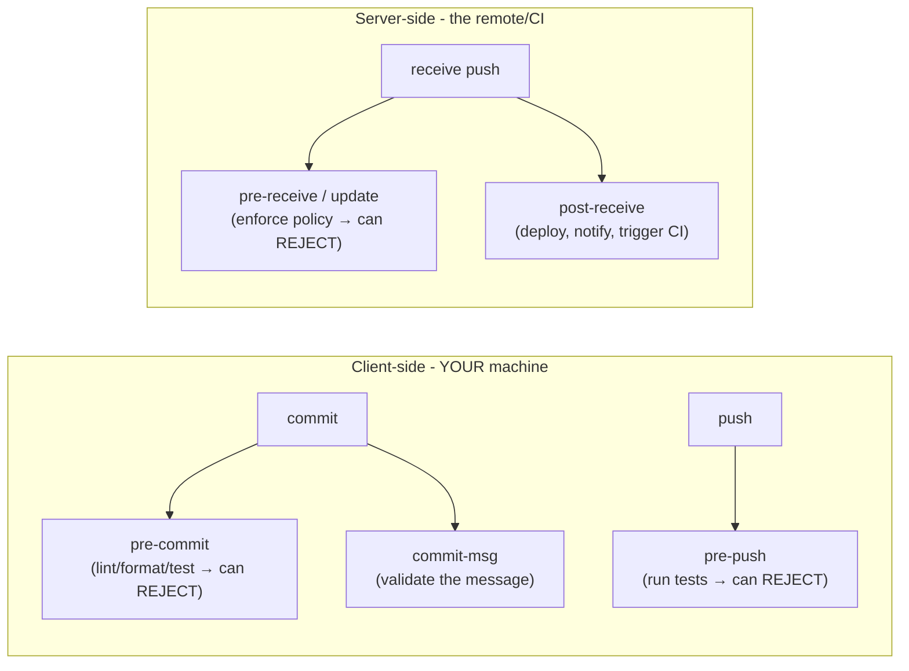

# Hooks & Automation: making Git do work for you

## 🧠 Intuition

**Git hooks** are scripts Git runs **automatically** at certain points in its lifecycle — before a commit,
after a merge, before a push, etc. They let you **automate checks and tasks**: reject a commit that fails the
linter, run tests before pushing, enforce a commit-message format, or notify a chat channel after a deploy.
Combined with **CI/CD** (automation that runs on the *server* when you push/open a PR), hooks turn Git from a
passive recorder into an active enforcer of quality.

> 💡 **Analogy — automatic safety checks on an assembly line.** Imagine sensors along an assembly line that
> automatically halt the belt if a part is defective ("don't let this through"), and stations that
> automatically stamp, test, or package items as they pass. Git hooks are those sensors and stations for your
> code: as work moves through commit → push → merge, hooks automatically inspect it (reject bad commits) and
> perform tasks (run tests, format code) — no human has to remember to do it.

## 🎯 The Problem

You keep accidentally committing code that fails the linter, has formatting issues, or breaks tests — and you
only find out *after* you've pushed and CI fails (or a reviewer points it out), wasting a round-trip. Or your
team wants every commit message to follow a format, but people forget. Manually remembering to lint, format,
and test before every commit doesn't scale. **Hooks** run these checks **automatically at the right moment**,
catching problems *before* they enter history — and CI provides a server-side safety net the team can't bypass.

## 📐 How It Works

### Client-side vs server-side hooks



- **Client-side hooks** run on **your machine** around local actions (commit, push). They're for your own
  productivity — but they live in `.git/hooks/` (which **isn't committed/shared**), and developers can
  **bypass** them (`--no-verify`), so they're *helpful, not enforceable*.
- **Server-side hooks** run on the **remote/server** when it receives a push — these the team **cannot
  bypass**, so they're for **enforced policy** (reject commits that don't meet standards) and triggering
  **deploys**.

### Common hooks

| Hook | Fires | Use |
|------|-------|-----|
| **pre-commit** | before a commit is created | lint, format, run fast tests; **reject** bad commits |
| **commit-msg** | after you write the message | enforce message format (e.g. Conventional Commits) |
| **pre-push** | before pushing | run the test suite; **reject** if it fails |
| **post-merge** | after a merge/pull | e.g. auto-install dependencies if package file changed |
| **pre-receive / update** | server, on receiving a push | enforce policy (no force-push to main, message rules) |
| **post-receive** | server, after accepting | trigger deploy, CI, notifications |

A hook that **exits non-zero aborts the action** (e.g. a failing `pre-commit` cancels the commit).

### Hooks live in `.git/hooks/` (and the sharing problem)

Git puts sample hooks in `.git/hooks/` (named `pre-commit.sample`, etc. — rename to activate). But because
`.git/` isn't part of the repo content, **hooks aren't shared** with teammates by default. Solutions: commit a
hooks folder and point Git at it (`core.hooksPath`), or use a **hook manager** (below).

### Hook managers (the practical way to share hooks)

Tools manage and share hooks via a committed config so the **whole team** gets them automatically:
- **Husky** (JS ecosystem), **pre-commit** (Python, language-agnostic), **Lefthook**, **Husky.NET** — install
  hooks from a config file in the repo.
- **lint-staged** — run linters/formatters only on **staged** files (fast pre-commit checks).

These run linters, formatters (Prettier, dotnet format), and tests on commit/push, shared across the team.

### Hooks vs CI/CD

- **Hooks (client)** = fast local feedback, but **bypassable** and not guaranteed shared.
- **CI/CD (server)** = runs on every push/PR in a controlled environment; **can't be bypassed**; the real gate
  ([branch protection, ch.15](15-Pull-Requests-and-Code-Review.md)).

Best practice: **use both** — hooks for instant local feedback (catch issues before commit), CI as the
authoritative gate. Don't rely on client hooks alone for enforcement.

## 💻 In Practice

### A simple pre-commit hook (by hand)

```bash
# .git/hooks/pre-commit  (make it executable: chmod +x)
#!/bin/sh
echo "Running linter..."
npm run lint || {            # if lint fails (non-zero)...
  echo "❌ Lint failed — commit aborted. Fix issues or use --no-verify to skip."
  exit 1                     # ...non-zero exit ABORTS the commit
}
```

```bash
git config core.hooksPath .githooks   # point Git at a COMMITTED hooks folder (shareable)
```

### Shared hooks with a manager (Husky example, JS)

```bash
npx husky init                          # sets up husky + a sample pre-commit
echo "npm test" > .husky/pre-commit     # run tests before each commit (shared via the repo)
# Now every teammate who installs deps gets the hook automatically.
```

### Bypassing a hook (when you must)

```bash
git commit -m "wip" --no-verify         # skip pre-commit / commit-msg hooks (use sparingly!)
git push --no-verify                    # skip pre-push hook
```

### CI as the real gate (GitHub Actions sketch)

```yaml
# .github/workflows/ci.yml — runs on the SERVER for every push/PR (can't be bypassed)
on: [push, pull_request]
jobs:
  test:
    runs-on: ubuntu-latest
    steps:
      - uses: actions/checkout@v4
      - run: npm ci
      - run: npm run lint
      - run: npm test          # PR can't merge unless this passes (with branch protection)
```

## ⚖️ Trade-offs / When to Use

- **Client hooks: fast feedback, not enforcement.** Great for catching lint/format/test issues *before* you
  commit/push — but they're local, bypassable (`--no-verify`), and not auto-shared. Never rely on them as the
  *only* guard.
- **Server hooks / CI: enforcement.** Use these (and branch protection) for rules the team must not bypass and
  to trigger deploys. CI is the authoritative quality gate.
- **Keep client hooks fast.** A slow pre-commit (full test suite) annoys developers into bypassing it; run
  *fast* checks on commit (lint/format/`lint-staged`), heavier ones on `pre-push` or CI.
- **Share hooks via a manager** (Husky/pre-commit/`core.hooksPath`) so the whole team benefits — uncommitted
  `.git/hooks/` scripts only help you.

## 🚫 Common Mistakes & Gotchas

```text
❌ Relying on client-side hooks to ENFORCE policy. → they're local, not shared, and bypassable (--no-verify).
✅ Enforce with server-side hooks / CI + branch protection; use client hooks for fast local feedback only.

❌ Writing hooks in .git/hooks/ and expecting teammates to have them. → .git/ isn't committed/shared.
✅ Use a hook manager (Husky/pre-commit) or core.hooksPath pointing at a committed folder.

❌ A heavy pre-commit hook (full test suite) on every commit. → slow; devs bypass it.
✅ Fast checks (lint/format on staged files) at commit; heavy tests at pre-push or in CI.

❌ Forgetting hooks must be executable / start with a shebang. → they silently don't run.
✅ chmod +x the hook and include `#!/bin/sh` (or the right interpreter).

❌ Using --no-verify routinely to skip checks. → defeats the purpose; broken code slips in.
✅ Reserve --no-verify for genuine emergencies; fix the underlying issue.
```

## 🌍 Real-World Use

Hooks and CI together form the **automated quality pipeline** of modern projects. Client-side hooks (via
**Husky**, **pre-commit**, **lint-staged**) auto-format code and run linters/quick tests on every commit, so
issues are caught instantly and the codebase stays consistent without manual effort. **commit-msg** hooks
enforce **Conventional Commits** (enabling automated changelogs/semantic versioning). On the server,
**CI/CD** (GitHub Actions, GitLab CI, Jenkins) runs the full test suite, build, and security scans on every
push/PR, and — with **branch protection** — *blocks merges* that fail, making quality non-negotiable.
**post-receive** hooks (or CI) trigger **automated deployments**. This automation is what lets teams move fast
*and* safely: the machine enforces standards so humans focus on the actual problem.

## 🎯 Practice (with full solutions)

### 1. Catch issues before they're committed — `Medium`
**Task:** Your team keeps pushing code with formatting/lint errors that fail CI, costing a round-trip each time.
Set up automation so problems are caught **before** committing, shared across the whole team.
**Solution:** Add a **shared pre-commit hook** via a hook manager so it's distributed through the repo (not
just in someone's `.git/hooks/`). For example, with Husky + lint-staged (JS):
```bash
npx husky init
# .husky/pre-commit:
npx lint-staged
# package.json: "lint-staged": { "*.{js,ts}": ["eslint --fix", "prettier --write"] }
```
Now every commit auto-lints/formats the **staged** files (fast), rejecting or fixing issues *before* they enter
history. Keep **CI** as the authoritative gate (it can't be bypassed) running the full lint/test on every PR.
**Why it works:** the shared pre-commit hook gives instant local feedback on the exact files being committed
(catching format/lint issues at the earliest point), and distributing it via the manager ensures the whole team
gets it — eliminating the CI-failure round-trips — while CI still enforces the rules authoritatively for anyone
who bypasses the local hook.

### 2. Hooks vs CI for enforcement — `Easy`
**Task:** A teammate says "we don't need CI — our pre-commit hook runs all the tests, so bad code can't get
in." Why is this insufficient?
**Solution:** Client-side hooks are **local, not shared by default, and bypassable** — a developer can skip them
with `git commit --no-verify`, or simply not have the hook installed (it lives in `.git/hooks/`, which isn't
committed). So they **cannot guarantee** that every change was tested. **CI** runs on the **server** for every
push/PR in a controlled environment that **can't be bypassed**, and with **branch protection** it *blocks
merges* that fail. Use hooks for fast local feedback **and** CI as the real, unbypassable gate.
**Why it works:** enforcement requires a check the team cannot skip; only server-side CI (with branch
protection) provides that, whereas client hooks are a helpful-but-optional local convenience — so the two are
complementary, not interchangeable.

## ✅ Key Takeaways

- **Git hooks** are scripts Git runs automatically at lifecycle points (**pre-commit**, **commit-msg**,
  **pre-push**, **post-merge**, server **pre/post-receive**); a non-zero exit **aborts** the action.
- **Client-side hooks** = fast local feedback (lint/format/test before commit/push) but **local, bypassable
  (`--no-verify`), and not auto-shared** (`.git/hooks/` isn't committed). **Server-side hooks / CI** = enforced
  policy + deploy triggers.
- **Share client hooks** with a manager (**Husky**, **pre-commit**, **lint-staged**) or `core.hooksPath`; keep
  them **fast** (heavy checks → pre-push/CI).
- **Use hooks AND CI together**: hooks for instant feedback, **CI + branch protection** as the authoritative,
  unbypassable gate (and to run deploys).
- Automation (lint/format/test on commit, full checks in CI) keeps quality high without relying on humans to
  remember.

**Self-check:**
1. What's the difference between client-side and server-side hooks, and which can enforce policy?
2. Why aren't `.git/hooks/` scripts enough for a team, and how do you share hooks?
3. Why use both hooks and CI rather than relying on hooks alone?

---
◀ Prev: [Pull Requests & Code Review](15-Pull-Requests-and-Code-Review.md) · ▲ [Index](README.md) · ▶ Next: [Advanced Tools](17-Advanced-Tools.md)
