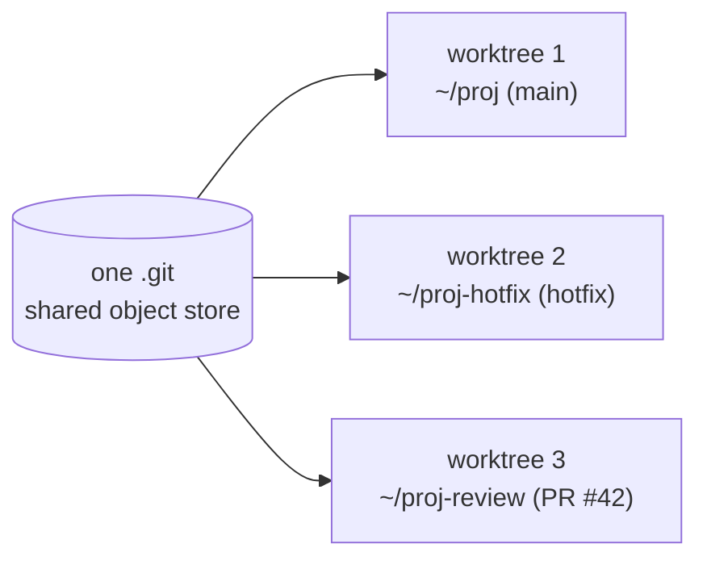
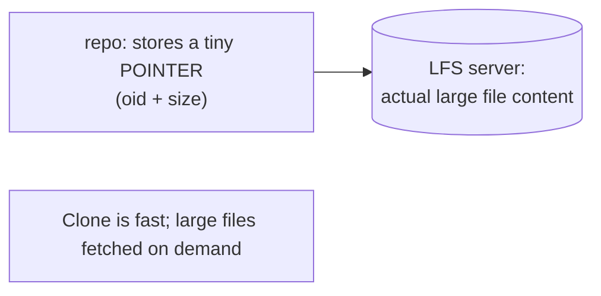

# Advanced Tools: worktrees, submodules, LFS, sparse-checkout

## 🧠 Intuition

Beyond the daily commands, Git has powerful tools for specific situations: working on **two branches at once**
without stashing (**worktrees**), embedding **one repo inside another** (**submodules**), versioning **large
binary files** efficiently (**LFS**), checking out **only part** of a huge repo (**sparse-checkout**), and
more. You won't use these every day, but knowing they exist — and when to reach for them — separates a Git user
from a Git expert.

> 💡 **Analogy — specialized tools in a workshop.** Most jobs need the basic hammer and screwdriver (commit,
> branch, merge). But occasionally you need the specialty tools: a second workbench to do two jobs at once
> (worktree), a way to mount a pre-built component into your project (submodule), a special crate for shipping
> heavy items (LFS), or a way to unpack just the parts of a huge shipment you need (sparse-checkout). You don't
> use them often, but when the situation calls for one, nothing else will do.

## 🎯 The Problem

Several recurring pains that the basics don't solve cleanly:
- You're mid-feature and need to **quickly check out another branch** to test it — but stashing/switching is
  disruptive and you lose your build state.
- Your project depends on **another Git repo** (a shared library) that you want to include at a **pinned
  version**.
- You need to commit **large binaries** (images, videos, datasets, game assets) — but Git bloats horribly
  because every version of a big file is stored in full, forever.
- You work in a **massive monorepo** but only need a small slice of it locally.

Each has a dedicated advanced tool.

## 📐 How It Works

### Worktrees — multiple working directories from one repo

`git worktree` lets you check out **multiple branches simultaneously** into **separate folders**, all backed by
the **same** repository (one `.git`). No stashing, no switching — each branch has its own working directory and
build state.



Great for: reviewing a PR while keeping your feature build intact, running a long build on one branch while
coding on another, or comparing two branches side by side.

### Submodules — a repo inside a repo (pinned)

A **submodule** embeds another Git repository inside yours at a **specific commit**. Your repo records *which
commit* of the submodule to use, so everyone gets the same pinned version. Used for shared libraries or
vendored dependencies you want to track by exact commit.

- ⚠️ Submodules are **notoriously fiddly** — easy to forget to update, clone, or commit the pointer. Often a
  package manager (npm, NuGet) or a **monorepo** is a simpler alternative. Use submodules when you genuinely
  need to embed and pin another repo.

### Git LFS (Large File Storage) — big binaries done right

Git stores every version of every file in full forever, so committing large binaries (a 200MB video, edited
repeatedly) **bloats the repo** catastrophically. **Git LFS** replaces large files in your repo with tiny
**pointer files**, storing the actual large content in a **separate LFS store** — keeping the repo small while
still versioning the binaries.



Used for: design assets, game art, ML datasets/models, media — any large/binary files under version control.

### Sparse-checkout — part of a huge repo

In a giant monorepo, `git sparse-checkout` lets you **populate only the directories you need** in your working
tree (the full history is still there, but you don't materialize every file). Speeds up checkout and reduces
disk use for large repos.

### A few more worth knowing

- **`git bisect run <script>`** — fully automated bug-hunting: Git runs your test script at each bisect step
  (exit 0 = good, non-0 = bad) to find the breaking commit unattended ([ch.11](11-Inspecting-History.md)).
- **`git rerere`** ("reuse recorded resolution") — Git remembers how you resolved a conflict and **auto-applies
  the same resolution** next time the same conflict recurs (great for long-lived rebases).
- **`git gc`** — garbage-collects and compresses the object store into **packfiles** (Git runs it
  automatically; this is how it stays space-efficient — recall [internals, ch.03](03-How-Git-Works-Internals.md)).
- **`git archive`** — export a clean snapshot of a commit as a `.zip`/`.tar` (no `.git`), for releases/distribution.

## 💻 In Practice

```bash
# --- WORKTREES: check out another branch in a separate folder ---
git worktree add ../proj-hotfix hotfix     # creates ../proj-hotfix with the hotfix branch checked out
git worktree add ../proj-review -b review origin/pr-42   # review a PR without disturbing your work
git worktree list                          # show all worktrees
git worktree remove ../proj-hotfix         # clean up when done

# --- SUBMODULES ---
git submodule add https://github.com/org/lib libs/lib   # embed another repo at libs/lib
git clone --recurse-submodules <url>       # clone a repo AND its submodules (don't forget!)
git submodule update --init --recursive    # fetch submodules after a normal clone
git submodule update --remote              # update submodules to their latest tracked commit

# --- GIT LFS ---
git lfs install                            # one-time setup
git lfs track "*.psd" "*.mp4" "*.bin"      # tell LFS which patterns to handle (writes .gitattributes)
git add .gitattributes && git add design.psd && git commit -m "Add design (LFS)"
git lfs ls-files                           # list LFS-tracked files

# --- SPARSE-CHECKOUT (big monorepo) ---
git clone --filter=blob:none --sparse <url>   # partial clone
cd repo
git sparse-checkout set apps/web libs/ui      # only materialize these directories

# --- AUTOMATED BISECT, RERERE, ARCHIVE ---
git bisect start HEAD v1.0 && git bisect run ./test.sh   # find the breaking commit automatically (ch.11)
git config rerere.enabled true                # remember conflict resolutions
git archive --format=zip HEAD -o release.zip  # export a clean snapshot (no .git)
```

## ⚖️ When to Use (and When Not)

- **Worktrees** — when you need **two branches checked out at once** (review a PR while keeping your build,
  run a long task on one branch while coding on another). Cleaner than stashing/switching for parallel work.
- **Submodules** — only when you genuinely need to **embed and pin another repo**; otherwise prefer a **package
  manager** or **monorepo** (submodules are error-prone and add friction). Always clone with
  `--recurse-submodules`.
- **LFS** — whenever you version **large/binary** files; set it up **before** committing them (retrofitting
  means rewriting history). Note LFS needs server support (GitHub/GitLab provide it, with quotas).
- **Sparse-checkout / partial clone** — for **huge monorepos** where you only need a slice; overkill for normal
  repos.

## 🚫 Common Mistakes & Gotchas

```text
❌ Committing large binaries directly into Git. → repo bloats forever (every version stored in full).
✅ Use Git LFS (set it up BEFORE adding the binaries); for already-committed bloat, rewrite history (ch.13).

❌ Cloning a repo with submodules using plain `git clone`. → submodule folders are empty.
✅ `git clone --recurse-submodules` (or `git submodule update --init --recursive` after).

❌ Forgetting to commit the updated submodule pointer. → teammates get the old/wrong submodule commit.
✅ After updating a submodule, commit the pointer change in the parent repo.

❌ Reaching for submodules when a package manager would do. → unnecessary complexity and friction.
✅ Prefer npm/NuGet/etc. or a monorepo unless you truly need an embedded, pinned repo.

❌ Stashing/switching repeatedly to juggle two branches. → loses build state, disruptive.
✅ Use `git worktree add` for a separate working dir per branch.

❌ Editing files directly in a worktree's .git internals or removing the folder manually. → corruption.
✅ Manage worktrees with `git worktree add/remove/list`.
```

## 🌍 Real-World Use

These tools solve real production needs. **Worktrees** are loved for **PR review** (check out the PR in a
separate folder, test it, switch back to your work instantly) and parallel builds. **Git LFS** is standard in
**game development, design, ML, and media** projects where large binaries must be versioned without destroying
repo performance — GitHub/GitLab support it natively. **Sparse-checkout and partial clone** make giant
**monorepos** (which some large companies use for everything) practical to work in locally. **Submodules**
appear in projects that vendor shared C/C++ libraries or embed another repo at a pinned commit (though many
teams migrate away from them due to the friction). **`git bisect run`** automates regression hunting in CI.
Knowing these exist means you reach for the right tool instead of fighting the basics.

## 🎯 Practice (with full solutions)

### 1. Review a PR without losing your work — `Medium`
**Task:** You're mid-feature with a working build, and you need to check out and test a teammate's branch
`pr-feature` — but you don't want to stash, switch, and rebuild (losing your current build state). What's the
clean approach?
**Solution:** Use a **worktree** — check out the other branch into a **separate folder**, leaving your current
working directory and build completely untouched:
```bash
git worktree add ../proj-review pr-feature   # creates ../proj-review with pr-feature checked out
cd ../proj-review                             # test it here (its own build state)
# ...review/test...
cd -                                          # back to your feature folder — never disturbed
git worktree remove ../proj-review            # clean up when done
```
**Why it works:** worktrees give each branch its **own working directory** backed by the same repository, so
you can have your feature *and* the PR checked out simultaneously — no stashing, no switching, no losing your
build — exactly what's needed for side-by-side review.

### 2. Version large assets — `Easy`
**Task:** Your project needs to version several 100MB+ design files (`.psd`) and video clips. If you commit them
normally, the repo will balloon. What do you do, and what's the critical timing detail?
**Solution:** Use **Git LFS** so the repo stores tiny **pointer files** while the large content lives in the
LFS store:
```bash
git lfs install
git lfs track "*.psd" "*.mp4"        # configure patterns (writes .gitattributes)
git add .gitattributes
git add design.psd clip.mp4
git commit -m "Add design assets via LFS"
```
**Critical timing:** set up LFS and `track` the patterns **before** committing the large files. If they're
already committed normally, they're in history (bloating it) and you'd have to **rewrite history**
([ch.13](13-Rewriting-History.md)) to migrate them — much harder.
**Why it works:** LFS replaces large files with small pointers in the repo (keeping clones fast and history
lean) while versioning the actual content separately; configuring it first ensures the binaries never enter
Git's normal object store in the first place.

## ✅ Key Takeaways

- **Worktrees** (`git worktree add`) check out **multiple branches into separate folders** from one repo — no
  stashing/switching; ideal for PR review and parallel work.
- **Submodules** embed **another repo at a pinned commit**; powerful but fiddly — clone with
  `--recurse-submodules`, commit the pointer, and prefer a package manager/monorepo when possible.
- **Git LFS** versions **large/binary files** via tiny pointer files (real content in a separate store) —
  keeping the repo small; **set it up before** committing the binaries.
- **Sparse-checkout / partial clone** materialize only part of a **huge monorepo**.
- Also know: **`git bisect run`** (automated bug-hunt), **`rerere`** (remember conflict resolutions), **`gc`**
  (packs/compresses — Git's space efficiency), **`git archive`** (clean export).

**Self-check:**
1. What problem do worktrees solve, and how do they differ from stashing-and-switching?
2. Why is committing large binaries directly into Git bad, and what does Git LFS do instead?
3. When are submodules appropriate, and what's a common simpler alternative?

---
◀ Prev: [Hooks & Automation](16-Hooks-and-Automation.md) · ▲ [Index](README.md) · ▶ Next: [Troubleshooting & Recovery](18-Troubleshooting-and-Recovery.md)
