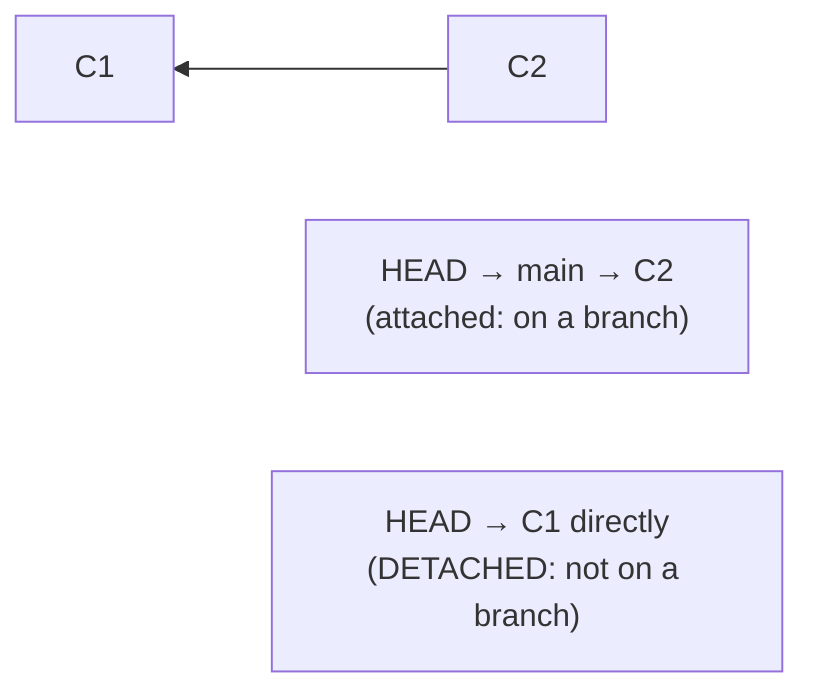

# Troubleshooting & Recovery: getting out of trouble (almost nothing is lost)

## 🧠 Intuition

Sooner or later you'll do something scary: a `reset --hard` that nukes your work, a "lost" commit after a
rebase, a detached HEAD, an accidental commit to the wrong branch, or a tangle you can't see your way out of.
The good news, rooted in [the object model (ch.03)](03-How-Git-Works-Internals.md): **Git almost never truly
deletes commits.** As long as a commit existed, it's in the object store and usually findable via the
**reflog** — your time-machine of every position HEAD has held. This chapter is the calm, systematic guide to
getting unstuck.

> 💡 **Analogy — a building with security cameras and a lost-and-found.** Even if you "lose" something (delete a
> branch, reset away commits), the building has **security footage of everywhere you've been** (the reflog) and
> a **lost-and-found** that holds items for ~90 days (unreferenced objects, before garbage collection). Almost
> nothing is gone for good — you just need to know where to look. Panic is the only real danger; the recovery
> tools are reliable.

## 🎯 The Problem

The classic emergencies, each with a clean fix:
1. "I ran `git reset --hard` and lost commits!"
2. "I'm in **detached HEAD** state — what does that mean and how do I get out?"
3. "I **committed to the wrong branch**."
4. "I **deleted a branch** that had unmerged work."
5. "My **rebase went wrong** / I lost commits during a rebase."
6. "I **committed a huge file or a secret** and pushed it."
7. Everyday errors: "detached HEAD," "rejected push," "merge conflict," "diverged branches."

The common thread: stay calm, find the commit (reflog/`fsck`), and move a pointer to it.

## 📐 How It Works

### The reflog: your #1 recovery tool

`git reflog` lists **every position HEAD has been** — every commit, reset, rebase, checkout, merge — with its
hash and a label. Even "lost" commits appear here. To recover, point a branch at the hash.

```text
$ git reflog
a1b2c3d HEAD@{0}: reset: moving to HEAD~3      ← the bad reset
e4f5g6h HEAD@{1}: commit: important work       ← what you want back!
...
$ git reset --hard HEAD@{1}     # or: git checkout -b rescue e4f5g6h
```

### `git fsck`: find truly orphaned commits

If something isn't in the reflog (rare), **`git fsck --lost-found`** scans the object store for **dangling
commits** (unreferenced but not yet garbage-collected). You can then recover them by hash.

### Detached HEAD: what it is, why it happens, how to fix it

Normally HEAD points to a **branch**. **Detached HEAD** means HEAD points **directly at a commit**, not a
branch — which happens when you `git checkout <commit-hash>` or `checkout <tag>` or land on a commit during
bisect. You *can* look around and even commit, but **new commits aren't on any branch** — so if you switch away,
they become orphaned (reflog-recoverable, but easy to lose).



**Fix:** if you made commits you want to keep, **create a branch** to capture them (`git switch -c newbranch`);
otherwise just `git switch main` to reattach.

### The recovery mindset

1. **Don't panic / don't make it worse.** Avoid more destructive commands until you understand the state.
2. **`git status`** and **`git reflog`** to see where you are and where you've been.
3. **Find the commit** you want (reflog hash, or `git fsck --lost-found`).
4. **Point a branch at it** (`git branch rescue <hash>` / `git reset --hard <hash>`).

## 💻 In Practice — the recovery cookbook

```bash
# ── Recover commits after a bad reset/rebase ──
git reflog                          # find the hash from BEFORE the mistake
git reset --hard HEAD@{1}           # move your branch back to it
#   (or, non-destructively, branch it off:)
git branch rescue <hash>            # create a branch at the lost commit, then inspect/merge

# ── Get out of detached HEAD (keeping commits you made) ──
git switch -c keep-my-work          # capture the detached commits on a new branch
#   ...or, if you made no commits to keep:
git switch main                     # just reattach to a branch

# ── Committed to the WRONG branch (commit is on main, should be on feature) ──
git switch -c feature               # create feature here (it now has the commit)
git switch main
git reset --hard HEAD~1             # remove the commit from main (it's safe on feature)
#   If main is shared/pushed, use revert instead of reset (ch.09).

# ── Recover a deleted branch ──
git reflog                          # find the deleted branch's tip commit
git branch recovered <hash>         # recreate it

# ── Find orphaned commits not in the reflog ──
git fsck --lost-found               # lists dangling commits
git show <dangling-hash>            # inspect; then git branch rescue <hash>

# ── Undo a botched rebase entirely ──
git rebase --abort                  # if still mid-rebase
git reflog                          # if already finished: find pre-rebase HEAD and reset to it
git reset --hard HEAD@{n}

# ── Restore a single file from a past commit ──
git restore --source=<commit> -- path/to/file    # bring back one file's old version

# ── Diverged branches ("ahead N, behind M") ──
git pull --rebase                   # replay your commits on top of upstream (or merge; ch.08)
```

### Common error messages → fixes (quick reference)

| Message | Meaning | Fix |
|---------|---------|-----|
| `Updates were rejected (fetch first)` | remote has commits you lack | `git pull` then push ([ch.08](08-Remotes-and-Collaboration.md)) |
| `You are in 'detached HEAD' state` | HEAD points at a commit, not a branch | `git switch -c <name>` (to keep) or `git switch main` |
| `CONFLICT (content): Merge conflict` | overlapping changes | edit markers, `add`, `commit` ([ch.06](06-Branching-and-Merging.md)) |
| `error: failed to push some refs` | non-fast-forward | pull/integrate first, then push |
| `fatal: not a git repository` | not inside a repo | `cd` into the repo, or `git init` |
| `Please commit or stash your changes` | dirty tree blocks the action | commit, or `git stash` ([ch.10](10-Stashing-and-Cleaning.md)) |

## ⚖️ Recovery Principles

- **The reflog is local and time-limited** (~90 days for reachable, ~30 for unreachable, by default) — recover
  promptly. It's *your* machine's history, so it won't help on a fresh clone.
- **Prefer non-destructive recovery:** branch the lost commit (`git branch rescue <hash>`) and inspect before
  doing a `reset --hard` onto it.
- **Reset vs revert for shared history:** if the mistake is on a **pushed/shared** branch, prefer **`revert`**
  (adds an undo commit) over rewriting ([ch.09](09-Undoing-Things.md)) — don't fix a shared mistake with a
  force-push that breaks teammates.
- **Secrets are a special case:** scrubbing history ([filter-repo, ch.13](13-Rewriting-History.md)) removes the
  file, but a pushed secret is **compromised** — **rotate it**, always.
- **Don't `gc` in a panic** — `git gc --prune=now` can permanently delete the very dangling commits you're
  trying to recover. Recover first.

## 🚫 Common Mistakes & Gotchas

```text
❌ Panicking and running more destructive commands (gc, more resets). → can turn recoverable into truly lost.
✅ Stop, run `git status` + `git reflog`, find the commit, then point a branch at it.

❌ Assuming `reset --hard` permanently destroyed commits. → they're in the reflog (~90 days)!
✅ `git reflog` → `git reset --hard HEAD@{n}` (or `git branch rescue <hash>`).

❌ Making commits in detached HEAD, then switching away. → those commits become orphaned (then GC'd).
✅ Capture them first: `git switch -c <name>` before leaving detached HEAD.

❌ Fixing a "wrong branch commit" on a SHARED branch with reset --hard + force-push. → breaks teammates.
✅ Move the commit to the right branch; on shared history use `revert` (ch.09).

❌ Running `git gc --prune=now` while trying to recover. → deletes the dangling commits you need.
✅ Recover first; never prune during a recovery.

❌ Expecting the reflog to help after a fresh clone or on another machine. → reflog is LOCAL.
✅ Recover on the machine where the mistake happened, promptly.
```

## 🌍 Real-World Use

Recovery skills are what make experienced developers **calm** when Git looks scary. The reflog resolves the
vast majority of "I lost my work!" panics in seconds — it's the single most reassuring command to know.
**Detached HEAD** confuses every beginner; recognizing it (and that you just need to `switch -c` to keep
commits) is a rite of passage. "Committed to the wrong branch" and "deleted the wrong branch" happen to
everyone and are trivially fixed via branch-and-reset / reflog. The deeper lesson — *Git is built on an
immutable object store, so commits persist and are findable* — is exactly the [object-model intuition
(ch.03)](03-How-Git-Works-Internals.md) paying off. Knowing recovery cold means you can use Git's powerful
(scary-looking) commands **fearlessly**, because you know how to undo them.

## 🎯 Practice (with full solutions)

### 1. Recover from a disastrous reset — `Medium`
**Task:** You meant to discard one commit but ran `git reset --hard HEAD~5`, wiping out 5 commits of work
(unpushed). Get them back.
**Solution:**
```bash
git reflog
#   Find the entry just BEFORE the reset, e.g.:
#   9f8e7d6 HEAD@{1}: commit: the work you want back
git reset --hard HEAD@{1}        # move your branch back to that commit → all 5 commits restored
#   (Safer/non-destructive alternative: git branch rescue 9f8e7d6  then inspect/merge.)
```
**Why it works:** `reset --hard` only **moved the branch pointer** — it didn't delete the commit objects, which
remain in the store and are recorded in the **reflog** along with the pre-reset position. Pointing the branch
back at `HEAD@{1}` (or the hash) restores all five commits exactly. Nothing was truly lost.

### 2. Escape detached HEAD with new commits — `Medium`
**Task:** You ran `git checkout v1.2.0` to look at an old release, then made 2 commits experimenting. Now
`git status` says "detached HEAD" and you realize those commits aren't on any branch. How do you keep them?
**Solution:** You're in **detached HEAD** (HEAD points at the `v1.2.0` commit, not a branch), so your 2 new
commits aren't on any branch and would be orphaned if you switched away. **Capture them by creating a branch
right where you are:**
```bash
git switch -c experiment      # creates 'experiment' AT your current (detached) commit → your 2 commits are now safe on it
git log --oneline             # confirm the 2 commits are on 'experiment'
```
(If you'd already switched away and lost them, `git reflog` would still find the commits to branch from.)
**Why it works:** detached-HEAD commits are real commits with no branch label; creating a branch at the current
HEAD attaches a permanent reference to them, so they're preserved and reachable instead of becoming orphaned —
the standard way to "rescue" work made in detached HEAD.

## ✅ Key Takeaways

- **Git almost never truly deletes commits** — they live in the object store and are findable via the
  **reflog** (`git reflog`, ~90 days) or **`git fsck --lost-found`** (dangling commits). Recovery = find the
  hash, point a branch at it.
- Recovery mindset: **don't panic, don't make it worse** → `git status` + `git reflog` → `git branch rescue
  <hash>` / `git reset --hard HEAD@{n}`.
- **Detached HEAD** = HEAD on a commit, not a branch (from `checkout <hash>/<tag>`/bisect); commits made there
  are orphaned if you leave — **`git switch -c <name>`** to keep them.
- Fix common situations: **wrong-branch commit** (branch it, reset/revert the original), **deleted branch**
  (reflog → recreate), **bad rebase** (`--abort` or reflog reset).
- The reflog is **local & time-limited**; recover **promptly**, prefer **non-destructive** recovery, use
  **revert** for shared history, **rotate leaked secrets**, and **never `gc --prune` during recovery**.

**Self-check:**
1. After `git reset --hard` wipes commits, how do you get them back, and why are they recoverable?
2. What is detached HEAD, and how do you preserve commits made while in it?
3. Why should you never run `git gc --prune=now` while trying to recover lost work?

---
◀ Prev: [Advanced Tools](17-Advanced-Tools.md) · ▲ [Index](README.md) · ▶ Next: [Best Practices](19-Best-Practices.md)
