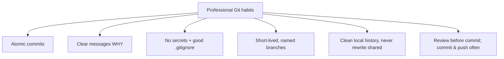

# Best Practices: the habits of clean, professional Git

## 🧠 Intuition

Knowing Git commands isn't the same as using Git *well*. The difference is **habits**: small, atomic commits
with clear messages; a clean `.gitignore`; never committing secrets; short-lived branches; and a tidy history.
These habits make your project's history a **readable story**, your changes **easy to review and revert**, and
your repo **safe and lean**. They're the positive form of all the mistakes this course has warned about — the
defaults of an experienced developer.

> 💡 **Analogy — keeping a clean, well-labeled lab notebook.** A scientist's notebook isn't valuable because
> they *can* write — it's valuable because of the **habits**: each entry dated and focused on one experiment,
> clearly explaining what and why, with nothing sensitive or irrelevant scribbled in. Months later, anyone can
> follow the reasoning and reproduce the work. Good Git practice is keeping that kind of notebook for your code
> — so your history is a trustworthy, navigable record instead of a mess.

## 🎯 The Problem

Two developers know the same Git commands. One leaves a history of `"WIP"`, `"fix"`, `"asdf"`, giant commits
mixing five unrelated changes, a committed `.env` with API keys, and week-old branches that merge with 200
conflicts. The other leaves atomic commits with messages that read like a changelog, a clean ignore file, no
secrets, and small branches that merge cleanly. When a bug appears, the second developer's `git blame`/`bisect`
pinpoints the cause in minutes; the first developer's history is useless. The *habits* — not the command
knowledge — make the difference.

## 📐 How It Works — the practices

### 1. Atomic commits (one logical change each)

A commit should be **one self-contained, logical change** — not "a day's work." Atomic commits are easy to
review, easy to revert (undo *just* that change), and easy to understand in history. Use the
[staging area / `git add -p` (ch.04)](04-The-Three-Areas-and-Lifecycle.md) to split a working session into
focused commits.

```text
❌ One commit: "implement feature, fix unrelated bug, reformat, update deps"
✅ Four commits: "Add search endpoint" / "Fix cart total rounding" / "Format with Prettier" / "Bump axios to 1.7"
```

### 2. Good commit messages

The message explains **why** (the diff shows *what*). The widely-adopted convention:

```text
Short imperative summary, ≤ 50 chars        ← "Add", "Fix", "Refactor" (not "Added"/"Fixes")
                                            ← blank line
Body (wrap ~72 cols) explaining WHY the change
is needed and any context a future reader wants.

Refs #123                                    ← link an issue
```

**Conventional Commits** (`feat:`, `fix:`, `docs:`, `chore:`…) add a machine-readable prefix that enables
automated changelogs and semantic versioning — common on teams.

### 3. Commit often, push regularly

Small, frequent commits are cheap save points (and your safety net). Push regularly so work is **backed up off
your machine** and visible to the team ([ch.08](08-Remotes-and-Collaboration.md)).

### 4. Never commit secrets

API keys, passwords, tokens, `.env` files — **never** commit them. A committed secret is in history (and
possibly pushed/cloned) **forever**; deleting it later doesn't un-leak it. Prevent with `.gitignore`; if it
happens, **rotate the secret** and scrub history ([ch.13](13-Rewriting-History.md)).

### 5. A clean `.gitignore`

Ignore build output, dependencies, logs, OS/editor junk, and secrets — set it up **before** the first commit
([ch.05](05-The-Basic-Workflow.md)). Use GitHub's per-language templates as a base.

### 6. Short-lived, well-named branches

Keep feature branches **small and short-lived** (merge within days) to minimize conflicts; use
**conventional names** (`feature/...`, `bugfix/...`, `hotfix/...`) ([ch.14](14-Workflows-and-Branching-Strategies.md)).

### 7. Keep history clean (but don't rewrite shared history)

Tidy your **local** branch before sharing (squash WIP commits — [ch.13](13-Rewriting-History.md)); **never
rewrite pushed/shared history** (use `revert` — [ch.09](09-Undoing-Things.md)). Pull before you start; integrate
often.

### 8. Review before committing

Run `git status` and `git diff --staged` before every commit — know exactly what you're recording (no debug
code, no secrets, no stray files).



## 💻 In Practice

```bash
# Split a mixed working session into ATOMIC commits:
git add -p                      # stage only the hunks for ONE logical change
git commit -m "Fix cart total rounding error"
git add -p                      # next logical change
git commit -m "Add search endpoint"

# A quality message with a body (opens editor):
git commit                      # write: imperative summary, blank line, WHY in the body

# Conventional Commits style:
git commit -m "feat(search): add product search endpoint"
git commit -m "fix(cart): correct rounding on totals"

# Review before committing:
git status
git diff --staged               # exactly what will be committed — check for secrets/debug/stray files

# A solid starter .gitignore (set up BEFORE first commit):
printf "node_modules/\nbin/\nobj/\ndist/\n*.log\n.env\n*.key\n.DS_Store\n.vscode/\n" > .gitignore

# Clean up a messy LOCAL branch before opening a PR:
git rebase -i HEAD~5            # squash WIP/typo commits into clean ones (ch.13) — local only!
```

## ⚖️ Trade-offs / Judgment

- **Atomic vs convenient:** truly atomic commits take a little discipline (staging selectively), but pay off
  hugely in review, revert, and debugging. Worth it for anything shared.
- **Squash vs preserve commits:** squashing yields a clean `main` (one commit per feature); preserving keeps
  granular history. Follow your team's convention ([ch.15](15-Pull-Requests-and-Code-Review.md)).
- **Message rigor:** Conventional Commits enable automation but add ceremony — adopt if your team values
  changelogs/semver; otherwise a clear imperative summary is the baseline everywhere.
- **The meta-principle:** optimize for the **future reader** (often you, in six months, debugging). Every habit
  here makes history more *useful* later — that's the test for whether it's worth it.

## 🚫 Common Mistakes & Anti-Patterns

```text
❌ Giant commits mixing unrelated changes. → unreviewable, can't revert just one thing.
✅ Atomic commits, one logical change each (use git add -p).

❌ Useless messages ("fix", "wip", "stuff", "asdf"). → history tells no story; blame/bisect are useless.
✅ Imperative summary explaining the change; body explaining WHY when needed.

❌ Committing secrets / .env / keys. → leaked forever (history + pushed); a security incident.
✅ .gitignore them BEFORE committing; if leaked, ROTATE the secret + scrub history (ch.13).

❌ Committing node_modules/, build output, IDE files. → bloated, noisy repo.
✅ A clean .gitignore (start from GitHub's templates).

❌ Long-lived branches that drift for weeks. → painful, conflict-heavy merges.
✅ Short-lived branches; integrate often.

❌ Rewriting shared/pushed history to "tidy up". → breaks teammates (Golden Rule, ch.07).
✅ Tidy LOCAL history before sharing; use revert for anything public.

❌ Committing without checking `git diff --staged`. → debug code/secrets/stray files sneak in.
✅ Review staged changes before every commit.
```

## 🌍 Real-World Use

These habits are the visible markers of a strong engineer and a healthy team. A history of **atomic commits
with clear messages** makes code review fast, `git blame`/`bisect` powerful, and reverts surgical — it's
*infrastructure for future debugging*. **Never committing secrets** is a hard security rule (leaked credentials
in Git history are a leading breach vector; bots scan public repos within seconds). A good **`.gitignore`** and
**short-lived, well-named branches** keep repos and merges manageable. Teams encode many of these as automated
checks — **commit-message linting**, **secret scanning**, **branch naming rules**, **squash-merge policies**
([ch.16](16-Hooks-and-Automation.md)). Ultimately every practice serves one goal: making the repository's
history a **trustworthy, navigable asset** rather than a liability — which is the whole point of version
control.

## 🎯 Practice (with full solutions)

### 1. Refactor a messy commit habit — `Medium`
**Task:** You've spent an afternoon and have, uncommitted: a new search feature, an unrelated bug fix, and some
reformatting — all mixed together. You're about to `git add . && git commit -m "stuff"`. Do it the
professional way instead.
**Solution:** Split the work into **atomic commits** with clear messages using selective staging:
```bash
git add -p                      # stage ONLY the search-feature hunks
git commit -m "Add product search endpoint"
git add -p                      # stage ONLY the bug-fix hunks
git commit -m "Fix cart total rounding error"
git add .                       # the remaining reformatting
git commit -m "Reformat with Prettier"
git diff --staged               # (before each commit) verify only the intended change is staged
```
**Why it works:** `git add -p` lets you stage individual hunks, so each commit captures **one logical change**
with a descriptive message — making history readable, each change independently revertable, and review easy —
versus one opaque `"stuff"` commit that mixes everything and tells future readers nothing.

### 2. Handle a committed secret — `Easy`
**Task:** You realize you committed and **pushed** `config.js` containing a live API key. Beyond removing it,
what's the single most important action, and why?
**Solution:** **Rotate (revoke and replace) the API key immediately** — treat it as **compromised**. Once a
secret is pushed, it may already be cloned, cached, or scraped by bots (which scan public repos within
seconds), so simply removing it from history does **not** make it safe. After rotating, also scrub it from
history ([`git filter-repo`, ch.13](13-Rewriting-History.md)) and add it to `.gitignore` so it can't recur — but
**rotation is the essential step**.
**Why it works:** removing a secret from Git history limits future exposure but cannot un-leak something already
published; the only way to neutralize a leaked credential is to invalidate it (rotate), which is why that's the
non-negotiable first action regardless of any history cleanup.

## ✅ Key Takeaways

- **Atomic commits** (one logical change) + **clear messages** (imperative summary + *why*) make history a
  readable, reviewable, revertable, debuggable asset. Use **`git add -p`** to split work; consider
  **Conventional Commits** for automation.
- **Never commit secrets** — `.gitignore` them up front; if leaked, **rotate the secret** (it's compromised)
  and scrub history. Keep a clean `.gitignore` (no deps/build output/junk).
- **Commit often, push regularly** (cheap save points + off-machine backup); **keep branches short-lived and
  well-named**.
- **Tidy local history before sharing** (squash WIP), but **never rewrite shared history** (use `revert`).
- **Review with `git status`/`git diff --staged` before committing**; optimize every habit for the **future
  reader** (often you, debugging later).

**Self-check:**
1. What makes a commit "atomic," and why does it help review/revert/debugging?
2. What's the structure of a good commit message, and why does the "why" matter?
3. If you accidentally push a secret, what is the single most important thing to do, and why isn't removing it
   from history enough?

---
◀ Prev: [Troubleshooting & Recovery](18-Troubleshooting-and-Recovery.md) · ▲ [Index](README.md) · ▶ Finish with the [Interview Cheat Sheet](INTERVIEW_CHEATSHEET.md)
